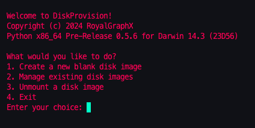
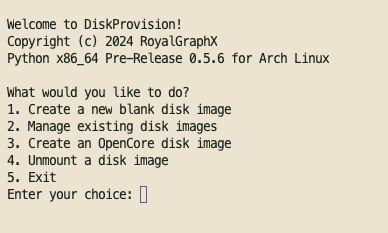

<p align="center">
  
</p>

<h1 align="center">Python Pre-Release Version 0.6.3</h1>
<h4 align="center">A virtual disk management tool for multiple OS's with unique application support.</h4>

## About

DiskProvision automates the process of managing disk images for use with various Hypervisor platforms such as QEMU, UTM, and any application that utilizes raw disk images. It can perform the following actions:

- Management of a 'database' of created images
  - View list of existing images
  - Mount the selected disk image to the host machine to browse contents
  - Format disk image as a specific format and view partitions on the disk
  - Delete disk images you no longer require
  - Duplicate disk image you want, as to 'back up' the contents at the time

- Special commands for supported Operating Systems
   - On Linux based systems:
     - Easily create multiple OpenCore disk images for use with [DarwinKVM](https://docs.darwinkvm.com/)
     - Probe disk images for information and partitions
     - Pseudo QEMU NBD front-end.
   - On Darwin based systems:
     - Mount and unmount using hdiutil, with an interactive menu
     - Support for management of UTM disk images for DarwinUTM machines
     - Format images as FAT32, APFS, and HFS+ Journaled
   - On NT based systems:
     - Placeholder :P , Not supported yet.

## Requirements

* Packages/Dependencies:
  * Python 3.9+ (Usually provided by default)
  * mkfs.fat (usually provided by dosfstools)
  * qemu-img (usually provided by qemu-utils or qemu-img)
  * qemu-nbd (usually provided by qemu-utils or qemu-img)

## Showcase

<p align="center">
  
</p>

<p align="center">
  
</p>

<p align="center">
  
</p>

## Usage

Open a terminal and navigate to the root of DiskProvision

1. Ensure the launcher has executable permissions:

```bash
chmod +x DiskProvision.sh
```

2. You can now interact with DiskProvision:

```bash
./DiskProvision.sh
```

<h6 align="center">A big thanks to all contributors and future contributors! ꩓</h6>
