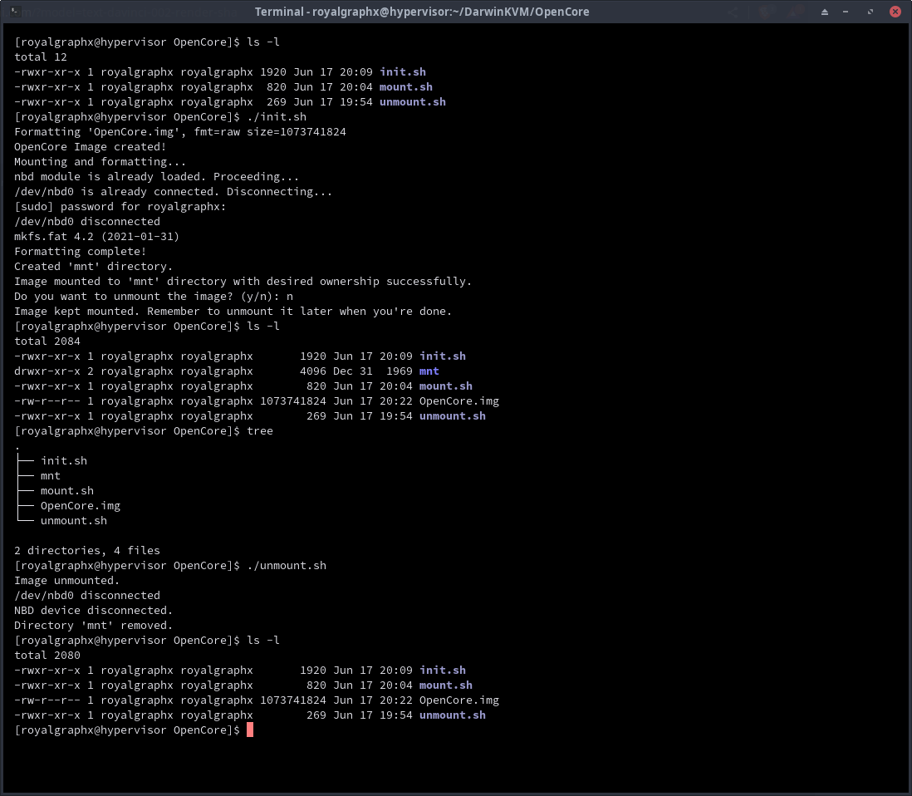

<p align="center">
  
</p>

<h1 align="center">DKVM DiskProvision Submodule</h1>
<h4 align="center">Allows the creation, management, and updating of the OpenCore EFI partition for your DKVM.</h4>

## About

This tool automates the process of creating and setting up an OpenCore.img disk image for use with QEMU. It also comes with ``mount.sh`` and ``unmount.sh`` to easily modify the contents. It performs the following actions:

- Creates an OpenCore.img disk image file.
- Loads the nbd kernel module if not already loaded.
- Connects /dev/nbd0 to the OpenCore.img disk image.
- Formats the connected device as FAT32 with the label "OPENCORE".
- Mounts the formatted device to the mnt directory with the user as the owner.
- Optionally unmounts the image when done.

## Requirements

* Packages/Dependencies:
  * qemu-img
  * qemu-utils
  * modprobe
  * mkfs.fat (usually provided by dosfstools)

## Usage

Open a terminal and navigate to the directory containing the script files.

1. Ensure the scripts have executable permissions:

``chmod +x init.sh mount.sh unmount.sh``

2. You can now create a blank OC EFI:

``./init.sh``

example output:

```
[royalgraphx@hypervisor DiskProvision]$ ./init.sh 
Formatting 'OpenCore.img', fmt=raw size=1073741824
OpenCore Image created!
Mounting and formatting...
nbd module is already loaded. Proceeding...
[sudo] password for royalgraphx: 
/dev/nbd0 disconnected
mkfs.fat 4.2 (2021-01-31)
Formatting complete!
Created 'mnt' directory.
Image mounted to 'mnt' directory with desired ownership successfully.
Do you want to unmount the image? (y/n): n
Image kept mounted. Remember to unmount it later when you're done.
[royalgraphx@hypervisor DiskProvision]$
```

## Mounting to edit OC EFI

As expected, the tools do as described. Here is some example output.

1. Mounting the OpenCore.img to edit contents:

``./mount.sh``

example output:

```
[royalgraphx@hypervisor DiskProvision]$ ./mount.sh 
nbd module is already loaded. Proceeding...
/dev/nbd0 is already connected. Disconnecting...
/dev/nbd0 disconnected
Connected /dev/nbd0.
Created 'mnt' directory.
Image mounted to 'mnt' directory with desired ownership successfully.
[royalgraphx@hypervisor OpenCore]$ ls -l
total 2088
-rwxr-xr-x 1 royalgraphx royalgraphx       1920 Jun 17 20:09 init.sh
drwxr-xr-x 2 royalgraphx royalgraphx       4096 Dec 31  1969 mnt
-rwxr-xr-x 1 royalgraphx royalgraphx        820 Jun 17 20:04 mount.sh
-rw-r--r-- 1 royalgraphx royalgraphx 1073741824 Jun 17 21:04 OpenCore.img
-rw-r--r-- 1 royalgraphx royalgraphx        564 Jun 17 20:48 README.md
-rwxr-xr-x 1 royalgraphx royalgraphx        269 Jun 17 19:54 unmount.sh
[royalgraphx@hypervisor DiskProvision]$
```

2. Unmounting the OpenCore.img:

``./unmount.sh``

Example output:

```
[royalgraphx@hypervisor DiskProvision]$ ./unmount.sh 
Image unmounted.
/dev/nbd0 disconnected
NBD device disconnected.
Directory 'mnt' removed.
[royalgraphx@hypervisor DiskProvision]$ ls -l
total 2084
-rwxr-xr-x 1 royalgraphx royalgraphx       1920 Jun 17 20:09 init.sh
-rwxr-xr-x 1 royalgraphx royalgraphx        820 Jun 17 20:04 mount.sh
-rw-r--r-- 1 royalgraphx royalgraphx 1073741824 Jun 17 21:05 OpenCore.img
-rw-r--r-- 1 royalgraphx royalgraphx        564 Jun 17 20:48 README.md
-rwxr-xr-x 1 royalgraphx royalgraphx        269 Jun 17 19:54 unmount.sh
[royalgraphx@hypervisor DiskProvision]$
```

# Example usecases

## Easily mounting and modifying

<h3 align="center">After running the init.sh, the user has a new mnt folder that acts as the mount point.</h3>
<p align="center">
  
</p>

<h3 align="center">Before starting the Virtual Machine, always remember to unmount.</h3>
<p align="center">
  
</p>

## Adding to Virt-Manager

<h3 align="center">Make sure you add it as a VirtIO drive, with no cache and unmap.</h3>
<p align="center">
  
</p>

<h3 align="center">Don't forget to set it as your boot device.</h3>
<p align="center">
  
</p>
