

  

  

<h3 align="center">The Advanced Guide for running macOS within QEMU</h3>
<h5 align="center">Host Requirements, Host Configuration, Setting Expectations, GRUB and systemd-boot Support, Package Configuration, Bridged Networking using systemd, IOMMU Viability, x86_64 and PowerPC Support, OpenCore for Q35 as Mac Pro models, Hardware Compatibility Charts, DarwinFetch + DiskProvision, Virt-Manager XMLs, Single and Dual GPU Setup passthrough, QEMU and macOS Debugging, Fake Core Count for incompatible CPU Topologies, CPU Thread Pinning, VirtIO Thread for disk images, Motherboard Audio passthrough, Bridged Networking on Ethernet, KB/M Sharing via Evdev, Custom Memory Mapping, USB Controller Mapping, Display Overrides, sPPT / Zero-RPM Disable, Legacy NVIDIA Patching, Home of the VMHide Kernel Extension. Welcome to DarwinKVM!</h5>

 

 
<h3 align="center">This is the git repo, Follow the Docs <a href="https://docs.darwinkvm.com/">here!</a></h3>
<h5 align="center">This is NOT a Pre-Built EFI! You are responsible for creating one reading the documentation above.</h5>
 

  

<h2 align="center"><b>macOS Tahoe</b></h2>
<h5 align="center"><i>Mac Pro (2019) - MacPro7,1</i></h5>

  <h3 align="center">
    26.0.0 - RX 6600 8GB - x86_64
  </h3>
  <a href="">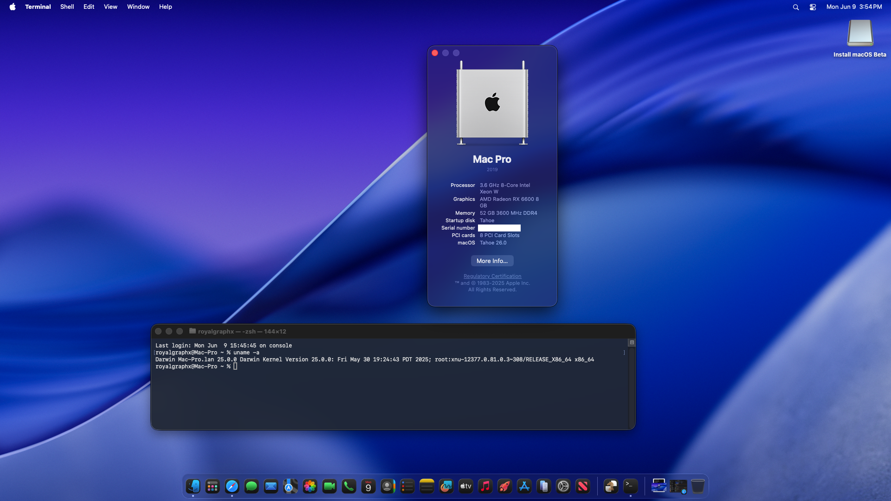</a>

<h2 align="center"><b>macOS Sequoia</b></h2>
<h5 align="center"><i>Mac Pro (2019) - MacPro7,1</i></h5>

  <h3 align="center">
    15.1.1 - WX 9100 16GB - x86_64 - Credits: @athleticat
  </h3>
  <a href="">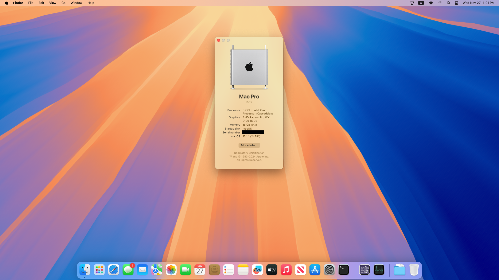</a>

  <h3 align="center">
    15.1 - RX 6650 XT 8GB - x86_64 - Credits: @f0xb4t
  </h3>
  <a href="">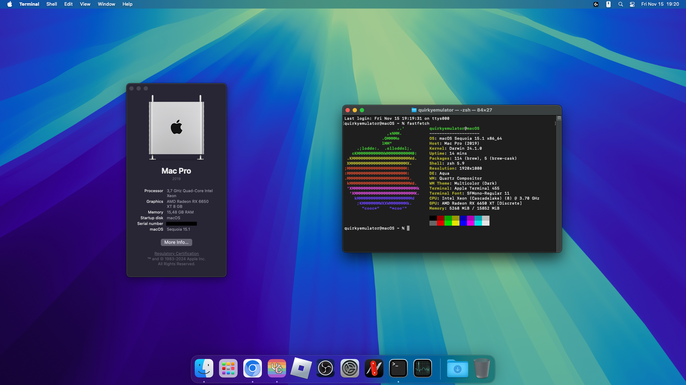</a>

  <h3 align="center">
    15.0 Beta 1 - RX 6600 8GB - x86_64
  </h3>
  <a href="">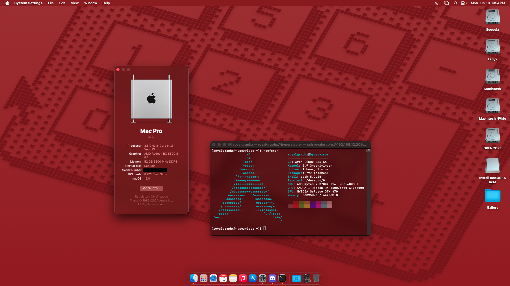</a>

<h2 align="center"><b>macOS Sonoma</b></h2>
<h5 align="center"><i>Mac Pro (2019) - MacPro7,1</i></h5>

  <h3 align="center">
    14.7 - RX 5700 XT 8GB - x86_64 - Credits: 
    <a href="https://github.com/Naymmmm">@Naymmmm</a>
  </h3>
  <a href="">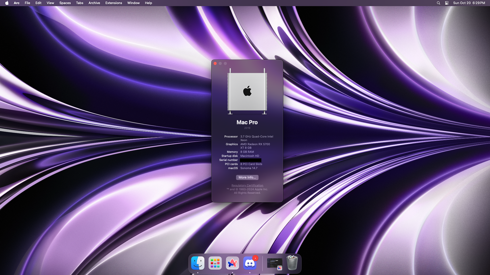</a>

  <h3 align="center">
    14.5 - RX 6600 8GB - x86_64
  </h3>
  <a href="">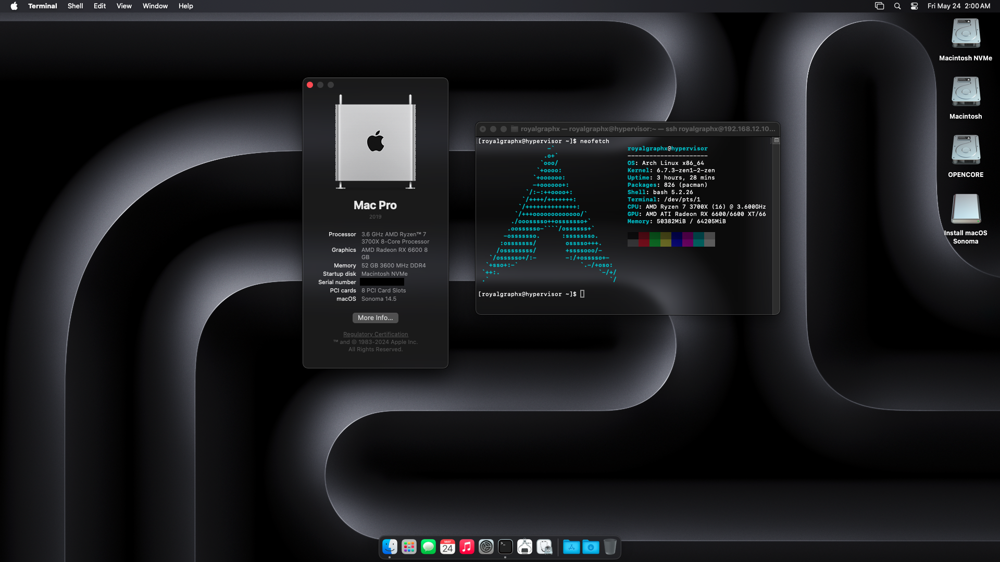</a>

  <h3 align="center">
    14.4 Beta - RX 6600 8GB - x86_64
  </h3>
  <a href="">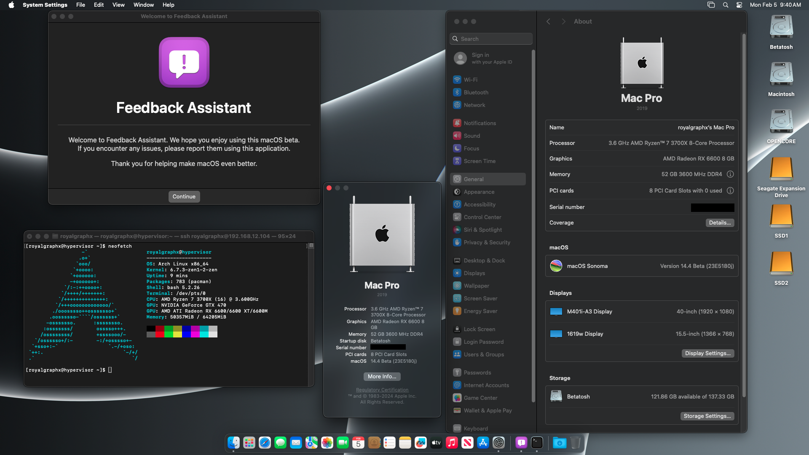</a>

  <h3 align="center">
    14.3 - RX 6600 8GB - x86_64
  </h3>
  <a href="">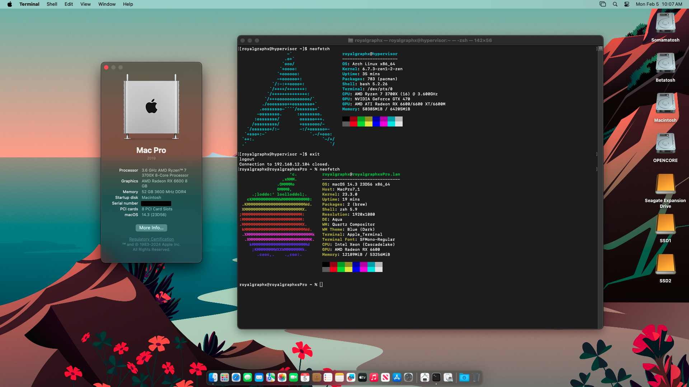</a>

  <h3 align="center">
    14.2.1 - RX 6750 XT 12GB - x86_64 - Credits: 
    <a href="https://github.com/heliokroger">@heliokroger</a>
  </h3>
  <a href="">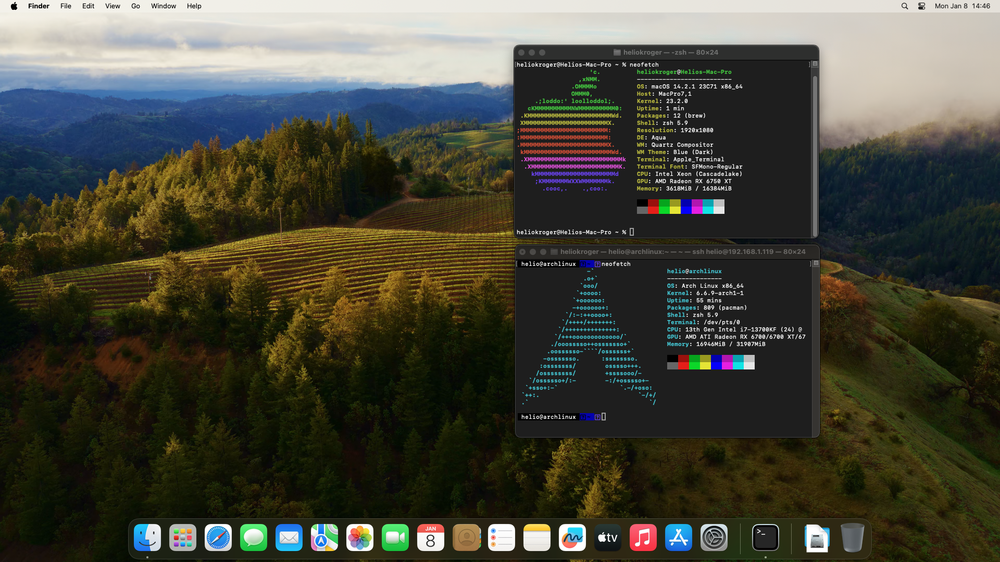</a>

  <h3 align="center">
    14.1 - RX 6800 XT 16GB - x86_64 - Credits: 
    <a href="https://github.com/haxi0">@haxi0</a>
  </h3>
  

  <h3 align="center">
    14.0 - RX 6600 8GB - x86_64
  </h3>
  <a href="">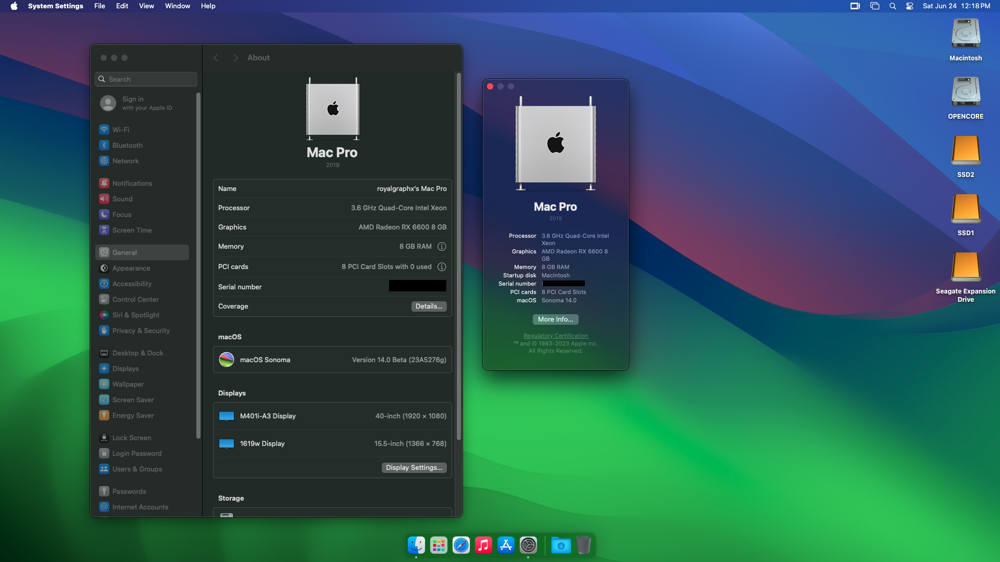</a>

<h2 align="center"><b>macOS Ventura</b></h2>
<h5 align="center"><i>Mac Pro (2019) - MacPro7,1</i></h5>

  <h3 align="center">
    13.5.1 - RX 6600 8GB - x86_64
  </h3>
  <a href="">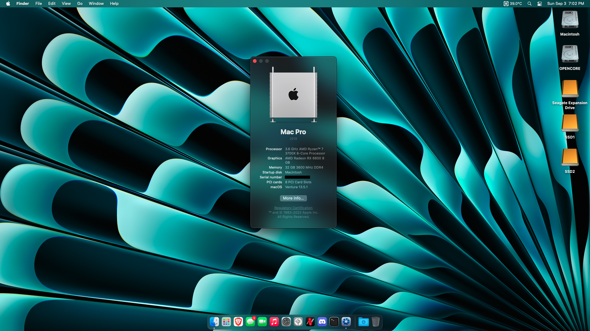</a>

  <h3 align="center">
    13.5 - GTX 1050 Ti 4GB - x86_64 - Credits: 
    <a href="https://github.com/Zormeister">@Zormeister</a>
  </h3>
  <a href="">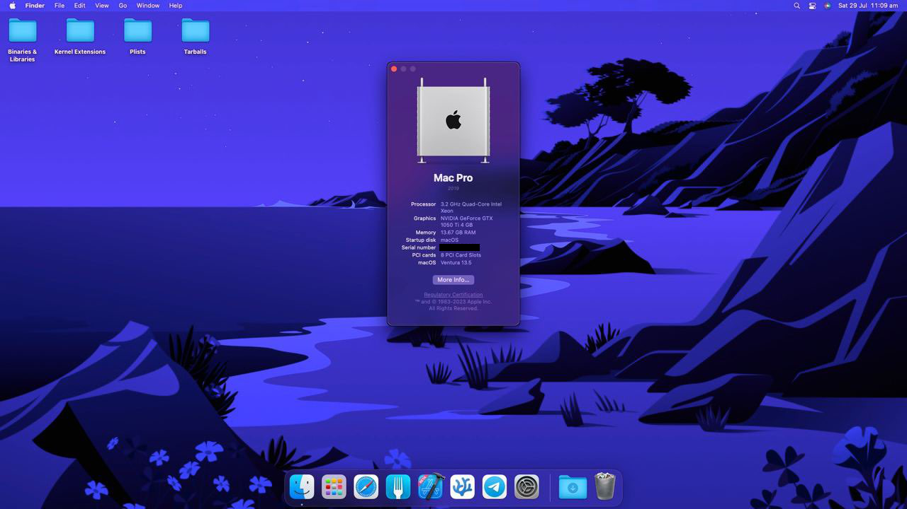</a>

  <h3 align="center">
    13.5 - RX 5600 XT 6GB - x86_64 - Credits: 
    <a href="https://github.com/rolowilde">@rolowilde</a>
  </h3>
  <a href="">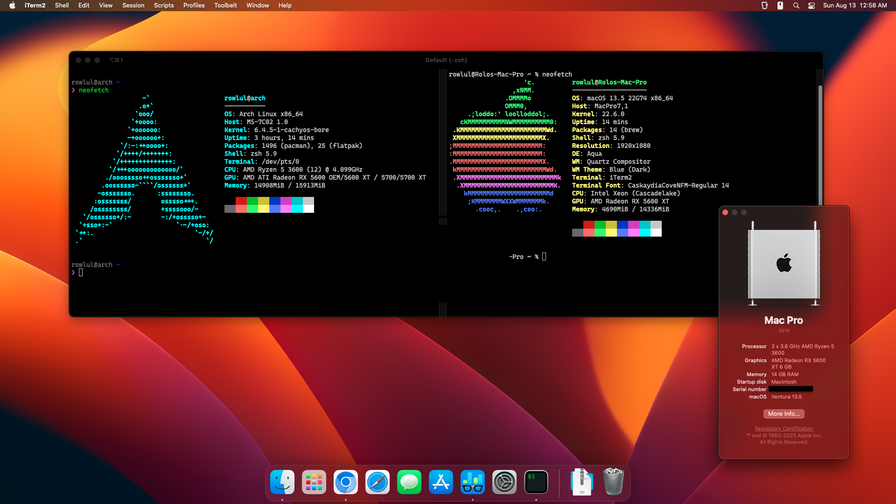</a>

  <h3 align="center">
    13.4 - RX 6600 8GB - x86_64
  </h3>
  <a href="">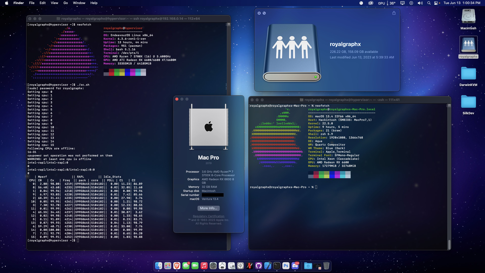</a>

<h2 align="center"><b>macOS Monterey</b></h2>
<h5 align="center"><i>Mac Pro (2019) - MacPro7,1</i></h5>

  <h3 align="center">
    12.7.5 - RX 6600 8GB - x86_64
  </h3>
  <a href="">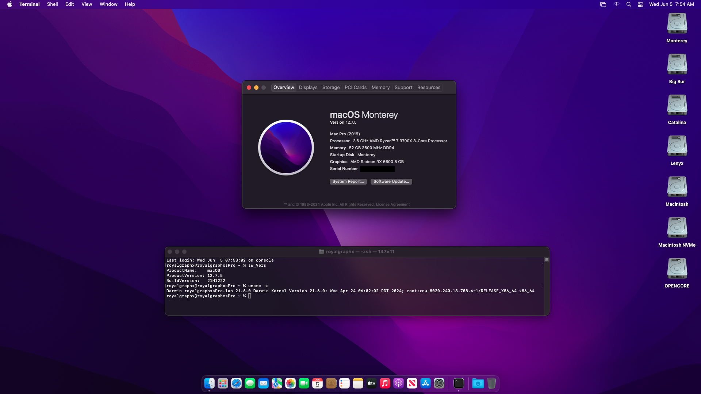</a>

<h2 align="center"><b>macOS Big Sur</b></h2>
<h5 align="center"><i>Mac Pro (2019) - MacPro7,1</i></h5>

  <h3 align="center">
    11.7.10 - VESA / VGA Graphics - x86_64
  </h3>
  <a href="">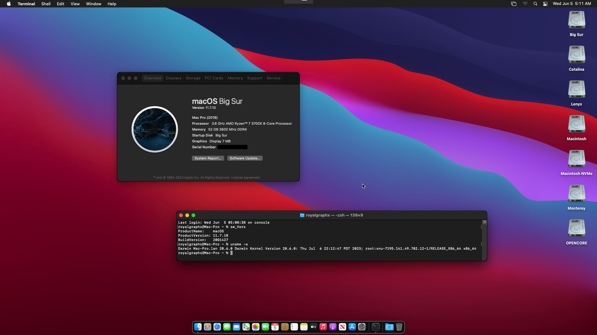</a>

  <h3 align="center">
    11.0.0 - Developer Preview 1 (20A4299v) - VESA / VGA Graphics - x86_64
  </h3>
  

<h2 align="center"><b>macOS 10.16</b></h2>
<h5 align="center"><i>Mac Pro (2019) - MacPro7,1</i></h5>

  <h3 align="center">
    AppleInternal GoldenGateSpike (20A2314a) - VESA / VGA Graphics - x86_64
  </h3>
  <a href="">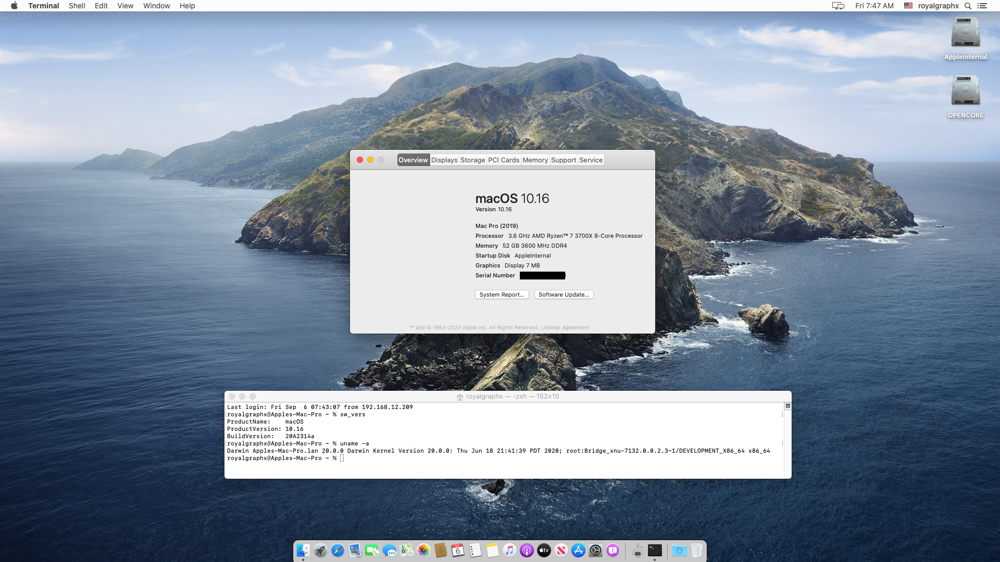</a>

<h2 align="center"><b>macOS Catalina</b></h2>
<h5 align="center"><i>Mac Pro (2019) - MacPro7,1</i></h5>

  <h3 align="center">
    10.15.7 - VESA / VGA Graphics - x86_64
  </h3>
  <a href="">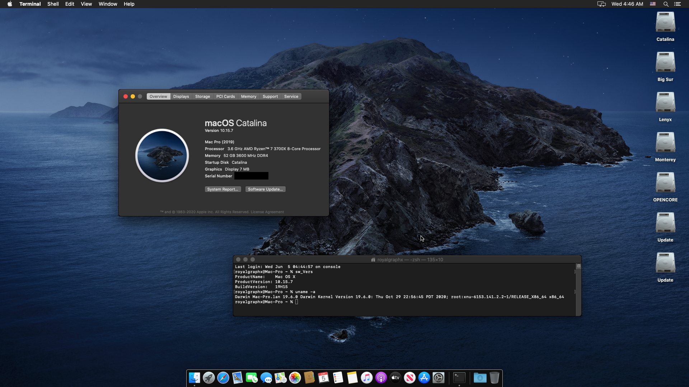</a>

<h2 align="center"><b>macOS Mojave</b></h2>
<h5 align="center"><i>Mac Pro (2010) - MacPro5,1</i></h5>

  <h3 align="center">
    10.14.4 - VESA / VGA Graphics - x86_64
  </h3>
  <a href="">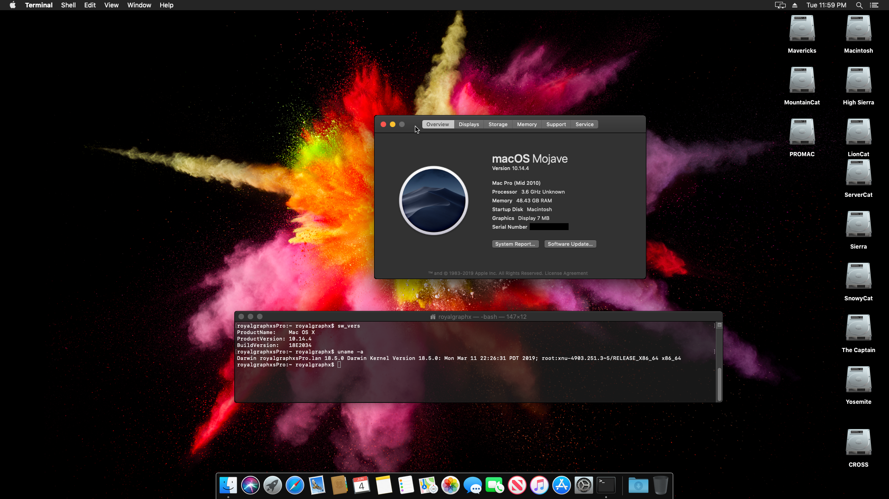</a>

<h2 align="center"><b>macOS High Sierra</b></h2>
<h5 align="center"><i>Mac Pro (2010) - MacPro5,1</i></h5>

  <h3 align="center">
    10.13.6 - GTX 470 1280MB
  </h3>
  <a href="">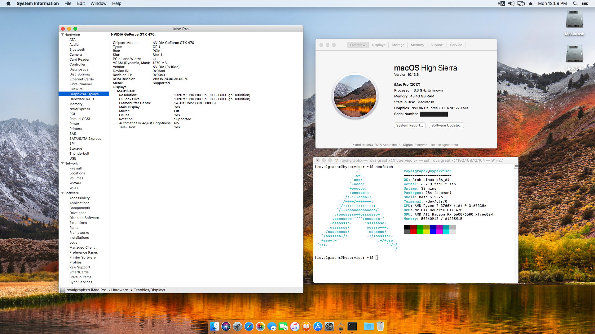</a>

<h2 align="center"><b>macOS Sierra</b></h2>
<h5 align="center"><i>Mac Pro (2010) - MacPro5,1</i></h5>

  <h3 align="center">
    10.12.5 - AppleInternal Phoenix (16F5049f) - GTX 470 1280MB
  </h3>
  <a href="">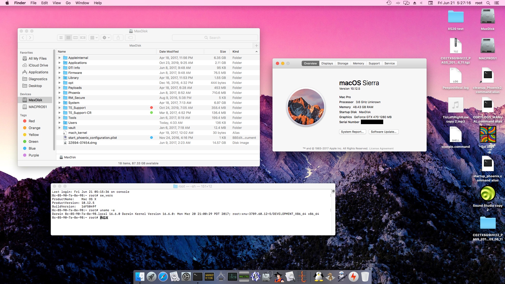</a>

  <h3 align="center">
    10.12 - VESA / VGA Graphics - x86_64
  </h3>
  

<h2 align="center"><b>Mac OS X El Capitan</b></h2>
<h5 align="center"><i>Mac Pro (2010) - MacPro5,1</i></h5>

  <h3 align="center">
    10.11.6 - VESA / VGA Graphics - x86_64
  </h3>
  <a href="">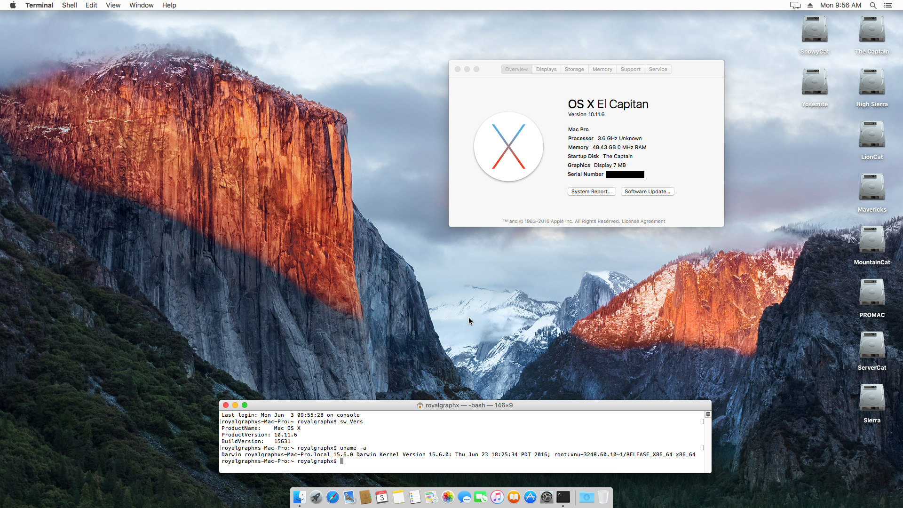</a>

<h2 align="center"><b>Mac OS X Yosmite</b></h2>
<h5 align="center"><i>Mac Pro (2010) - MacPro5,1</i></h5>

  <h3 align="center">
    10.10 - VESA / VGA Graphics - x86_64
  </h3>
  <a href="">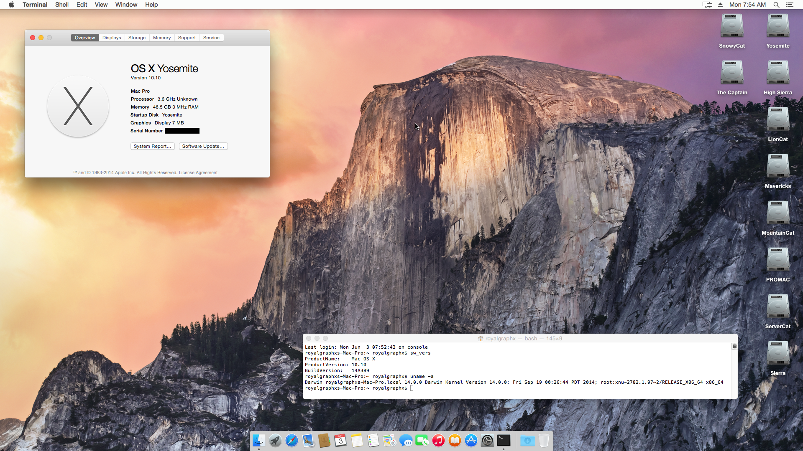</a>

<h2 align="center"><b>Mac OS X Mavericks</b></h2>
<h5 align="center"><i>Mac Pro (2010) - MacPro5,1</i></h5>

  <h3 align="center">
    10.9.5 - VESA / VGA Graphics - x86_64
  </h3>
  <a href="">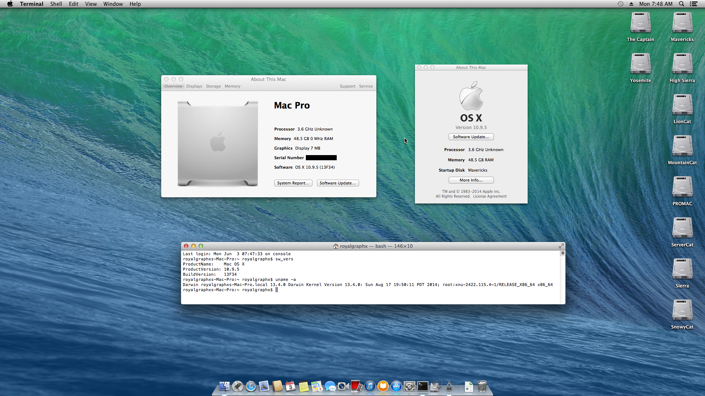</a>

<h2 align="center"><b>Mac OS X Mountain Lion</b></h2>
<h5 align="center"><i>Mac Pro (2010) - MacPro5,1</i></h5>

  <h3 align="center">
    10.8.5 - VESA / VGA Graphics - x86_64
  </h3>
  <a href="">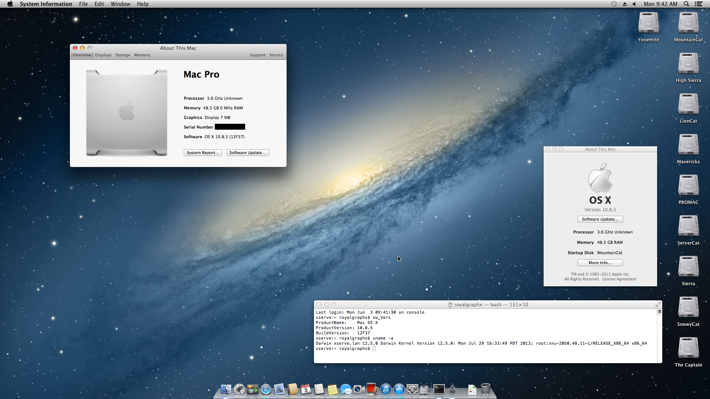</a>

<h2 align="center"><b>Mac OS X Lion</b></h2>
<h5 align="center"><i>Mac Pro (2010) - MacPro5,1</i></h5>

  <h3 align="center">
    10.7.5 - GTX 470 1280MB - x86_64
  </h3>
  <a href="">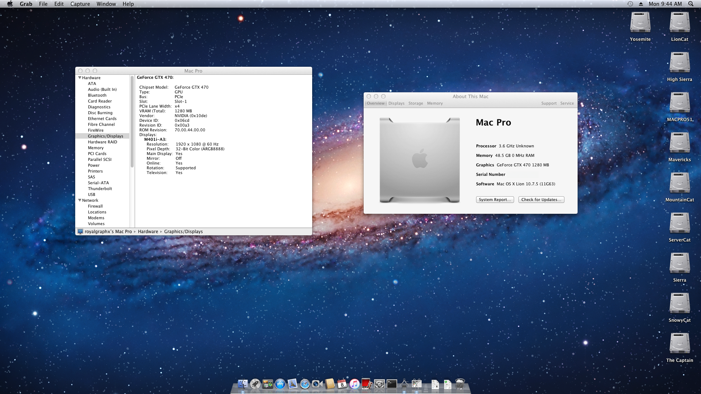</a>

<h2 align="center"><b>Mac OS X Snow Leopard</b></h2>
<h5 align="center"><i>Mac Pro (2010) - MacPro5,1</i></h5>
<h5 align="center"><i>Xserve Xeon (2009) - Xserve3,1</i></h5>
<h5 align="center"><i>Mac mini (2009) - Macmini3,1</i></h5>
<h5 align="center"><i>PowerMac G4 AGP (1999) - PowerMac3,1</i></h5>

  <h3 align="center">
    10.6.8 - ATI Radeon HD 5450 2GB - x86_64
  </h3>
  <a href="">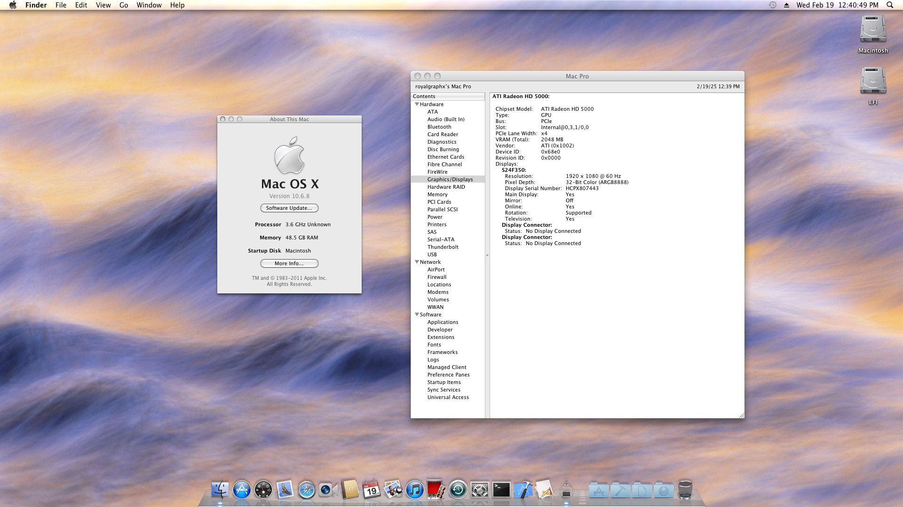</a>

  <h3 align="center">
    10.6.8 Server - ATI Radeon HD 5450 2GB - x86_64
  </h3>
  <a href="">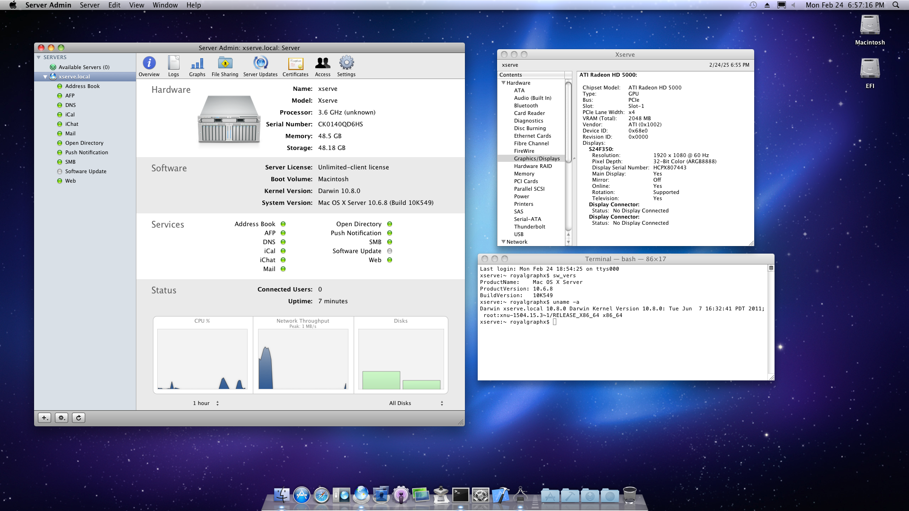</a>

  <h3 align="center">
    10.6.2 - AppleInternal Factory (10C540) - ATI Radeon HD 5450 2GB - i386
  </h3>
  <a href="">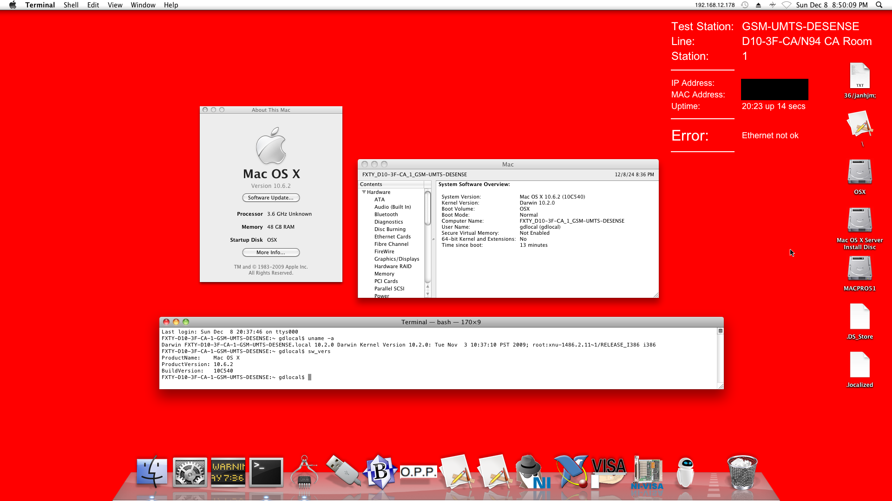</a>

  <h3 align="center">
    10.6 - Developer Preview 1 (10A190) - PowerPC
  </h3>
  <a href="">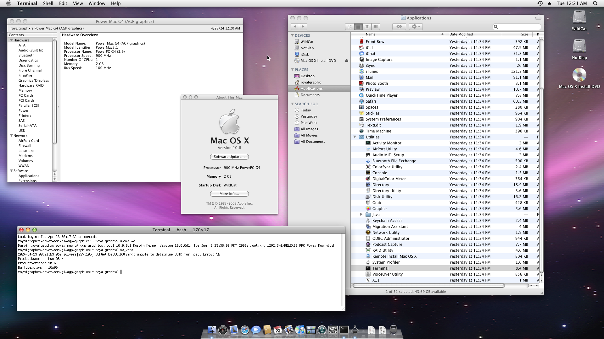</a>

<h2 align="center"><b>Mac OS X Leopard</b></h2>
<h5 align="center"><i>Mac Pro (2009) - MacPro4,1</i></h5>
<h5 align="center"><i>Mac Pro (2008) - MacPro3,1</i></h5>
<h5 align="center"><i>PowerMac G4 AGP (1999) - PowerMac3,1</i></h5>

  <h3 align="center">
    10.5.8 - VESA / VGA Graphics - i386
  </h3>
  <a href="">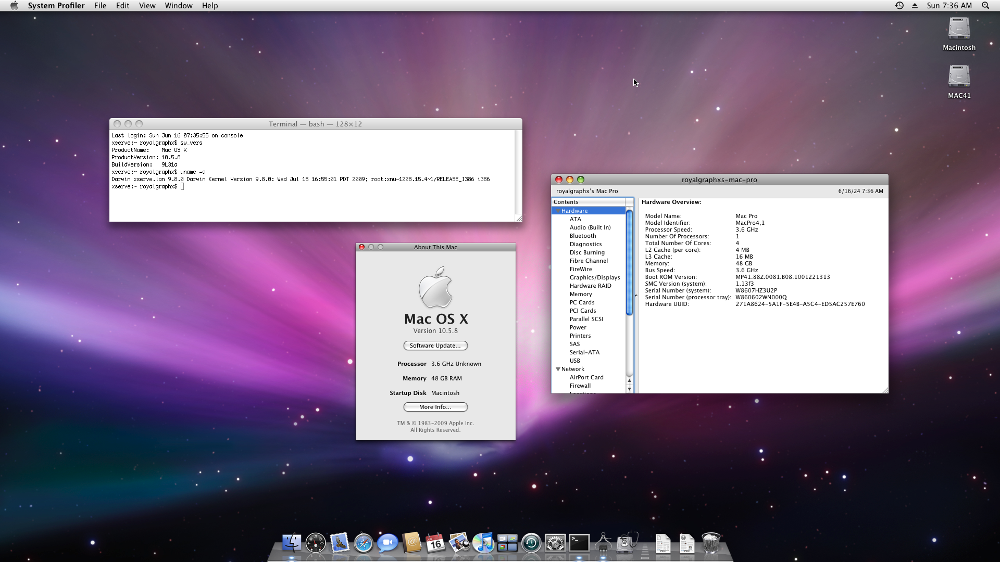</a>

  <h3 align="center">
    10.5.4 - VESA / VGA Graphics - PowerPC
  </h3>
  <a href="">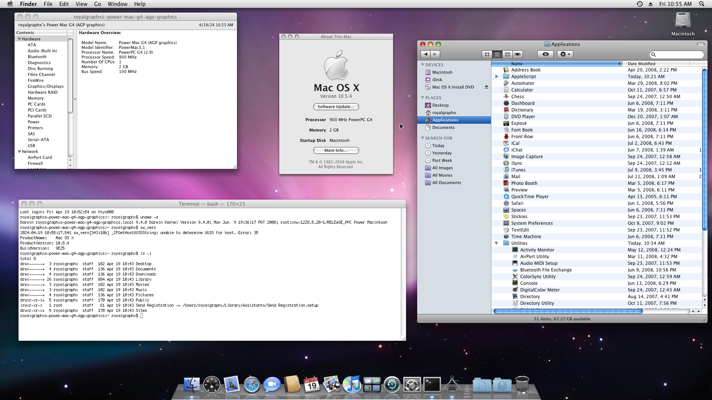</a>

  <h3 align="center">
    10.5 Server - VESA / VGA Graphics - i386
  </h3>
  <a href="">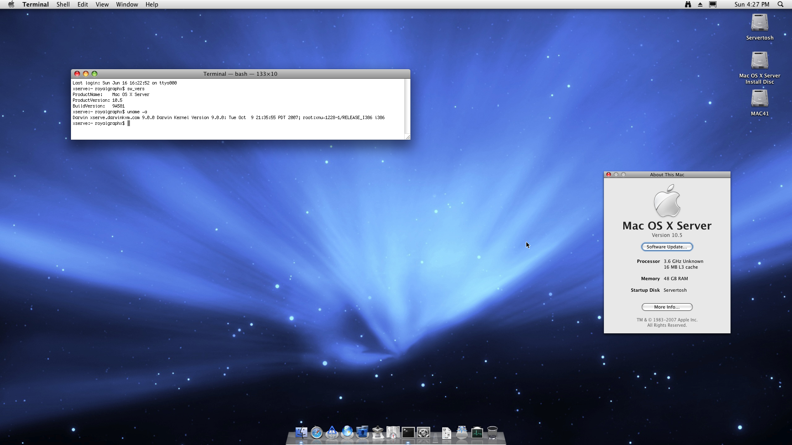</a>

<h2 align="center"><b>Mac OS X Tiger</b></h2>
<h5 align="center"><i>Mac Pro (2007) - MacPro2,1</i></h5>
<h5 align="center"><i>Mac Pro (2006) - MacPro1,1</i></h5>
<h5 align="center"><i>Apple Developer Transition Kit (2005) - ADP2,1</i></h5>
<h5 align="center"><i>PowerMac G4 AGP (1999) - PowerMac3,1</i></h5>

  <h3 align="center">
    10.4.11 - VESA / VGA Graphics - i386
  </h3>
  <a href="">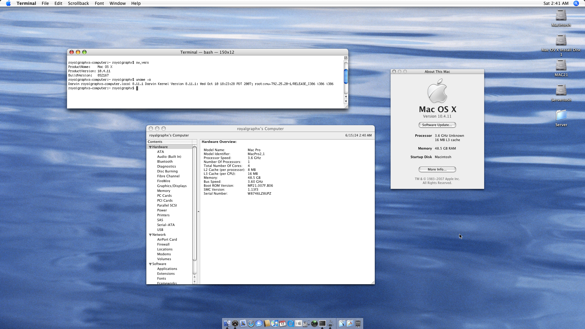</a>

  <h3 align="center">
    10.4.11 Server - VESA / VGA Graphics - i386
  </h3>
  <a href="">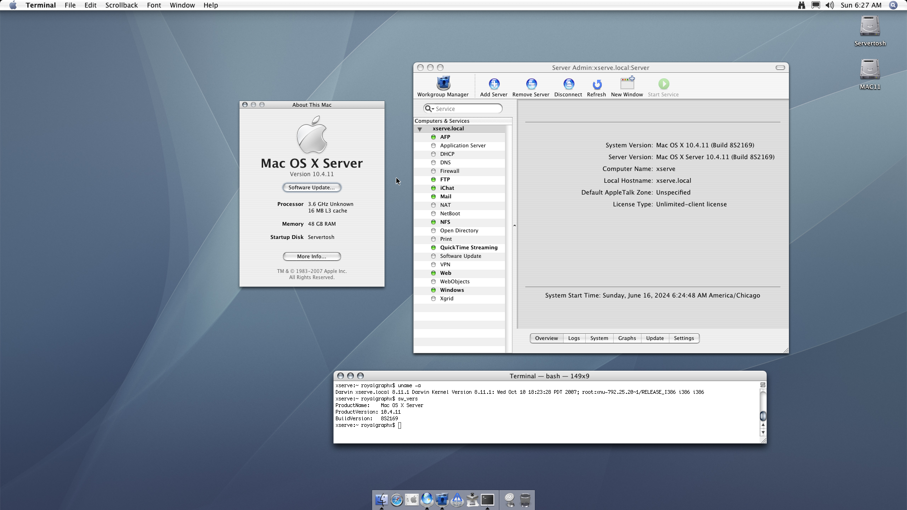</a>

  <h3 align="center">
    10.4.11 - VESA / VGA Graphics - PowerPC
  </h3>
  <a href="">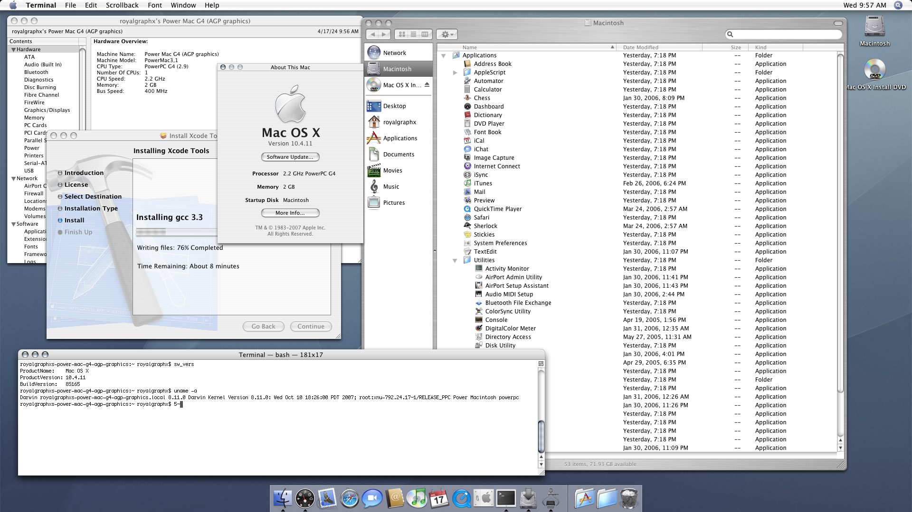</a>

  <h3 align="center">
    10.4.7 - VESA / VGA Graphics - i386
  </h3>
  <a href="">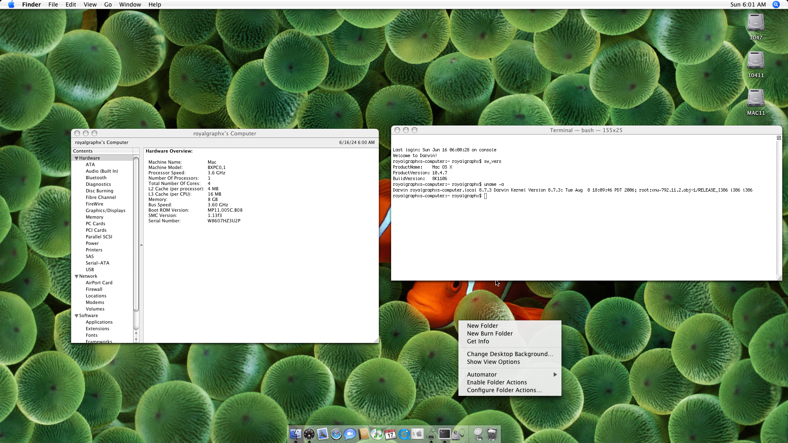</a>

  <h3 align="center">
    10.4.1 - Apple DTK Build 8B1025 - VESA / VGA Graphics - i386
  </h3>
  <a href="">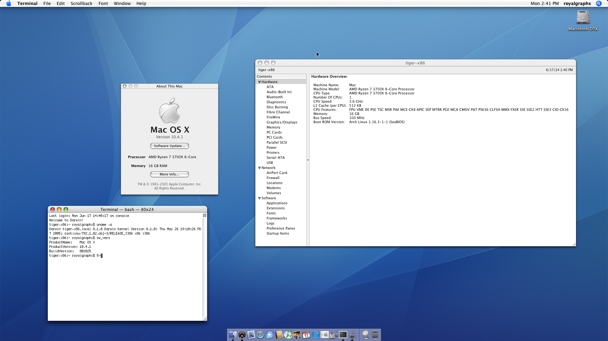</a>

<h2 align="center"><b>Mac OS X Panther</b></h2>
<h5 align="center"><i>PowerMac G4 AGP (1999) - PowerMac3,1</i></h5>

  <h3 align="center">
    10.3 - VESA / VGA Graphics - PowerPC
  </h3>
  <a href="">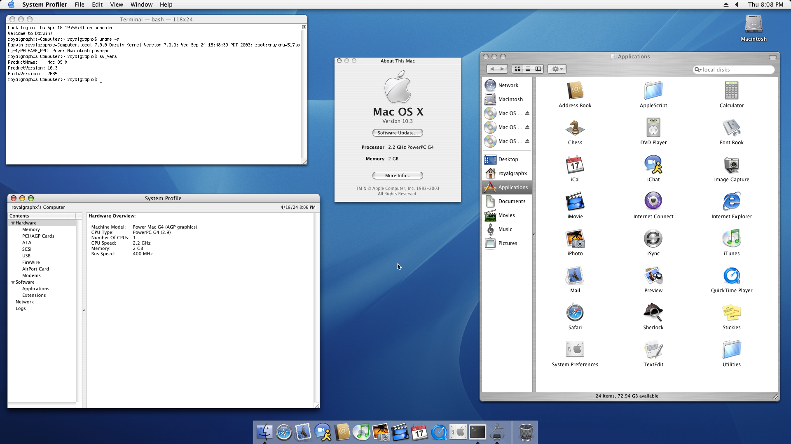</a>

<h2 align="center"><b>Mac OS X Jaguar</b></h2>
<h5 align="center"><i>PowerMac G4 AGP (1999) - PowerMac3,1</i></h5>

  <h3 align="center">
    10.2 - VESA / VGA Graphics - PowerPC
  </h3>
  <a href="">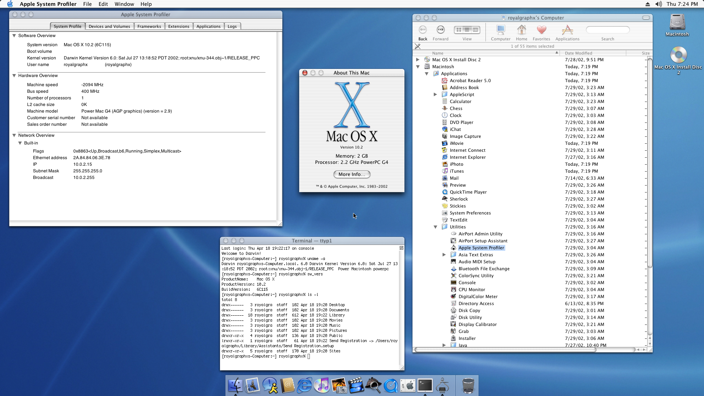</a>

<h2 align="center"><b>Mac OS X Puma</b></h2>
<h5 align="center"><i>PowerMac G4 AGP (1999) - PowerMac3,1</i></h5>

  <h3 align="center">
    10.1 - VESA / VGA Graphics - PowerPC
  </h3>
  <a href="">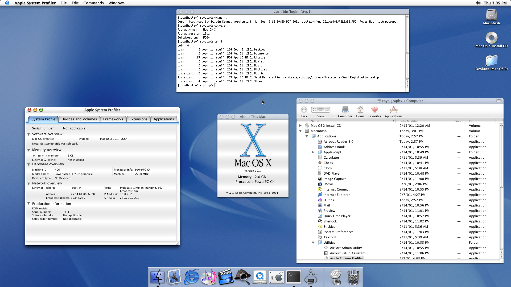</a>

<h2 align="center"><b>Mac OS X Cheetah</b></h2>
<h5 align="center"><i>PowerMac G4 AGP (1999) - PowerMac3,1</i></h5>

  <h3 align="center">
    10.0.3 - VESA / VGA Graphics - PowerPC
  </h3>
  <a href="">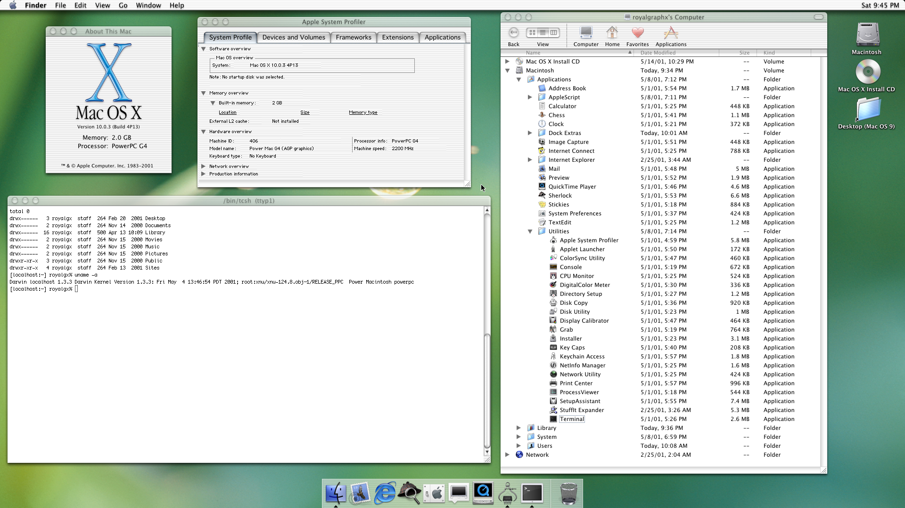</a>

 
 
 
<h1 align="center">Need Help?</h1>
 

  

<h4 align="center">If you run into any issues, you can join the <a href="https://discord.gg/RC53DvQd3j">DarwinKVM</a> Discord server! Feel free to ping the @Helpers role within a help channel for support. Hexley provides our discord users with a multitude of commands to assist anyone who may need specific actions performed. Such features that Hexley offers aim to speed up the process with command such as:</h4>

<h6 align="center">/genplatinfo - Generates PlatformInfo for a given Mac model</h6>
<h6 align="center">/checkcoverage - Allows to get a serial numbers Coverage status</h6>
<h6 align="center">/pci - Find PCI devices by vendor ID and device ID.</h6>
<h6 align="center">/usb - Find USB devices by vendor ID and device ID.</h6>
<h6 align="center">/link - Quickly link a URL for someone.</h6>
<h6 align="center">/time - Displays the time of a given user.</h6>

 

<h1 align="center">Contributing to the Documentation</h1>
 

  

<h4 align="center">If you have any changes or improvements you'd like to contribute for review and merge, to update misinformation or outdated information, as well as maybe even adding whole new pages, you can follow the general outline below to get a local copy of the documentation running.</h4>
<h6 align="center">Instructions written for macOS hosts but is adoptable to other OSs.</h6>

 

1. Install/Update ``brew`` 
   - Visit https://brew.sh/ for instructions and information.

2. Install/Update ``ruby``
   - Once ``brew`` is installed, you can run ``brew install ruby`` in your terminal.
   - If using ZSH (any recent versions of macOS) Be sure to read the post install text as it suggest you should run the following command to export to PATH:
      - ``echo 'export PATH="/usr/local/opt/ruby/bin:$PATH"' >> ~/.zshrc``
      - Restart Terminal for changes to apply.

3. Install/Update ``gem`` and ``bundler``
   - Run ``gem update`` in your terminal window.
   - Run ``gem install bundler`` in your terminal window.

4. Fork DarwinKVM, git clone your fork, navigate to Docs directory.
   - ``git clone --recursive git@github.com:yourusername/DarwinKVM.git``
   - ``cd DarwinKVM/docs``

5. Installing Docs dependencies, and running the server.
   - Run ``bundle install`` in your terminal window.
   - Running ``bundle exec jekyll serve --incremental`` will build and run a live copy of the DarwinKVM docs on port 4000 by default.
   - To change the port, you can specify the IP address and port to run on, allowing local mobile devices to also connect and preview DKVM Docs.
      - ``bundle exec jekyll serve --host YOUR_IP_ADDRESS --port PORT --incremental``

<h4 align="center">You'll now be able to see the changes you make update live so you can work quickly and preview the final look of your Markdown files easily. Once you are done making your changes you can then proceed to submit a Pull Request for review, and eventual merge to Main.</h4>
<h6 align="center">A big thanks to all contributors and future contributors! ꩓</h6>
