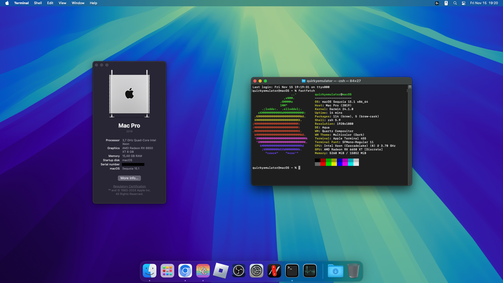
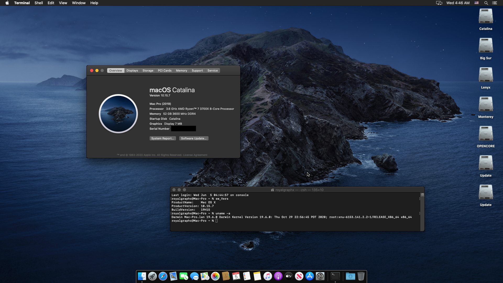
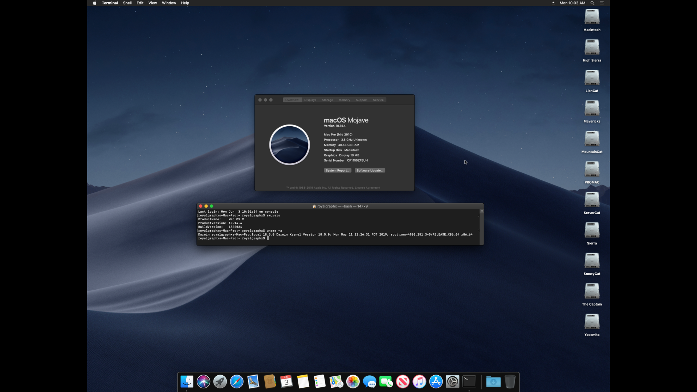
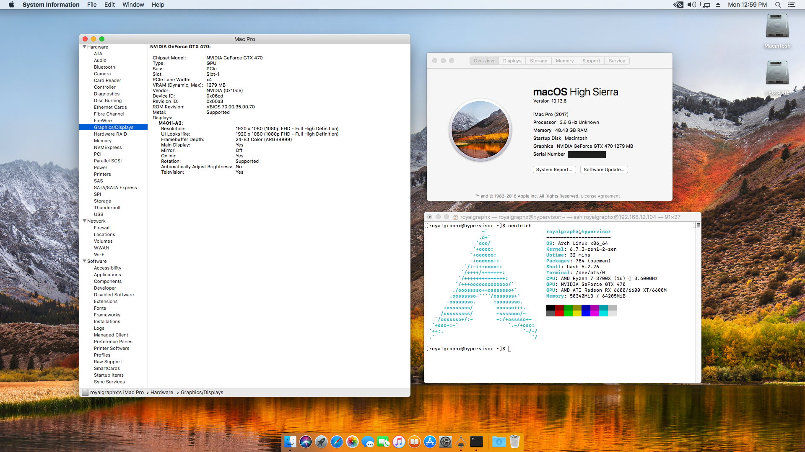
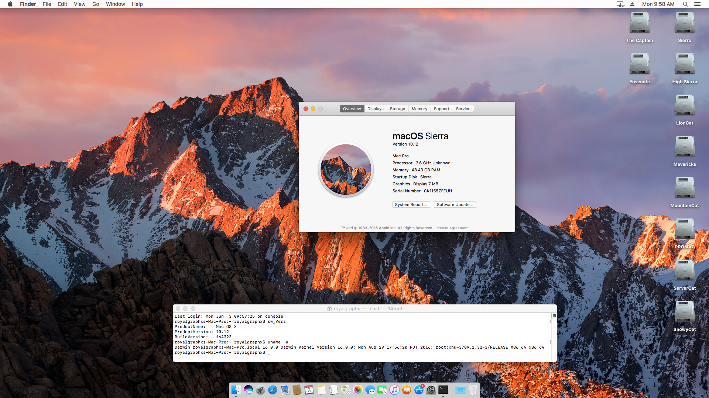
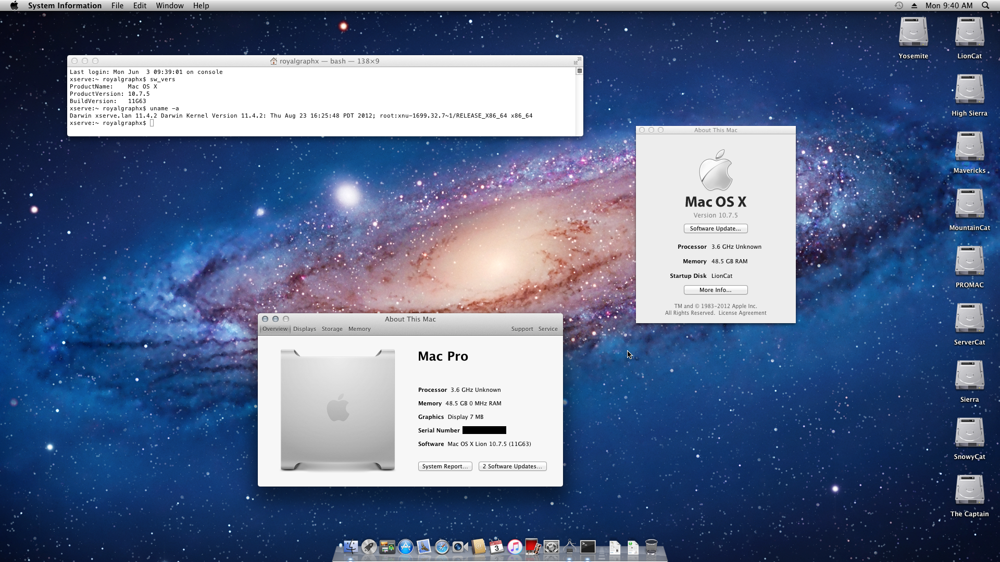
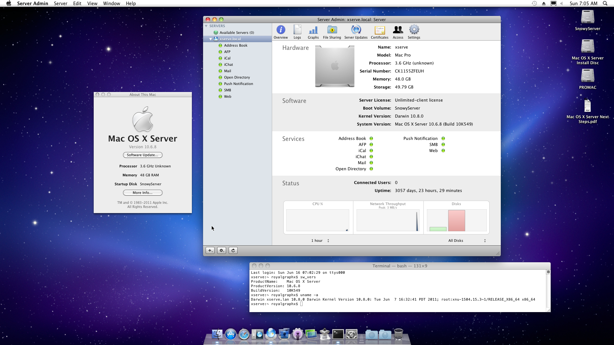
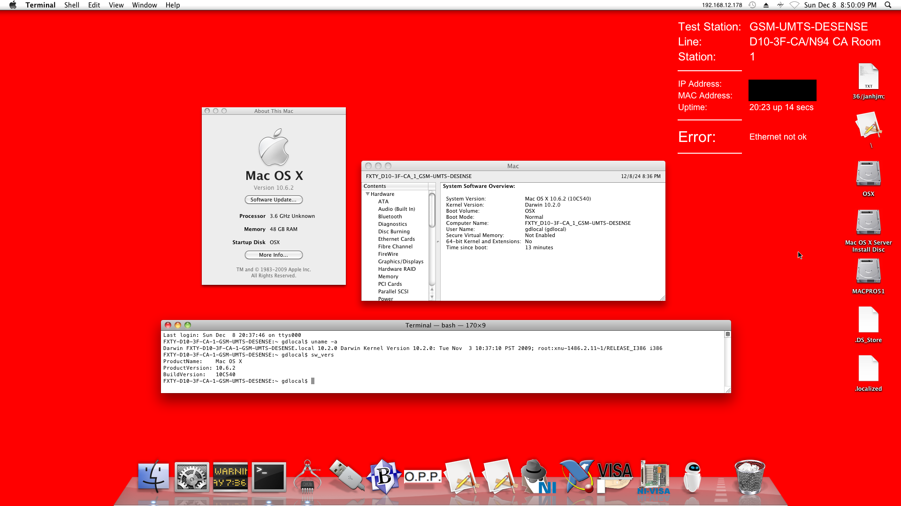
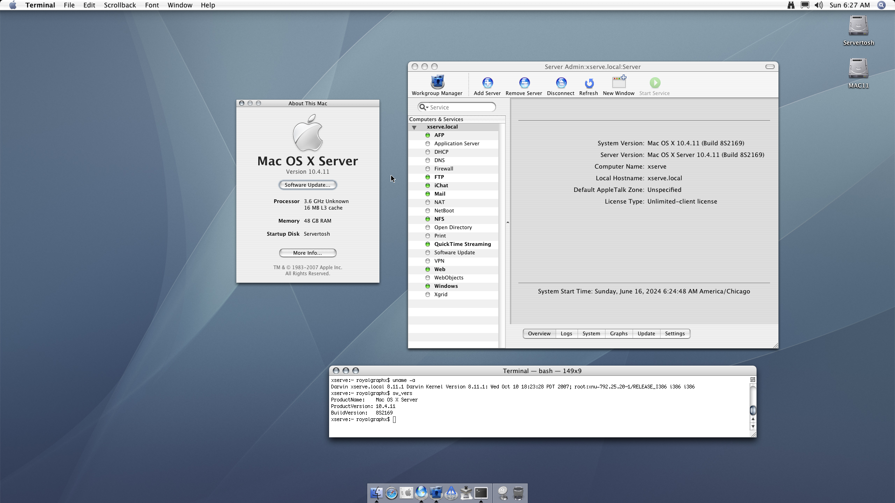
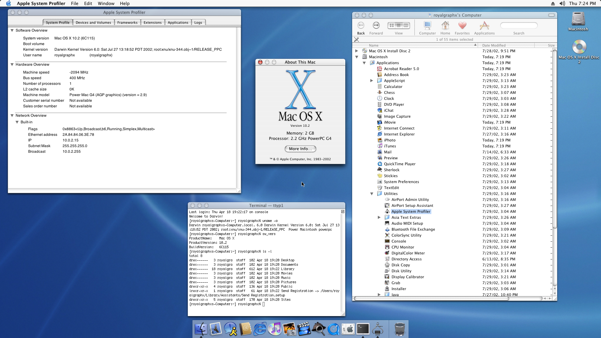

  

  

<h3 align="center">An Advanced Guide for running macOS within QEMU/KVM</h3>
<h5 align="center">EFI guides, GPU Passthrough guides, Display Overrides for incompatible monitors, Custom Memory Mapping, Custom USB Mapping, Fake Core Count for incompatible CPU Topology, Host CPU Overclocking, Host Network Bridge for VM visibility, AMD GPU Zero-RPM Disable and custom sPPT Fan Curve, as well as many more advanced tutorials ready to further perfect your macOS experience!</h5>

<h3 align="center">This is the git repo, follow the guide <a href="https://docs.darwinkvm.com/">here!</a></h2>
<h5 align="center">PATIENCE! This is NOT a Pre-Built EFI! You are responsible for creating it!</h5>

 

  

<h3 align="center">macOS Sonoma 15.1.1 (Credits: @athleticat)</h3>

  

<h3 align="center">macOS Sonoma 15.1 (Credits: @f0xb4t)</h3>

  

<h3 align="center">macOS Sequoia 15.0 Beta 1</h3>

  
  

<h3 align="center"></h3>

  

<h3 align="center">macOS Sonoma 14.5</h3>

  

<h3 align="center">macOS Sonoma 14.4 Beta</h3>

  

<h3 align="center">macOS Sonoma 14.3</h3>

  

<h3 align="center">macOS Sonoma 14.2.1 (Credits: @heliokroger)</h3>

  

<h3 align="center">macOS Sonoma 14.1</h3>

  

<h3 align="center">macOS Sonoma 14.1 (Credits: @Haxi0)</h3>

  

<h3 align="center">macOS Sonoma 14.0</h3>

  

<h3 align="center">macOS Ventura 13.5.1</h3>

  

<h3 align="center">macOS Ventura 13.5 + NVIDIA GPU (Credits: @Zormeister)</h3>

  

<h3 align="center">macOS Ventura 13.5 (Credits: @Rowlul)</h3>

  

<h3 align="center">macOS Ventura 13.4</h3>

  

<h3 align="center">macOS Monterey 12.7.5</h3>

  

<h3 align="center">macOS Big Sur 11.7.10</h3>

  

<h3 align="center">macOS Big Sur 11.0.0 Developer Preview 1 (20A4299v)</h3>

  

<h3 align="center">Mac OS X 10.16 (AppleInternal GoldenGateSpike 20A2314a)</h3>

  

<h3 align="center">Mac OS X Catalina 10.15.7</h3>

  

<h3 align="center">Mac OS X Mojave 10.14.4</h3>

  

<h3 align="center">Mac OS X High Sierra 10.13.6</h3>

  

<h3 align="center">Mac OS X Sierra 10.12.5 (AppleInternal Phoenix 16F5049f)</h3>

  

<h3 align="center">Mac OS X Sierra 10.12</h3>

  

<h3 align="center">Mac OS X El Capitan 10.11.6</h3>

  

<h3 align="center">Mac OS X Yosemite 10.10</h3>

  

<h3 align="center">Mac OS X Mavericks 10.9.5</h3>

  

<h3 align="center">Mac OS X Mountain Lion 10.8.5</h3>

  

<h3 align="center">Mac OS X Lion 10.7.5</h3>

  

<h3 align="center">Mac OS X Snow Leopard 10.6.8 on x86_64</h3>

  

<h3 align="center">Mac OS X Server Snow Leopard 10.6.8 on x86_64</h3>

  

<h3 align="center">Mac OS X Snow Leopard 10.6.2 on i386 (AppleInternal Factory Mac Mini)</h3>

  

<h3 align="center">Mac OS X Snow Leopard Developer Preview 10A190 (10.6) on PowerPC</h3>

  

<h3 align="center">Mac OS X Leopard 10.5.8 on x86_64</h3>

  

<h3 align="center">Mac OS X Server Leopard 10.5 on x86_64</h3>

  

<h3 align="center">Mac OS X Leopard 10.5.4 on PowerPC</h3>

  

<h3 align="center">Mac OS X Tiger 10.4.11 on x86_64</h3>

  

<h3 align="center">Mac OS X Server Tiger 10.4.11 on x86_64</h3>

  

<h3 align="center">Mac OS X Tiger 10.4.7 on x86_64</h3>

  

<h3 align="center">Mac OS X Tiger 10.4.1 (8B1025, ADP2,1) on x86_64</h3>

  

<h3 align="center">Mac OS X Tiger 10.4.11 on PowerPC</h3>

  

<h3 align="center">Mac OS X Panther 10.3</h3>

  

<h3 align="center">Mac OS X Jaguar 10.2</h3>

  

<h3 align="center">Mac OS X Puma 10.1</h3>

  

<h3 align="center">Mac OS X Cheetah 10.0.3</h3>

  

 

<h1 align="center">Need Help?</h1>
 

  

<h4 align="center">If you run into any issues, you can join the <a href="https://discord.gg/ryQFC8Vk7b">DarwinKVM</a> Discord server! Feel free to ping the @Helpers role within a help channel for support. Hexley provides our discord users with a multitude of commands to assist anyone who may need specific actions performed. Such features that Hexley offers aim to speed up the process with command such as:</h4>

<h6 align="center">/genplatinfo - Generates PlatformInfo for a given Mac model</h6>
<h6 align="center">/checkcoverage - Allows to get a serial numbers Coverage status</h6>
<h6 align="center">/pci - Find PCI devices by vendor ID and device ID.</h6>
<h6 align="center">/usb - Find USB devices by vendor ID and device ID.</h6>
<h6 align="center">/link - Quickly link a URL for someone.</h6>
<h6 align="center">/time - Displays the time of a given user.</h6>

 

<h1 align="center">Contributing to the Documentation</h1>

<h4 align="center">If you have any changes or improvements you'd like to contribute for review and merge, to update misinformation or outdated information, as well as maybe even adding whole new pages, you can follow the general outline below to get a local copy of the documentation running.</h4>
<h6 align="center">Instructions written for macOS hosts but is adoptable to other OS's.</h6>

 

1. Install/Update ``brew`` 
   - Visit https://brew.sh/ for instructions and information.

2. Install/Update ``ruby``
   - Once ``brew`` is installed, you can run ``brew install ruby`` in your terminal.
   - If using ZSH (any recent versions of macOS) Be sure to read the post install text as it suggest you should run the following command to export to PATH:
      - ``echo 'export PATH="/usr/local/opt/ruby/bin:$PATH"' >> ~/.zshrc``
      - Restart Terminal for changes to apply.

3. Install/Update ``gem`` and ``bundler``
   - Run ``gem update`` in your terminal window.
   - Run ``gem install bundler`` in your terminal window.

4. Fork DarwinKVM, git clone your fork, navigate to Docs directory.
   - ``git clone --recursive git@github.com:yourusername/DarwinKVM.git``
   - ``cd DarwinKVM/docs``

5. Installing Docs dependencies, and running the server.
   - Run ``bundle install`` in your terminal window.
   - Running ``bundle exec jekyll serve --incremental`` will build and run a live copy of the DarwinKVM docs on port 4000 by default.
   - To change the port, you can specify the IP address and port to run on, allowing local mobile devices to also connect and preview DKVM Docs.
      - ``bundle exec jekyll serve --host YOUR_IP_ADDRESS --port PORT --incremental``

<h4 align="center">You'll now be able to see the changes you make update live so you can work quickly and preview the final look of your Markdown files easily. Once you are done making your changes you can then proceed to submit a Pull Request for review, and eventual merge to Main.</h4>
<h6 align="center">A big thanks to all contributors and future contributors! ꩓</h6>
