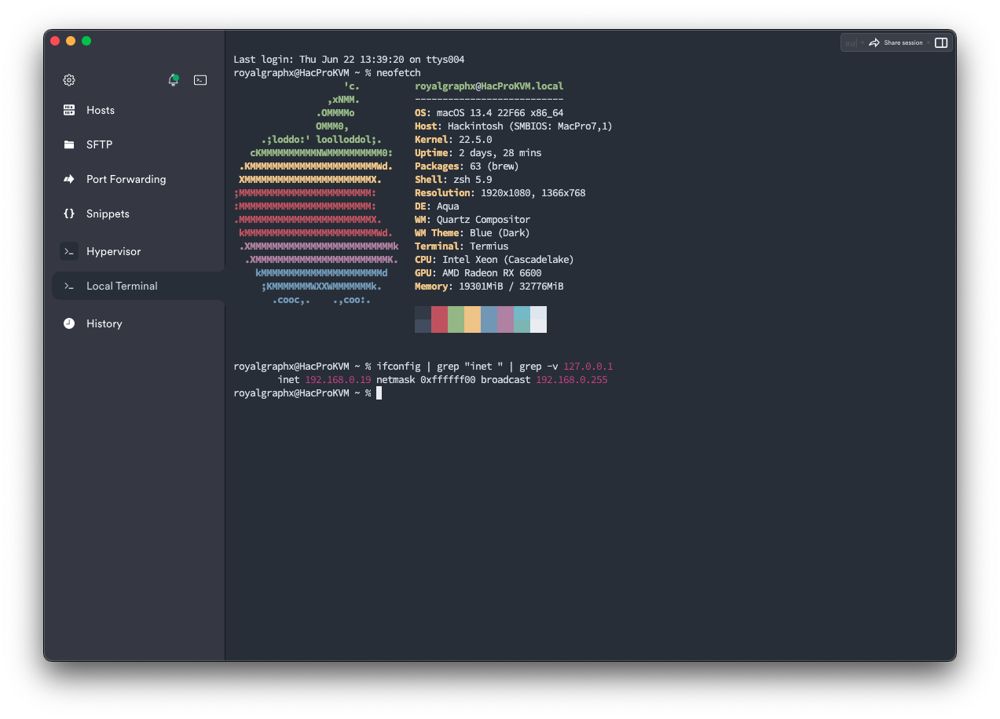
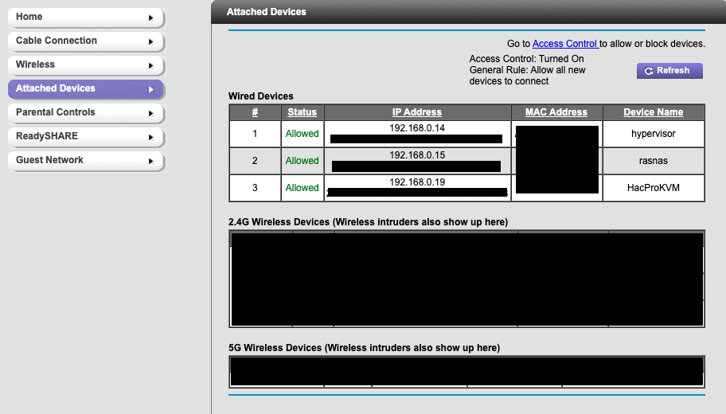
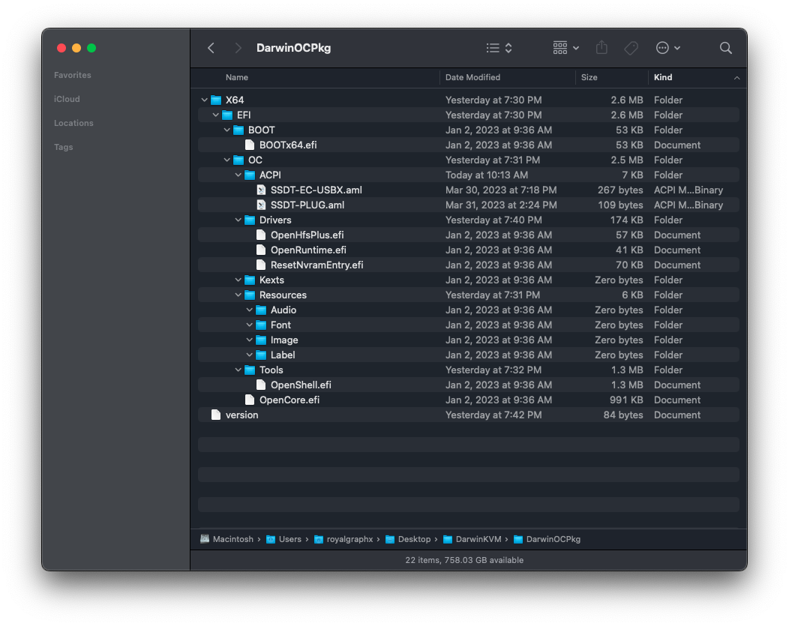
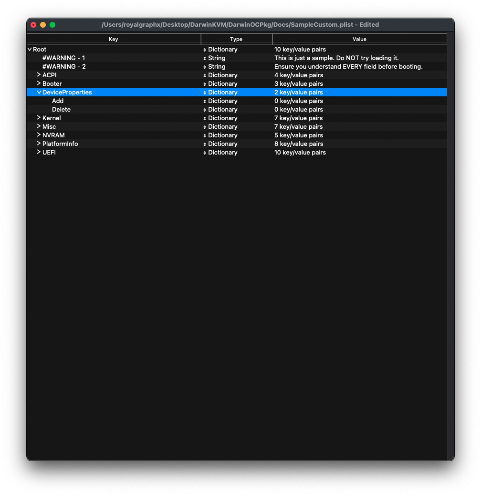
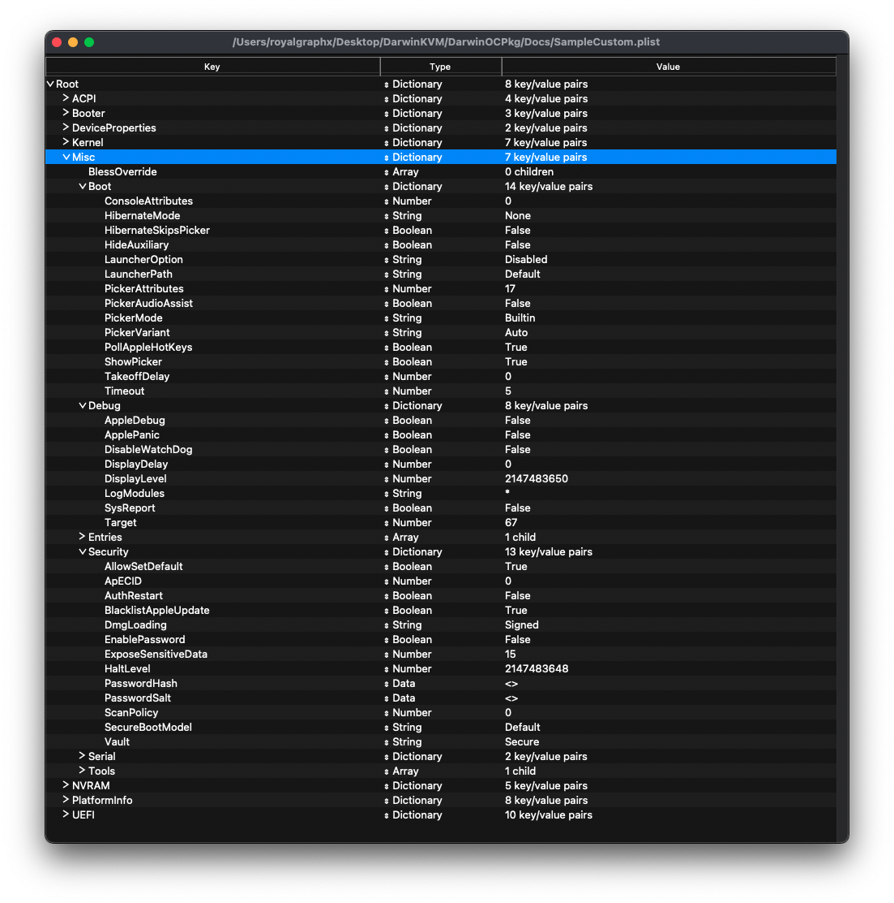
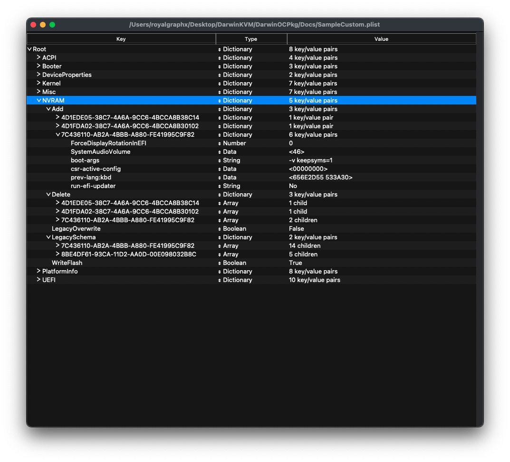

<p align="center">
  
</p>

<h1 align="center">An Advanced Template for running macOS within QEMU/KVM</h1>
<h4 align="center">Features: Clean EFI Template for maximum customizability before boot, Compatibility with RisingPrism's Single GPU Passthrough, DisplayOverrides for repairing incompatible monitors, Custom Memory Mapping, Custom USB Mapping, Fake Core Count for incompatible CPU Topology, Host CPU Overclocking, Host Network Bridge for VM visibility, AMD GPU Zero-RPM Disable and custom sPPT Fan Curve! as well as many more advanced tutorials ready to further perfect your experience!</h4>

### Requirements

* A compatible graphics card. <b>This is a must, don't bother if you're not getting GPU Accel.</b> please reference this [list](https://dortania.github.io/GPU-Buyers-Guide/) to verify.
  * There are some exceptions, if you're crazy and want to use a legacy NVIDIA GPU, please reference this [list](https://elitemacx86.com/threads/nvidia-gpu-compatibility-list-for-macos.614/) to check macOS/OCLP compatibility. If it's supported, there is a section down for Legacy NVIDIA Patching.

* A modern Linux distribution. E.g. Arch Based for the latest packages, my personally tested and working are:
  * EndeavourOS
  * ArcoLinuxB Plasma
  * Pure Arch

* A CPU with Intel VT-x / AMD SVM support is required (`grep -e vmx -e svm /proc/cpuinfo`)

* A CPU with SSE4.1 support is required for >= macOS Sierra

* A CPU with AVX2 support is required for >= macOS Mojave

* Previous experience creating an EFI for your bare metal system and/or reading/understanding the [Dortania OpenCore Guide](https://dortania.github.io/OpenCore-Install-Guide/)

* Various Software/Packages, some optional, some not:
  * qemu
  * libvirtd/virtmanager
  * Python 3 installed with the tkinter package
  * dmg2img
  * qemu-img
  * [RisingPrism's Single GPU Passthrough Scripts](https://gitlab.com/risingprismtv/single-gpu-passthrough)
  * [ProperTree](https://github.com/corpnewt/ProperTree)
  * [GenSMBios](https://github.com/corpnewt/GenSMBIOS)
  * [Hackintool](https://github.com/benbaker76/Hackintool)
  * [SSDTTime](https://github.com/corpnewt/SSDTTime)

<br>

* <b>PATIENCE! This is NOT a Pre-Built EFI! You are responsible for completing it!</b>

</br>
<h1 align="center">Table of Contents</h1>

- What is this for?

- Who is this for?

- Host Preparations
  - Part 1 - BIOS Settings
  - Part 2 - GRUB Configuration
  - Part 3 - Bridge Networking
  - Part 4 - Package Installation
  - Part 5 - Libvirtd Configuration
    - A. Modifying Files
    - B. Libvirt Services

- OpenCore Configuration
  - Part 0 - Image Creation
  - Part 1 - ACPI Tables
  - Part 2 - Drivers
  - Part 3 - Kexts
  - Part 4 - Tools

- Config.plist Configuration
  - Part 0 - Required Tools / Brief Overview
  - Part 1 - ACPI
  - Part 2 - Booter
  - Part 3 - Device Properties
  - Part 4 - Kernel
  - Part 5 - Misc
  - Part 6 - NVRAM
  - Part 7 - Platform Info
  - Part 8 - UEFI


</br>
<h1 align="center">What is this for?</h1>

This repository and its contents are to be a continuation of my work on [LegacyOSXKVM](https://github.com/royalgraphx/LegacyOSXKVM). The goal of that project was to allow anyone to quickly revisit some of their favorite versions of Mac OS X as it was known to many for years with its various releases. Snow Leopard was the main focus of that project, and as such had the most effort put into it. Nowadays we need to be on modern versions of macOS to enjoy the latest and greatest offered from Apple. The focus has now shifted to providing an Up-to-Date, Out of Box (OOB), Clean Template for creating Virtual Machines of the latest versions offered by Apple. As of writing this, you can create a powerful VM of macOS Ventura, Monterey, and even Sonoma works. The guides in this repository will help you continuously work on your virtual machine to make it the perfect experience. Things will not work right away, you will slowly keep fixing them as you discover what must be fixed.

</br>
<h1 align="center">Who is this for?</h1>

This is for experienced users. You should already be familiar with 3 core concepts: [Virtualization](https://libvirt.org/)/[QEMU](https://www.qemu.org/docs/master/), [OpenCore](https://dortania.github.io/OpenCore-Install-Guide/), and [macOS](https://en.wikipedia.org/wiki/MacOS). If you feel as though you are not up to speed on any of these concepts, please take the time to first gain adequate knowledge as it will vastly improve your chances of having a working system you can daily drive. This guide is written completely from my perspective as I've learned throughout my time in the Hackintosh community. What you would typically do if you wanted to run macOS on your system you would have to use the OpenCore bootloader to provide macOS with the necessary information it needs. A Virtual Machine is no different. In theory, what we are simply doing is creating an OpenCore disk image that acts as if it were the equivalent of a USB or an EFI partition post-installation. While there exist many projects that utilize QEMU/KVM, for daily driving you must have a compatible GPU. What this means for the user of any projects that are seen as the equivalent to "Prebuilt EFI's" is that there is no learning involved. This causes the user to not understand why certain things are broken on their system and possibly may never fix those issues, potentially leaving them in the background. This guide is for those who are looking to properly create a macOS Virtual Machine from the ground up. <b>PLEASE READ CAREFULLY.</b> Try not to ask for support before rereading, many times you will misread something on accident or are simply not paying enough attention to what it's instructing you to do. 

<br>
<h1 align="center">Host Preparations</h1>

<h2 align="center"><b>Part 1:</b> BIOS Settings</h2>
<h4 align="center">Will depend on your Host Hardware.</h4>
<h4 align="center">This section has been derived from the <a href="https://gitlab.com/risingprismtv/single-gpu-passthrough/-/wikis/1)-Preparations">Preparations</a> section via <a href="https://gitlab.com/risingprismtv/single-gpu-passthrough/-/wikis/home">RisingPrism</a>.</h4>
<br>

Depending on your machine's CPU, you need to enable certain settings in your BIOS for your passthrough to succeed. Enable the settings listed in this table:

<br>

| AMD  | Intel |
| ---- | ----- |
| IOMMU | VT-D |
| NX Mode | VT-X |
| SVM Mode | No Equivalent |

<br>

<b>Note for Intel:</b> You may not have both options, in that case, just enable the one available to you.
If you do not have any virtualization settings, like said before make sure your BIOS is up to date, and that your CPU and motherboard support virtualization.

<br>
<br>
<br>

<h2 align="center"><b>Part 2:</b> GRUB Configuration</h2>
<h4 align="center">Enabling flags needed for Virtualization/QEMU/KVM/libvirtd</h4>
<h4 align="center">This section has been derived from the <a href="https://gitlab.com/risingprismtv/single-gpu-passthrough/-/wikis/2)-Editing-GRUB">Editing GRUB</a> section via <a href="https://gitlab.com/risingprismtv/single-gpu-passthrough/-/wikis/home">RisingPrism</a>.</h4>
<br>

<br>

Start by using your favorite terminal text editor. In this example, we'll be using nano.

```
sudo nano /etc/default/grub
```

We'll need to check our GRUB CMD Line flags and add various ones depending on the users' hardware.

| AMD / AMD GPU  | Intel CPU | Needed Regardless|
| ---- | ----- | ----- |
| amd_iommu=on | intel_iommu=on | iommu=pt |
| video=efifb:off |  |  |

Example GRUB configuration for an AMD CPU host.

```
amd_iommu=on iommu=pt video=efifb:off
```

When you're done make sure you use ``grub-mkconfig`` to update the GRUB Bootloader. Restart Required.

```
sudo grub-mkconfig -o /boot/grub/grub.cfg
```

<br>
<br>

<h2 align="center"><b>Part 3:</b> Bridge Networking</h2>
<h4 align="center">Creation of the Bridge interface for your DKVM.</h4>
<h4 align="center">This section has been derived from the <a href="https://github.com/royalgraphx/DarwinKVM/tree/main/BridgeNetworking">Bridge Networking</a> Submodule.</h4>
<br>

<br>

<h3 align="center"><b>Overview</b></h3>

<br>

First things first, I highly recommend you take the time out of your day to not skip this process, just as you shouldn't skip over any other steps. To understand the point of a network bridge, you'll need to know that when you use QEMU or Virt-Manager to start a Virtual Machine with networking, you will typically be using the default network provided by libvirt. This creates its own DHCP server, meaning that our Machines are created with IP addresses such that, we see "192.168.68.2" or something along those lines, which does not match up with our local IPs on our broader network. The point of setting this Bridge interface up is to strip our ethernet controller of an assigned IP address and stop any other Network Managers that may be present on the users' system so that we can leverage systemd-networkd to automate the bridge creation. What it simply does, is create a new interface named "br0". It then modifies the users' current ethernet interface to "master br0", meaning that br0 is now providing the information to the users' physical ethernet interface. We then give br0 an IP address via DHCP using ipv4. When we use Virt-Manager in this configuration, we can use a bridge interface, we set it to ``br0`` and the result is our Virtual Machines now appear on the broader network as physical, real devices. Allowing SSH via and to any other devices on the LAN.

<br>

<h2 align="center"><b>A. Goal Examples</b></h2>

<br>

<h3 align="center">This is the guest macOS talking to devices on the broader network.</h3>

<p align="center">
  
</p>

<p align="center">
  
</p>

<p align="center">
  
</p>

<p align="center">
  
</p>

<br>

<h2 align="center"><b>B. Prerequisites to the script</b></h2>

<br>

In my opinion, this is the number one step to set up practically right after the installation of a new host operating system. Allowing your virtual machines to be visible to the broader network may seem like something you can ignore, and while you very well can... I enjoy my Virtual Machines appearing as real, physical ethernet devices. The most popular and commonly used package for managing your network connection will most likely be "NetworkManager", and this can be checked by issuing a systemctl command to check the status.

```
sudo systemctl status NetworkManager
```

If you see that it is running, you can choose to stop it but for this guide, we'll be making use of the DKVM Bridge Networking submodule. It contains a script that will quickly go through a few checks and create a bridge interface for your use. You must have systemd in some form, install it prior or check your system for systemd-networkd with the following command.

```
sudo systemctl status systemd-networkd
```

For more information and the completion of this section, refer to [Bridge Networking](https://github.com/royalgraphx/DarwinKVM/tree/main/BridgeNetworking).


<br>
<br>

<h2 align="center"><b>Part 4:</b> Package Installation</h2>
<h4 align="center">Package requirements for base DKVM.</h4>
<h4 align="center">This section has been derived from the <a href="https://gitlab.com/risingprismtv/single-gpu-passthrough/-/wikis/4)-Configuration-of-libvirt">Configuration of libvirt
</a> section via <a href="https://gitlab.com/risingprismtv/single-gpu-passthrough/-/wikis/home">RisingPrism</a>.</h4>
<br>

Since everything in this guide is outlined for simply Arch, you may need to find the package equivalent to your system. Here is the command to install all required packages.

```
sudo pacman -S virt-manager qemu vde2 ebtables iptables-nft nftables dnsmasq bridge-utils ovmf
```

Please note: Conflicts may happen when installing these programs.
A warning like the below example may appear in your terminal:

```
iptables and iptables-nft are in conflict. Remove iptables? [y/N]
```

If you do encounter this kind of message, press y and enter to continue the installation.

<br>
<br>

<h2 align="center"><b>Part 5:</b> Libvirtd Configuration</h2>
<h4 align="center">Necessary changes to use Virt-Manager via User.</h4>
<h4 align="center">This section has been derived from the <a href="https://gitlab.com/risingprismtv/single-gpu-passthrough/-/wikis/4)-Configuration-of-libvirt">Configuration of libvirt
</a> section via <a href="https://gitlab.com/risingprismtv/single-gpu-passthrough/-/wikis/home">RisingPrism</a>.</h4>
<br>

<br>

<h2 align="center"><b>A. Modifying Files</b></h2>

<br>

There are two files we must edit. Please make the changes accordingly. Not too much to say, follow this step-by-step and you'll be fine along with getting logs printed.

<br>

Use your favorite text editor to make the following changes:
```
/etc/libvirt/libvirtd.conf
```

``Read/Write permissions and Group - Uncomment the following lines.``

```
unix_sock_group = "libvirt"
unix_sock_rw_perms = "0770"
```

``Logging - Add to the very bottom.``

```
log_filters="3:qemu 1:libvirt"
log_outputs="2:file:/var/log/libvirt/libvirtd.log"
```

<br>
<br>

Use your favorite text editor to make the following changes:
```
/etc/libvirt/qemu.conf
```

``Read/Write permissions and Group - Uncomment and Edit the following lines.``

```
user = "root"
group = "root"

To username:

user = "royalgraphx"
group = "royalgraphx"
```

<br>

<h2 align="center"><b>B. Libvirtd Services</b></h2>

<br>

You now need to add your user to the libvirt group, to allow libvirt to write files properly.

```
sudo usermod -a -G kvm,libvirt $(whoami)
```

Now enable, start, and restart the libvirtd Service to fully apply changes.

```
sudo systemctl enable libvirtd
sudo systemctl start libvirtd
sudo systemctl restart libvirtd
```


<br>
<h1 align="center">OpenCore Configuration</h1>
<h2 align="center">Current OpenCorePkg supported: 0.8.8</h2>
<p align="center">
  
</p>

<h2 align="center"><b><span style="color:red">Part 0:</span></b> Image Creation</h2>
<h4 align="center">Creation of the OpenCore .img for your DKVM.</h4>
<h4 align="center">This section has been derived from the <a href="https://github.com/royalgraphx/DarwinKVM/tree/main/OpenCore">OpenCore</a> Submodule.</h4>
<br>

```
This tool automates the process of creating and setting up an OpenCore.img disk image for use with QEMU. It also comes with mount.sh and unmount.sh to easily modify the contents.
```

Don't skip this section. To continue in this guide you will need an image file that will act as our OpenCore USB, holding all its contents. The fastest way to do this is by changing the directory into the OpenCore folder in this repository. You can quickly generate and mount a 1GB ``.img`` file to add to your Virtual Machine later. If you need any help understanding this section, please refer to the [README.md](https://github.com/royalgraphx/DarwinKVM/tree/main/OpenCore) for better context. You can now go ahead and transfer the EFI folder from [DarwinOCPkg](https://github.com/royalgraphx/DarwinKVM/tree/main/DarwinOCPkg) to the root of the image. The rest of the steps will outline adding the necessary files to build your EFI for your Virtual Machine.

<br>
<h2 align="center"><b>Part 1:</b> ACPI Tables</h2>
<h4 align="center">This section has been derived from the <a href="https://dortania.github.io/Getting-Started-With-ACPI/">Getting Started with ACPI</a> guide. It may be out of date.</h4>
<br>

``So what are DSDTs and SSDTs? Well, these are tables present in your firmware that outline hardware devices like USB controllers, CPU threads, embedded controllers, system clocks and such. A DSDT(Differentiated System Description Table) can be seen as the body holding most of the info with smaller bits of info being passed by the SSDT(Secondary System Description Table). You can think of the DSDT as the building blueprints with SSDTs being sticky notes outlining extra details to the project.``

You can read more about ACPI and it's specs [here](https://uefi.org/sites/default/files/resources/ACPI_Spec_6_4_Jan22.pdf).

``macOS can be very picky about the devices present in the DSDT and so our job is to correct it. The main devices that need to be corrected for macOS to work properly:``

 - Embedded controllers(EC)
   - All semi-modern Intel machines have an EC (usually called H_EC, ECDV, EC0, etc...) exposed in their DSDT, with many AMD systems also having it exposed. These controllers are generally not compatible with macOS and can cause a kernel panic, so they need to be hidden from macOS. macOS Catalina requires a device named EC to be present though, so a dummy EC is created.
 - USBX
   - For Skylake and newer plus AMD. This file is plug-and-play and requires no device configuration, do not use it on Broadwell and older.
 - Plugin type
   - This allows the use of XCPM providing native CPU power management on Intel Haswell and newer CPUs, the SSDT will connect to the first thread of the CPU.


For our Virtual Machine use case, we will be emulating an Intel Cascade Lake CPU so regardless of the host architecture, the only ACPI's we require to boot macOS will be EC-USBX and PLUG.

You can view the CPU ACPI requirements by generation [here](https://dortania.github.io/Getting-Started-With-ACPI/ssdt-platform.html#desktop). 

``Note: Cascade Lake supersedes Skylake although not shown on the chart.``

<br>
<h4><b>The required files can be found in the DarwinOCPkg/X64/EFI/OC/ACPI folder.</b></h4>

Thanks to [ExtremeXT](https://github.com/ExtremeXT) for allowing me to include his manually created EC-USBX which combines them into a single file, as well as the included PLUG file. We've both tested it and it works as expected, and I use it for my daily machine so I'm confident including it, feel free to manually make your own or possibly try the ones from acidanthera! As long as you complete this ACPI section, you can go ahead to the next step.

<br>
<h2 align="center"><b>Part 2:</b> Drivers</h2>
<h4 align="center">This section has been derived from the <a href="https://dortania.github.io/OpenCore-Install-Guide/installer-guide/opencore-efi.html">Adding The Base OpenCore Files</a> guide. It may be out of date.</h4>
<br>

``Now something you'll notice is that it comes with a bunch of files in Drivers and Tools folder, we don't want most of these:``
 - Keep the following from Drivers (if applicable):

| Driver  | Status | Description | 
| ----- | ----- | ----- |
| OpenRuntime.efi | Required | Required for proper operation |
| ResetNvramEntry.efi | Required | Required to reset the system's NVRAM |
| OpenHfsPlus.efi | Optional | Open sourced HFS Plus driver, quite slow so we recommend not using unless you know what you're doing |

There are already base files included in the repository. You'll have to check with your hardware to see if you need anything additional. As outlined in [Gathering files -> Firmware Drivers](https://dortania.github.io/OpenCore-Install-Guide/ktext.html#firmware-drivers) you will see a table that states [HfsPlus.efi](https://github.com/acidanthera/OcBinaryData/blob/master/Drivers/HfsPlus.efi) is a required Driver. Personally from my experience, I've been fine using OpenHfsPlus.efi but you should first try with [HfsPlus.efi](https://github.com/acidanthera/OcBinaryData/blob/master/Drivers/HfsPlus.efi), please download and add that to your OpenCore EFI.

<br>
<h2 align="center"><b>Part 3:</b> Kexts</h2>
<h4 align="center">This section has been derived from the <a href="https://dortania.github.io/OpenCore-Install-Guide/ktext.html#kexts">Kexts</a> section via <a href="https://dortania.github.io/OpenCore-Install-Guide/ktext.html">Gathering files</a>. It may be out of date.</h4>
<br>

Here is a basic chart of a Kext, its use, and the status of the requirement. Check with the hardware you'll be passing through if you need any Kexts. For example, Samsung NVMe should be using NVMeFix.kext for better voltage and temperature management by macOS.

| Kext  | Status | Description | 
| ----- | ----- | ----- |
| [Lilu](https://github.com/acidanthera/Lilu/releases) | Required | A kext to patch many processes, required for AppleALC, WhateverGreen, VirtualSMC and many other kexts. Without Lilu, they will not work. |
| [WhateverGreen](https://github.com/acidanthera/WhateverGreen/releases) | Required | Used for graphics patching, DRM fixes, board ID checks, framebuffer fixes, etc; all GPUs benefit from this kext. |
| [VirtualSMC](https://github.com/acidanthera/VirtualSMC/releases) | Required | Emulates the SMC chip found on real macs, without this macOS will not boot |
| [AppleMCEReporterDisabler](https://github.com/acidanthera/bugtracker/files/3703498/AppleMCEReporterDisabler.kext.zip) | Required | Required on macOS 12.3 and later on AMD systems, and on macOS 10.15 and later on dual-socket Intel systems. |
| [NVMeFix](https://github.com/acidanthera/NVMeFix/releases) | Optional | NVMeFix is a set of patches for the Apple NVMe storage driver, IONVMeFamily. Its goal is to improve compatibility with non-Apple SSDs. It may be used both on Apple and non-Apple computers. |
| [RestrictEvents](https://github.com/acidanthera/RestrictEvents/releases) | Optional | Lilu Kernel extension for blocking unwanted processes causing compatibility issues on different hardware and unlocking the support for certain features restricted to other hardware. |
| [RadeonSensor](https://github.com/aluveitie/RadeonSensor/releases) | Optional | Kext and Gadget to show Radeon GPU temperature on macOS. |
| [AGPMInjector](https://github.com/Pavo-IM/AGPMInjector/releases) | Optional | This is an AGPM (Apple Graphics Power Management) Injector kext generator. |

<br>
<h2 align="center"><b>Part 4:</b> Tools</h2>
<h4 align="center">This section has been derived from the <a href="https://dortania.github.io/OpenCore-Install-Guide/installer-guide/opencore-efi.html">Adding The Base OpenCore Files</a>. It may be out of date.</h4>
<br>

As far as I'm concerned, you only need OpenShell.efi and even then, that's only for debugging. It's already included within [DarwinOCPkg](https://github.com/royalgraphx/DarwinKVM/tree/main/DarwinOCPkg).

| Tool  | Status | Description | 
| ----- | ----- | ----- |
| OpenShell.efi | Optional | Recommended for easier debugging. |

<br>
<h2 align="center">You should now be able to continue to the continue to the config.</h2>


<br>
<br>
<h1 align="center">Config.plist Configuration</h1>
<h2 align="center">Virtual Machine Cascade Lake</h2>
<p align="center">
  
</p>

<h2 align="center"><b><span style="color:red">Part 0:</span></b> Required Tools / Brief Overview</h2>
<h4 align="center">Download the following tools needed for modifications.</h4>
<br>

| Tool  | Status | Description | 
| ----- | ----- | ----- |
| [Python](https://www.python.org/downloads/) | Required | ADD TO PATH! MUST SELECT DURING INSTALL. |
| [ProperTree](https://github.com/corpnewt/ProperTree) | Required | Software that required Python, provides GUI and Tools for config.plist |
| [GenSMBIOS](https://github.com/corpnewt/GenSMBIOS) | Required | Must generate clean SMBIOS information for iServices |
| [DarwinOCPkg](https://github.com/royalgraphx/DarwinKVM/tree/main/DarwinOCPkg/Docs/Sample.plist) | Required | Need Docs/Sample.plist renamed to config.plist in OC folder. |

We'll first need a valid Python installation on our host. Don't forget to add Python to PATH. If for whatever reason you missed the option, restart the installer and select "Add to PATH". You'll then need to get your hands on ProperTree. 

This will allow you to use tools like "OC Clean Snapshot" which will scan your OC folder and add the various files to your config.plist automatically and in the correct order. This is especially true when dealing with kext loading order. Essentially, you cannot load a dependency before the main Kext that needs it, is loaded... so to make sure we don't run into any issues we use the officially recommended method of OC Clean Snapshot and regular OC Snapshot when updating things in our folders. 

GenSMBIOS will be very important because the Sample.plist does not contain any serial number. Meaning you cannot log into iServices until you properly generate MacPro7,1 SMBIOS information and use that on your config.plist

Of course, the repository includes a custom Sample.plist that has been cleaned up and peer-reviewed for the proper configuration needed for QEMU/KVM. There is still a Config guide you must follow for the Virtual Machine platform, but it will do the same thing as the main Dortania guide Configs: teach you what makes your hack work.

<br>
<h2 align="center"><b>Part 1:</b> ACPI</h2>
<p align="center">
  
</p>

<h2 align="center"><b>Add</b></h2>

This section of the config is meant to expose the various ACPI in your OC folder. This along with many of the other sections will be auto-filled by simply going to ``File -> OC Clean Snapshot`` and going to the OC folder in your OpenCore.img mount point.

<h2 align="center"><b>Delete</b></h2>

This blocks certain ACPI tables from loading, for us, we can ignore this.

<h2 align="center"><b>Patch</b></h2>

This section allows us to dynamically modify parts of the ACPI (DSDT, SSDT, etc.) via OpenCore. For us, our patches are handled by our SSDTs. This is a much cleaner solution as this will allow us to boot Windows and other OSes with OpenCore for dual or multi-boot configurations.

<h2 align="center"><b>Quirks</b></h2>

For settings relating to ACPI, leave everything here as default as we have no use for these quirks.

<br>
<br>
<h2 align="center"><b>Part 2:</b> Booter</h2>
<p align="center">
  
</p>

<h2 align="center"><b>MmioWhitelist</b></h2>

This section is allowing spaces to be passthrough to macOS that are generally ignored, useful when paired with DevirtualiseMmio. We can ignore this for our Virtual Machine use cases generally.

<h2 align="center"><b>Patch</b></h2>

This contains general patches, for us, we can ignore this.

<h2 align="center"><b><span style="color:gold">Quirks</span></b></h2>

Don't skip over this section, we'll be changing the following:

<br>

| Quirk  | Value | Description | 
| ----- | ----- | ----- |
| EnableWriteUnprotector | False | This quirk and RebuildAppleMemoryMap can commonly conflict, recommended to enable the latter on newer platforms and disable this entry. |
| RebuildAppleMemoryMap | True | Generates Memory Map compatible with macOS. |
| SetupVirtualMap | False | Fixes SetVirtualAddresses calls to virtual addresses, required for Gigabyte boards to resolve early kernel panics. On Virtual Machine platforms, it isn't required. |
| SyncRuntimePermissions | True | Fixes alignment with MAT tables and required to boot Windows and Linux with MAT tables, also recommended for macOS. Mainly relevant for RebuildAppleMemoryMap users. |

<br>
<br>
<h2 align="center"><b>Part 3:</b> Device Properties</h2>
<p align="center">
  
</p>

<h2 align="center"><b>Add</b></h2>

This allows you to add properties to various devices using its PciRoot address. For now, and in most cases we can ignore this. An example would be: overriding an ethernet controller to appear as built-in so that macOS allows iServices to work. On Virtual Machines, we rarely have to override.

<h2 align="center"><b>Delete</b></h2>

This allows you to delete properties of various devices using its PciRoot address. For now, and in most cases we can ignore this.

<br>
<br>
<h2 align="center"><b>Part 4:</b> Kernel</h2>
<p align="center">
  
</p>

<h2 align="center"><b>Add</b></h2>

This section of the config is meant to expose the various Kexts in your OC folder. This along with many of the other sections will be auto-filled by simply going to ``File -> OC Clean Snapshot`` and going to the OC folder in your OpenCore.img mount point.

<h2 align="center"><b>Block</b></h2>

Blocks certain kexts from loading. Not relevant for us.

<h2 align="center"><b>Emulate</b></h2>

Needed for spoofing unsupported CPUs like Pentiums and Celerons

- Cpuid1Mask: Leave this blank
- Cpuid1Data: Leave this blank

<h2 align="center"><b>Force</b></h2>

Used for loading kexts off system volume, only relevant for older operating systems where certain kexts are not present in the cache, i.e IONetworkingFamily in 10.6.

For us, we can ignore.

<h2 align="center"><b>Patch</b></h2>

Patches both the kernel and Kexts. I've gone ahead and incorporated CaseySJ's PCI Bus Enum fix on KVM. For us, we can ignore this section.

<h2 align="center"><b><span style="color:gold">Quirks</span></b></h2>

<br>
Don't skip over this section, we'll be changing the following:
<br>
<br>

| Quirk  | Value | Description | 
| ----- | ----- | ----- |
| ForceSecureBootScheme | True | Whole reason why we go OpenCore. |
| PanicNoKextDump | True | Allows for reading kernel panics logs when kernel panics occur. |
| PowerTimeoutKernelPanic | True | Helps fix kernel panics relating to power changes with Apple drivers in macOS Catalina, most notably with digital audio. |
| ProvideCurrentCpuInfo | True | Provides current CPU info to the kernel. This quirk works differently depending on the CPU: For KVM and other hypervisors it provides precomputed MSR 35h values solving kernel panic with ``-cpu host``. |

<h2 align="center"><b>Scheme</b></h2>

Settings related to legacy booting, we can change the following.

| Key  | Type | Value | 
| ----- | ----- | ----- |
| CustomKernel | Boolean | False |
| FuzzyMatch | Boolean | False |
| KernelArch | String | x86_64 |
| KernelCache | String | Prelinked |

<br>
<br>
<h2 align="center"><b>Part 5:</b> Misc</h2>
<p align="center">
  
</p>

<h2 align="center"><b>BlessOverride</b></h2>

To be filled with plist string entries containing absolute UEFI paths to customised bootloaders such as \EFI\debian\grubx64.efi for the Debian bootloader. We do nothing here, nor will we ever.

<h2 align="center"><b>Boot</b></h2>

<br>
Don't skip over this section, we'll be changing the following:
<br>
<br>

| Key  | Type | Value | 
| ----- | ----- | ----- |
| HideAuxiliary | Boolean | False |
| PollAppleHotKeys | Boolean | True |

<h2 align="center"><b>Debug</b></h2>

Helpful for debugging OpenCore boot issues.
Don't skip over this section, we'll be changing the following:
<br>
<br>

| Key  | Type | Value | 
| ----- | ----- | ----- |
| Target | Number | 67 |

<h2 align="center"><b>Entries</b></h2>

Used for specifying irregular boot paths that can't be found naturally with OpenCore. We do nothing here, nor will we ever.

<h2 align="center"><b><span style="color:gold">Security</span></b></h2>

Security is pretty self-explanatory, <b>do not skip</b>. Optional is a word, you must type it out. It IS case-sensitive. We'll be changing the following:

| Key  | Type | Value | 
| ----- | ----- | ----- |
| AllowSetDefault | Boolean | True |
| ExposeSensitiveData | Number | 15 |
| ScanPolicy | Number | 0 |
| Vault | String | <span style="color:red">Optional</span> |


<h2 align="center"><b>Serial</b></h2>

Used for serial debugging (Leave everything as default).

<h2 align="center"><b>Tools</b></h2>

This section of the config is meant to expose the various Tools in your OC folder. This along with many of the other sections will be auto-filled by simply going to ``File -> OC Clean Snapshot`` and going to the OC folder in your OpenCore.img mount point.


<br>
<h2 align="center"><b>Part 6:</b> NVRAM</h2>
<p align="center">
  
</p>


<h2 align="center"><b>Add</b></h2>

```
7C436110-AB2A-4BBB-A880-FE41995C9F82
```

<br>

We can use this dictionary to modify boot-args. Use the chart below for various arguments that possibly be useful later in the future. For the Recovery and Installation, before the GPU passthrough, you don't need to modify this section.

<br>

| boot-arg | Description | 
| ----- | ----- |
| -v | This enables verbose mode, which shows all the behind-the-scenes text that scrolls by as you're booting instead of the Apple logo and progress bar. It's invaluable to any Hackintosher, as it gives you an inside look at the boot process, and can help you identify issues, problem kexts, etc. |
| debug=0x100	 | This disables macOS's watchdog which helps prevents a reboot on a kernel panic. That way you can hopefully glean some useful info and follow the breadcrumbs to get past the issues. |
| keepsyms=1 | This is a companion setting to debug=0x100 that tells the OS to also print the symbols on a kernel panic. That can give some more helpful insight as to what's causing the panic itself. |
| alcid=1 | Used for setting layout-id for AppleALC, see supported codecs to figure out which layout to use for your specific system. More info on this is covered in the OpenCore Guide |

<br>

GPU Related boot-args

<br>

| boot-arg | Description | 
| ----- | ----- |
| agdpmod=pikera | Used for disabling board ID checks on some Navi GPUs (RX 5000 & 6000 series), without this you'll get a black screen. Don't use if you don't have Navi (ie. Polaris and Vega cards shouldn't use this) |
| -radcodec	| Used for allowing officially unsupported AMD GPUs (spoofed) to use the Hardware Video Encoder |
| radpg=15 | Used for disabling some power-gating modes, helpful for properly initializing AMD Cape Verde based GPUs |
| unfairgva=1 | Used for fixing hardware DRM support on supported AMD GPUs |

<h2 align="center"><b>Delete</b></h2>

Forcibly rewrites NVRAM variables, do note that Add will not overwrite values already present in NVRAM so values like boot-args should be left alone.

<h2 align="center"><b>LegacyOverwrite</b></h2>

For us, we can leave it to the default value of ``False``.

<h2 align="center"><b>LegacySchema</b></h2>

Used for assigning NVRAM variables, used with OpenVariableRuntimeDxe.efi. Only needed for systems without native NVRAM. We do nothing here, and never will.

<h2 align="center"><b>WriteFlash</b></h2>

Enables writing to flash memory for all added variables.

| Key  | Type | Value | 
| ----- | ----- | ----- |
| WriteFlash | Boolean | True |

<br>
<br>
<h2 align="center"><b>Part 7:</b> Platform Info</h2>
<p align="center">
  
</p>


<h2 align="center"><b>Automatic</b></h2>

Leave as default.

<h2 align="center"><b>CustomMemory</b></h2>

Can be used later.

<h2 align="center"><b><span style="color:gold">Generic</span></b></h2>

At this point in the guide, you'll need to open a terminal and an instance of GenSMBIOS. Select option 1 for downloading MacSerial and Option 3 for selecting SMBIOS. For this Cascade Lake example, we'll choose the MacPro7,1 SMBIOS.

This will give us output similar to the following:

```
  #######################################################
 #               MacPro7,1 SMBIOS Info                 #
#######################################################

Type:         MacPro7,1
Serial:       F0000000000M
Board Serial: F0000000000000000F
SmUUID:       90000006-3009-4004-B001-800000000008
Apple ROM:    000000000005

Press [enter] to return...
```

To fill out the information on your config.plist, refer to the following chart to convert across.

| GenSMBIOS | config.plist | 
| ----- | ----- |
| Board Serial | MLB |
| Apple ROM | ROM |
| Type | SystemProductName |
| Serial | SystemSerialNumber |
| SmUUID | SystemUUID |

<h2 align="center"><b>UpdateDataHub</b></h2>

Update Data Hub fields. We can leave this default.

<h2 align="center"><b>UpdateSMBIOS</b></h2>

Updates SMBIOS fields. We can leave this default.

<h2 align="center"><b>UpdateSMBIOSMode</b></h2>

Replace the tables with newly allocated EfiReservedMemoryType. We can leave this default.

<h2 align="center"><b>UseRawUuidEncoding</b></h2>

Use raw encoding for SMBIOS UUIDs. We can leave this default.

<br>
<br>
<h2 align="center"><b>Part 8:</b> UEFI</h2>
<p align="center">
  
</p>


<h2 align="center"><b>APFS</b></h2>

By default, OpenCore only loads APFS drivers from macOS Big Sur and newer. If you are booting macOS Catalina or earlier, you may need to set a new minimum version/date. Not setting this can result in OpenCore not finding your macOS partition! For us, running Monterey, Ventura, or even Sonoma, we can skip this section.

<h2 align="center"><b>Audio</b></h2>

Related to AudioDxe settings, for us we'll be ignoring (leave as default). This is unrelated to audio support in macOS. This is mainly for adding back the Chime sound when macOS starts on bare metal situations.

<h2 align="center"><b>ConnectDrivers</b></h2>

Forces .efi drivers, change to NO will automatically connect added UEFI drivers. This can make booting slightly faster, but not all drivers connect themselves. E.g. certain file system drivers may not load. Leave it as default for our use case.

<h2 align="center"><b>Drivers</b></h2>

This section of the config is meant to expose the various Drivers in your OC folder. This along with many of the other sections will be auto-filled by simply going to ``File -> OC Clean Snapshot`` and going to the OC folder in your OpenCore.img mount point.

<h2 align="center"><b>Input</b></h2>

Related to boot.efi keyboard passthrough used for FileVault and Hotkey support, leave everything here as default as we have no use for these quirks.

<h2 align="center"><b>Output</b></h2>

Relating to OpenCore's visual output, leave everything here as default as we have no use for these quirks.

<h2 align="center"><b>ProtocolOverrides</b></h2>

Mainly relevant for Virtual Machines, legacy Macs and FileVault users. leave everything here as default as we have no use for these quirks.

<h2 align="center"><b><span style="color:gold">Quirks</span></b></h2>

Relating to quirks with the UEFI environment, for us we'll be changing the following:

If missing, add it.

| Key  | Type | Value | 
| ----- | ----- | ----- |
| ResizeUsePciRbIo | Boolean | False |

<h2 align="center"><b>ReservedMemory</b></h2>

Used for exempting certain memory regions from OSes to use, mainly relevant for Sandy Bridge iGPUs or systems with faulty memory. Use of this quirk is not covered in this guide. We also won't be needing it anyways, safely ignore.

<br>
<h2 align="center">Congratulations! You've built your EFI image!</h2>
<p align="center">
  
</p>

