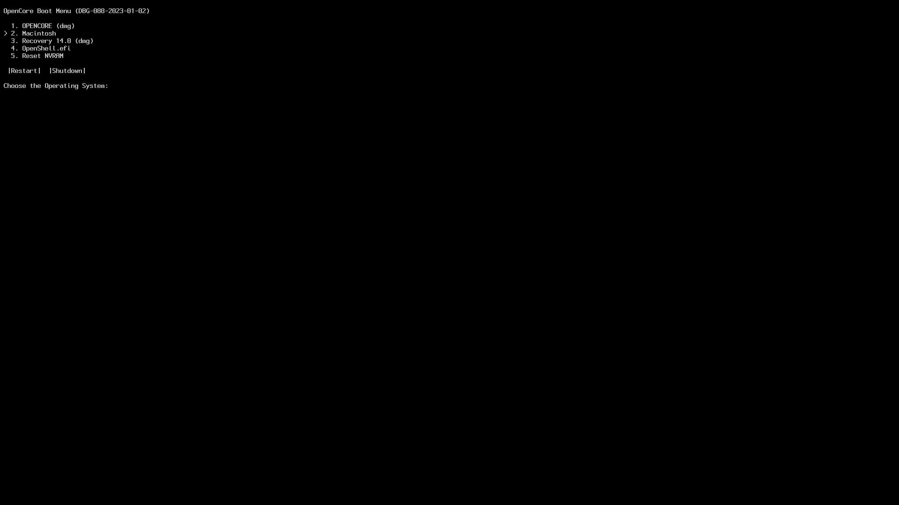
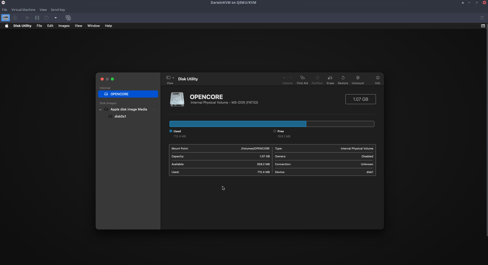
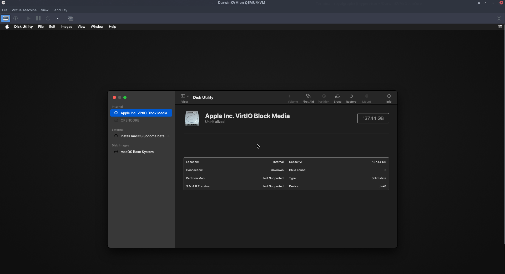

  

  

<h1 align="center">An Advanced Guide for running macOS within QEMU/KVM</h1>

<h4 align="center">Features: Clean EFI Guide for maximum customizability before boot, Compatibility with RisingPrism's Single GPU Passthrough, Display Overrides for repairing incompatible monitors, Custom Memory Mapping, Custom USB Mapping, Fake Core Count for incompatible CPU Topology, Host CPU Overclocking, Host Network Bridge for VM visibility, AMD GPU Zero-RPM Disable and custom sPPT Fan Curve! as well as many more advanced tutorials ready to further perfect your experience!</h4>

<h1 align="center">This is the git repo, follow the guide <a href="https://royalgraphx.github.io/DarwinKVM/">here!</a></h1>

### Requirements

* A compatible graphics card. <b>This is a must, don't bother if you're not getting GPU Accel.</b> please reference this [list](https://dortania.github.io/GPU-Buyers-Guide/) to verify.
  * There are some exceptions, if you're crazy and want to use a legacy NVIDIA GPU, please reference this [list](https://elitemacx86.com/threads/nvidia-gpu-compatibility-list-for-macos.614/) to check macOS/OCLP compatibility. If it's supported, there is a section down for Legacy NVIDIA Patching.

* A modern Linux distribution. E.g. Arch Based for the latest packages, my personally tested and working are:
  * EndeavourOS
  * ArcoLinuxB Plasma
  * Pure Arch

* A CPU with Intel VT-x or AMD SVM support is required (`grep -e vmx -e svm /proc/cpuinfo`)

* A CPU with SSE4.1 support is required for >= macOS Sierra

* A CPU with AVX2 support is required for >= macOS Ventura; but you can bypass the limitation with CryptexFixup as of now.

* Previous experience creating an EFI for your bare metal system and/or reading/understanding the [Dortania OpenCore Guide](https://dortania.github.io/OpenCore-Install-Guide/)

* Various Software/Packages, some optional, some not:
  * qemu
  * libvirtd/virtmanager
  * Python 3 installed with the tkinter package
  * dmg2img
  * qemu-img
  * [RisingPrism's Single GPU Passthrough Scripts](https://gitlab.com/risingprismtv/single-gpu-passthrough)
  * [ProperTree](https://github.com/corpnewt/ProperTree)
  * [GenSMBios](https://github.com/corpnewt/GenSMBIOS)
  * [Hackintool](https://github.com/benbaker76/Hackintool)
  * [SSDTTime](https://github.com/corpnewt/SSDTTime)

 

* <b>PATIENCE! This is NOT a Pre-Built EFI! You are responsible for completing it!</b>

 

# Support

If you run into any issues, you can join the [DarwinKVM Discord](https://discord.gg/ryQFC8Vk7b) server! Feel free to ping the @Helpers role within a help channel for support, and [Hexley](https://github.com/royalgraphx/Hexley), the one and only bot provides our discord users with a multitude of commands to assist anyone who may need specific actions performed.

<h1 align="center">Gallery</h1>

  

  

  

  

  

  

  

  

  

