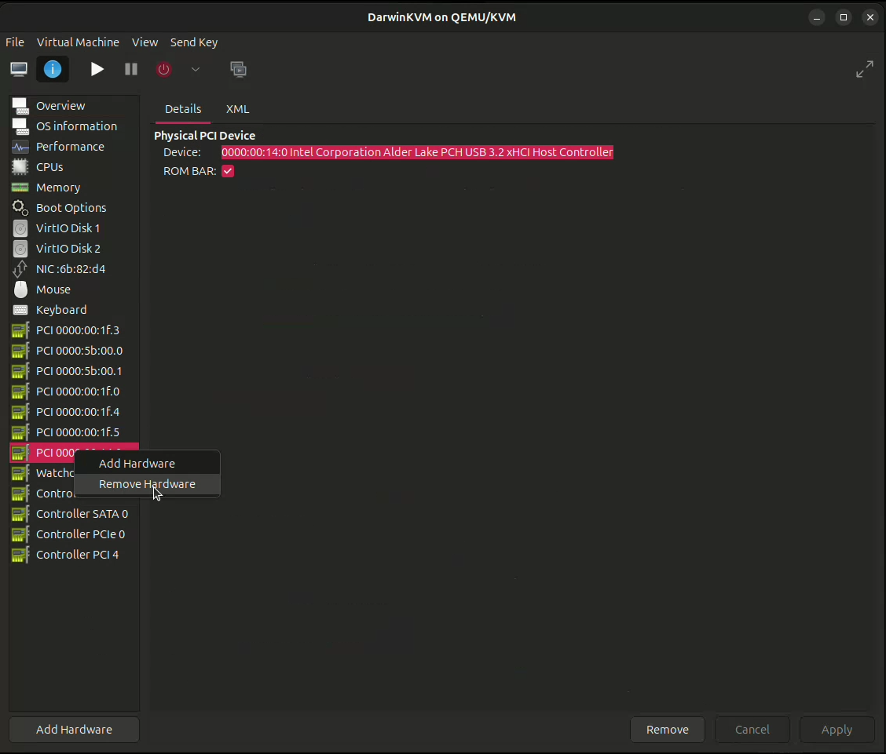
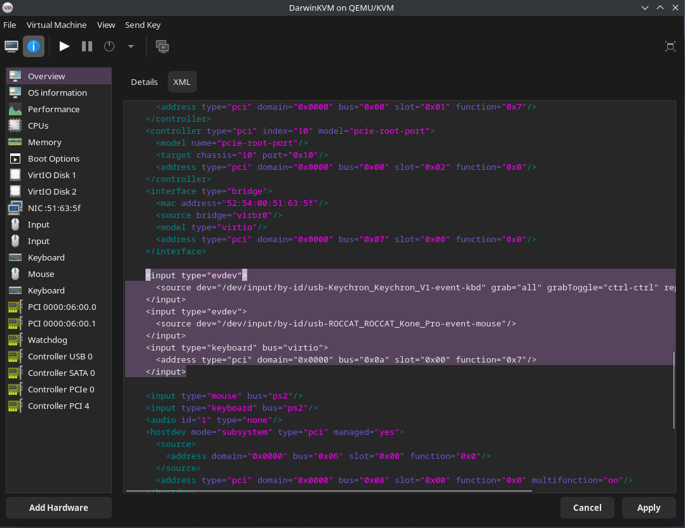
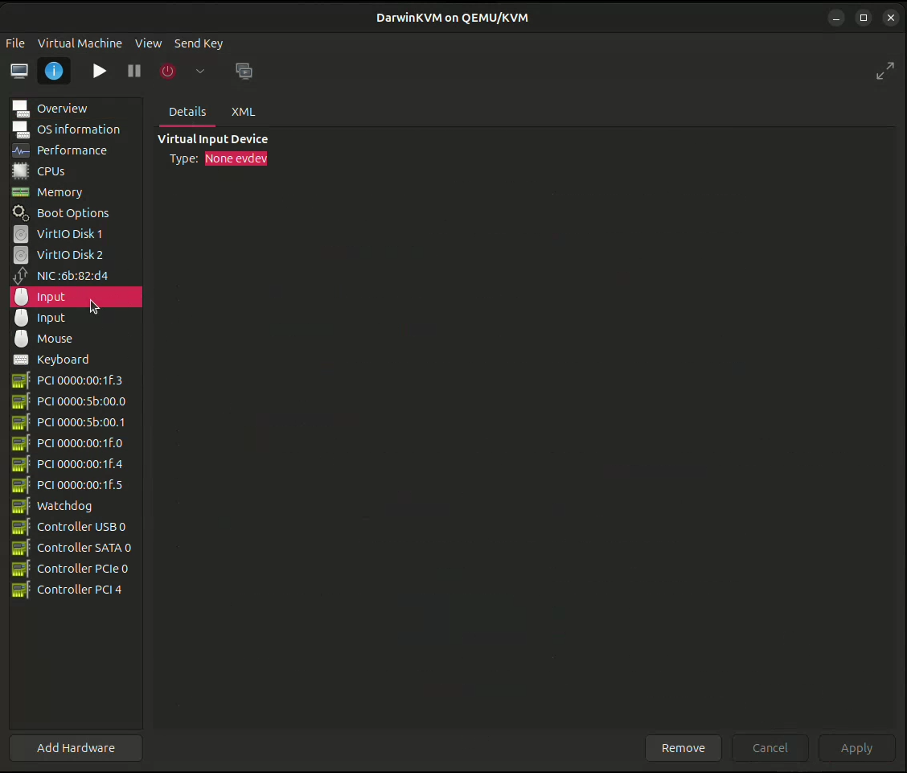
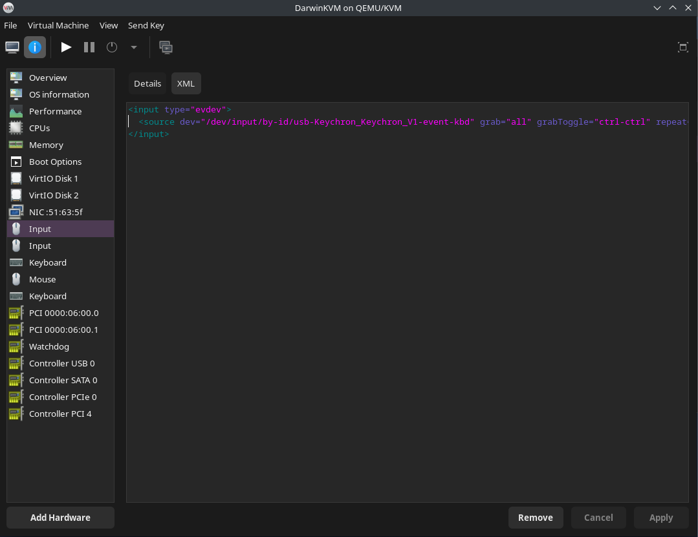

# XML Modifications

> [!WARNING]
> In order to use ``evdev``, we will need to **remove the USB controller from our machine**. Otherwise, the controller will capture the USB (and input) devices first, thus removing the files from ``/dev/input/by-id/``.
>
> If you really want to pass in USB devices, try passing in the USB devices directly via USB passthrough, or utilize a secondary USB controller for passthrough.

First, let's remove the USB controller from the virtual machine.

<p align="center">
    
</p>

Now, we need to edit the XML of the virtual machine. Go to Overview > XML, and scroll down until you see the following lines:

```xml
<input type="mouse" bus="ps2"/>
<input type="keyboard" bus="ps2"/>
```

Now, **before** the mouse and keyboard XML, copy and paste the following XML to add our mouse and keyboard (replacing the paths with the actual paths to the keyboard and mouse):

```xml
<input type="evdev">
  <source dev="/dev/input/by-id/(mouse-path)">
</input>
<input type="evdev">
  <source dev="/dev/input/by-id/(keyboard-path)" grab="all" grabToggle="ctrl-ctrl" repeat="on">
</input>
```

> [!NOTE]
> The ``grabToggle`` option will be the keyboard shortcut to switch the keyboard and mouse focus from host (Linux) and guest (macOS). This can be configured to the keyboard shortcut that you prefer. By default, it will be ``'ctrl-ctrl'``, but this option can be configured to the following options:
> - ``'alt-alt'``
> - ``'shift-shift'``
> - ``'meta-meta'``
> - ``'scrolllock'``
> - ``'ctrl-scrolllock'``


<p align="center">
    
</p>

> [!NOTE]
> Remember to **'Apply'** when you finish!

You should then see two 'Input' devices in the sidebar!

Sample configuration for the mouse (should be similar for keyboard as well):

<p align="center">
    
</p>

<p align="center">
    
</p>

**Do not boot into DarwinKVM yet! We still need to configure the driver/kext for KB/M!**

## You can now continue to the next <a href="./04-AddingToKext">page</a>.
