

  

{: .internalnote }
There are still screenshots that have yet to be updated with the ATI HD 5450. In the meantime, the legacy VESA / VGA screenshots are still being used. They'll be replaced soon.

<h2 align="center">Welcome!</h2>

<h5 align="center">This page is meant to be scrolled until you reach the bottom. We've worked hard to successfully archive every single release of OS X / macOS for preservation on both PowerPC and Intel platforms and you too can run your own choice of any guest OS release! Check out what they look like here.</h5>
<h5 align="center">The entries can have various (but not all) information:</h5>

 
<h2 align="center"><b>Name of OS release</b></h2>
<h5 align="center"><i>Mac Model (####) - ModelIdentifier#,#</i></h5>

  <h3 align="center">
    Product Version - Product Codename (Product Build Number) - Graphics Processing Unit
  </h3>
  <h3 align="center">
    Architecture - Mac Product Name - Credits: @username
  </h3>

 
 

<h5 align="center">The entries can have multiple screenshots of the various versions of said release. The gallery is sorted by chronological order. 10.6.8 will appear above 10.6.4 and so on. We also have Server variants, and AppleInternal copies running under DarwinKVM showcased here. Preservation is key! Submit your very own screenshot via the Discord in the #showcase channel for consideration in the next update.</h5>

 
 
 

<h2 align="center"><b>macOS Tahoe</b></h2>
<h5 align="center"><i>Mac Pro (2019) - MacPro7,1</i></h5>

  <h3 align="center">
    26.0.0 Developer Beta 1 - RX 6600 8GB - x86_64
  </h3>
  <a href="">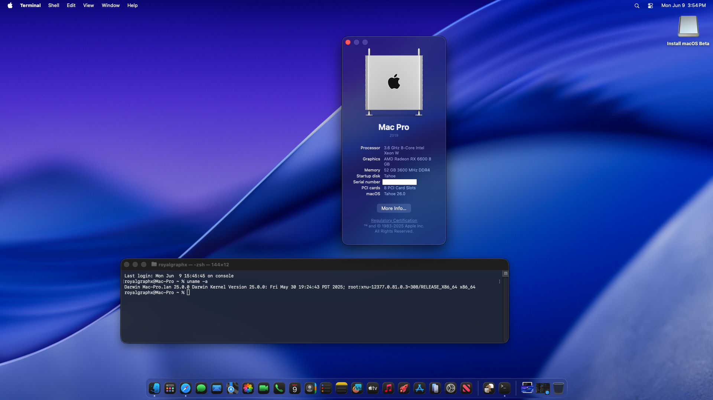</a>

<h2 align="center"><b>macOS Sequoia</b></h2>
<h5 align="center"><i>Mac Pro (2019) - MacPro7,1</i></h5>

  <h3 align="center">
    15.1.1 - WX 9100 16GB - x86_64 - Credits: @athleticat
  </h3>
  

  <h3 align="center">
    15.1 - RX 6650 XT 8GB - x86_64 - Credits: @f0xb4t
  </h3>
  

  <h3 align="center">
    15.0 Developer Beta 1 - RX 6600 8GB - x86_64
  </h3>
  

<h2 align="center"><b>macOS Sonoma</b></h2>
<h5 align="center"><i>Mac Pro (2019) - MacPro7,1</i></h5>

  <h3 align="center">
    14.7 - RX 5700 XT 8GB - x86_64 - Credits: 
    <a href="https://github.com/Naymmmm">@Naymmmm</a>
  </h3>
  <a href="">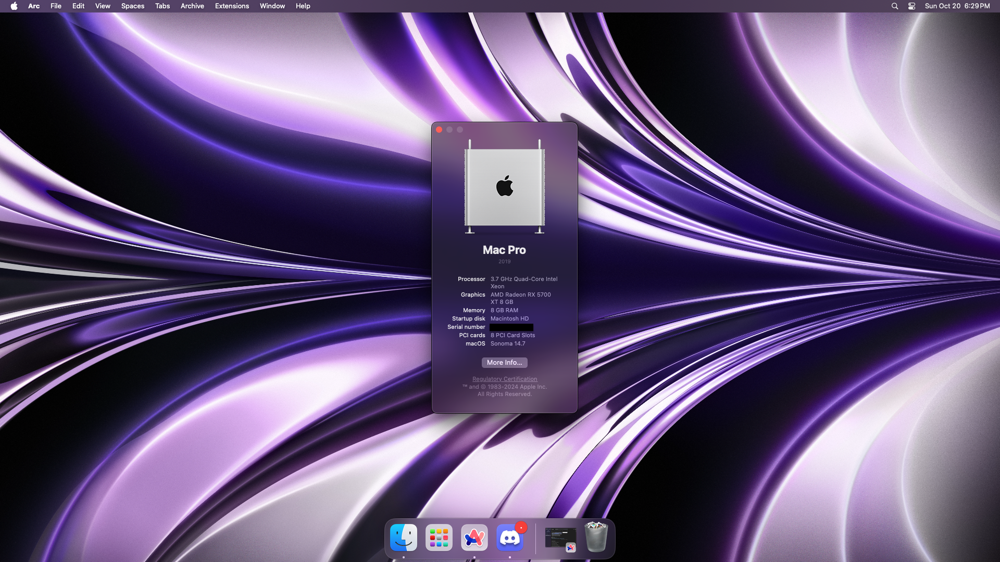</a>

  <h3 align="center">
    14.5 - RX 6600 8GB - x86_64
  </h3>
  

  <h3 align="center">
    14.4 Beta - RX 6600 8GB - x86_64
  </h3>
  

  <h3 align="center">
    14.3 - RX 6600 8GB - x86_64
  </h3>
  <a href="">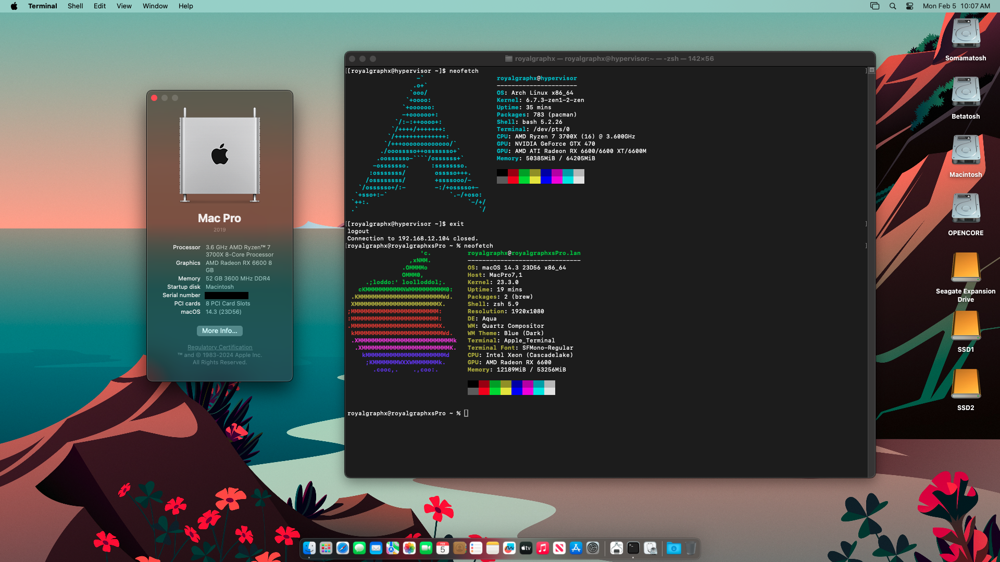</a>

  <h3 align="center">
    14.2.1 - RX 6750 XT 12GB - x86_64 - Credits: 
    <a href="https://github.com/heliokroger">@heliokroger</a>
  </h3>
  

  <h3 align="center">
    14.1 - RX 6800 XT 16GB - x86_64 - Credits: 
    <a href="https://github.com/haxi0">@haxi0</a>
  </h3>
  

  <h3 align="center">
    14.0 - RX 6600 8GB - x86_64
  </h3>
  <a href="">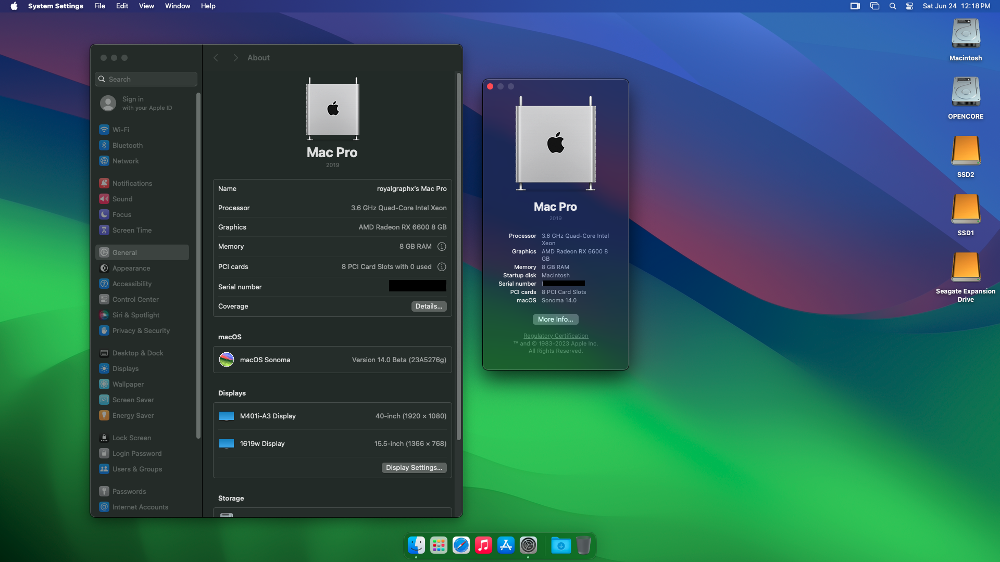</a>

<h2 align="center"><b>macOS Ventura</b></h2>
<h5 align="center"><i>Mac Pro (2019) - MacPro7,1</i></h5>

  <h3 align="center">
    13.5.1 - RX 6600 8GB - x86_64
  </h3>
  

  <h3 align="center">
    13.5 - GTX 1050 Ti 4GB - x86_64 - Credits: 
    <a href="https://github.com/Zormeister">@Zormeister</a>
  </h3>
  

  <h3 align="center">
    13.5 - RX 5600 XT 6GB - x86_64 - Credits: 
    <a href="https://github.com/rolowilde">@rolowilde</a>
  </h3>
  

  <h3 align="center">
    13.4 - RX 6600 8GB - x86_64
  </h3>
  

<h2 align="center"><b>macOS Monterey</b></h2>
<h5 align="center"><i>Mac Pro (2019) - MacPro7,1</i></h5>

  <h3 align="center">
    12.7.5 - RX 6600 8GB - x86_64
  </h3>
  <a href="">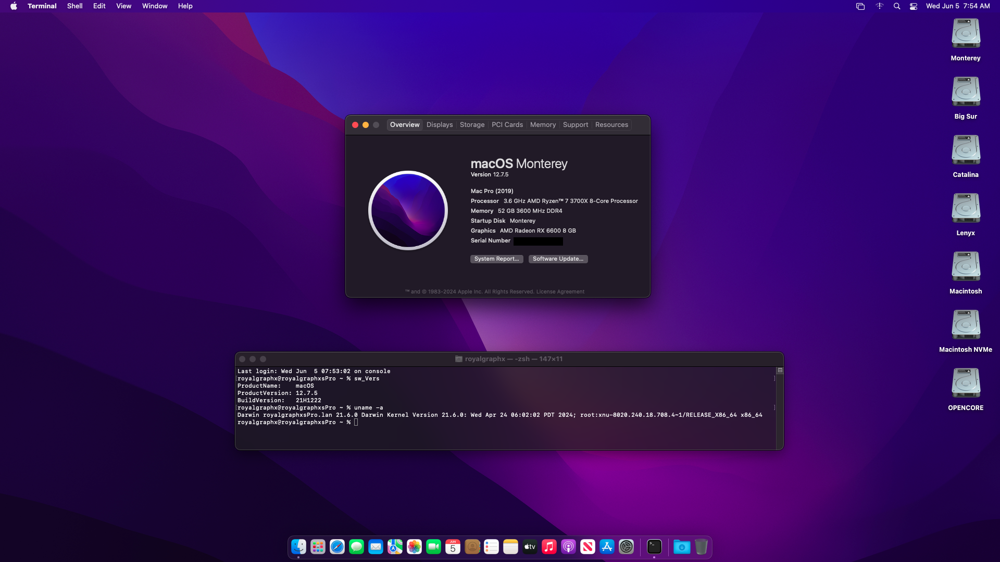</a>

<h2 align="center"><b>macOS Big Sur</b></h2>
<h5 align="center"><i>Mac Pro (2019) - MacPro7,1</i></h5>

  <h3 align="center">
    11.7.10 - VESA / VGA Graphics - x86_64
  </h3>
  

  <h3 align="center">
    11.0.0 - Developer Preview 1 (20A4299v) - VESA / VGA Graphics - x86_64
  </h3>
  

<h2 align="center"><b>macOS 10.16</b></h2>
<h5 align="center"><i>Mac Pro (2019) - MacPro7,1</i></h5>

  <h3 align="center">
    AppleInternal GoldenGateSpike (20A2314a) - VESA / VGA Graphics - x86_64
  </h3>
  <a href="">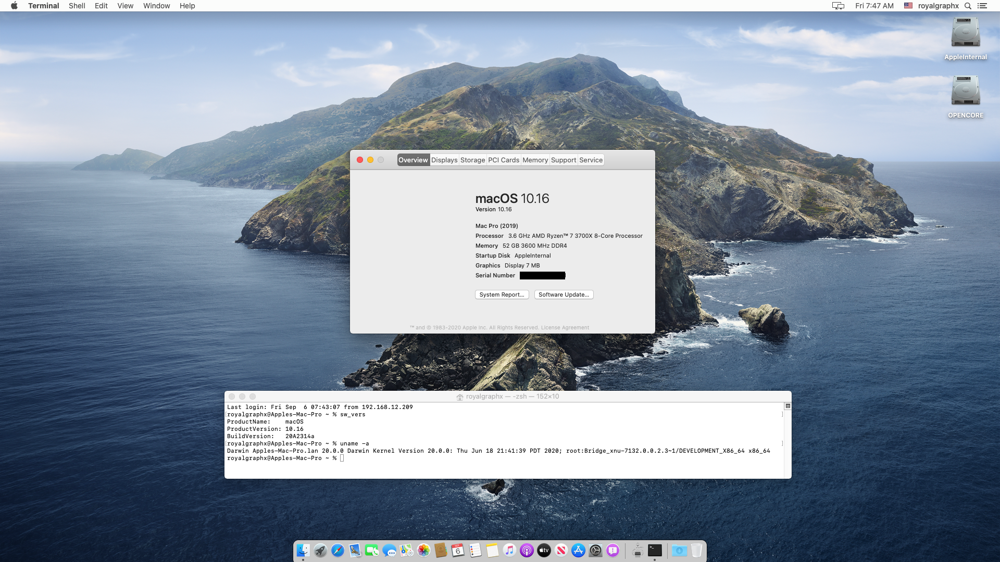</a>

<h2 align="center"><b>macOS Catalina</b></h2>
<h5 align="center"><i>Mac Pro (2019) - MacPro7,1</i></h5>

  <h3 align="center">
    10.15.7 - VESA / VGA Graphics - x86_64
  </h3>
  

<h2 align="center"><b>macOS Mojave</b></h2>
<h5 align="center"><i>Mac Pro (2010) - MacPro5,1</i></h5>

  <h3 align="center">
    10.14.4 - VESA / VGA Graphics - x86_64
  </h3>
  

<h2 align="center"><b>macOS High Sierra</b></h2>
<h5 align="center"><i>Mac Pro (2010) - MacPro5,1</i></h5>

  <h3 align="center">
    10.13.6 - GTX 470 1280MB
  </h3>
  

<h2 align="center"><b>macOS Sierra</b></h2>
<h5 align="center"><i>Mac Pro (2010) - MacPro5,1</i></h5>

  <h3 align="center">
    10.12.5 - AppleInternal Phoenix (16F5049f) - GTX 470 1280MB
  </h3>
  <a href="">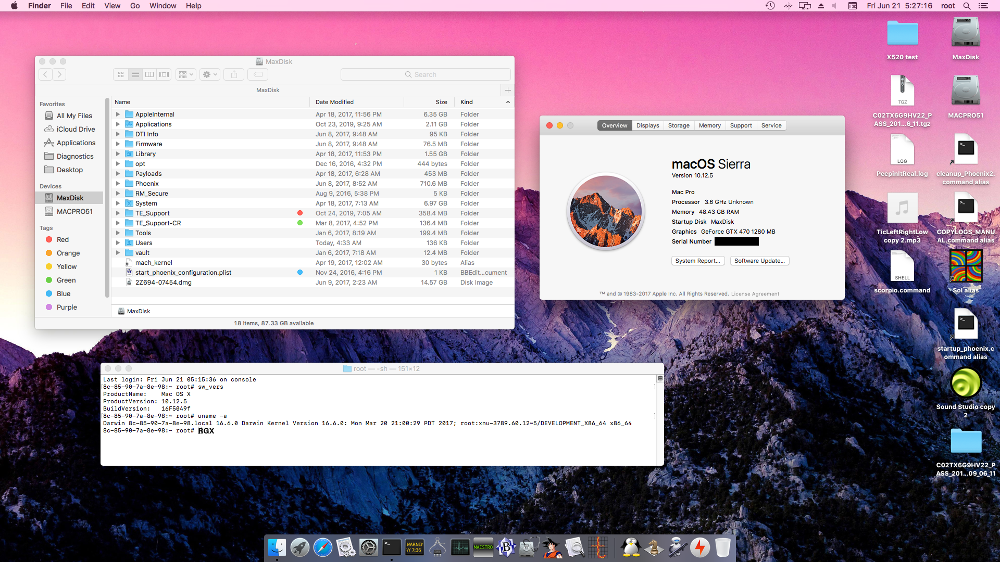</a>

  <h3 align="center">
    10.12 - VESA / VGA Graphics - x86_64
  </h3>
  <a href="">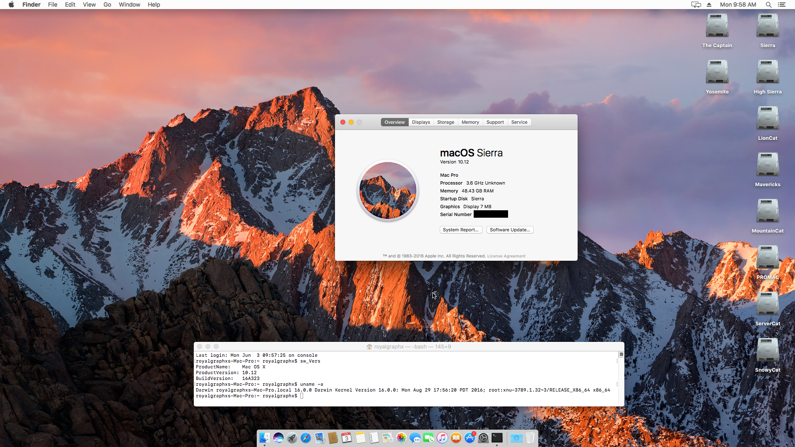</a>

<h2 align="center"><b>Mac OS X El Capitan</b></h2>
<h5 align="center"><i>Mac Pro (2010) - MacPro5,1</i></h5>

  <h3 align="center">
    10.11.6 - VESA / VGA Graphics - x86_64
  </h3>
  <a href="">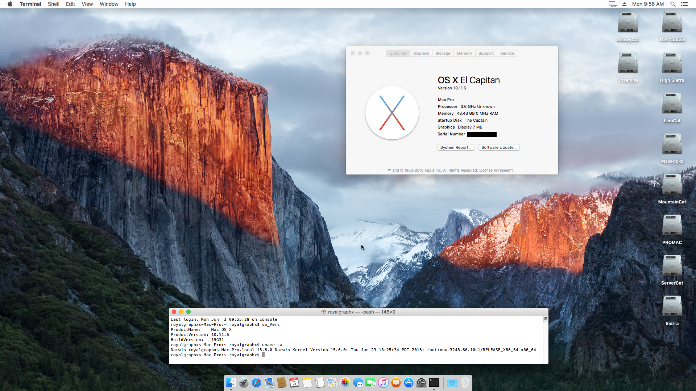</a>

<h2 align="center"><b>Mac OS X Yosmite</b></h2>
<h5 align="center"><i>Mac Pro (2010) - MacPro5,1</i></h5>

  <h3 align="center">
    10.10 - VESA / VGA Graphics - x86_64
  </h3>
  <a href="">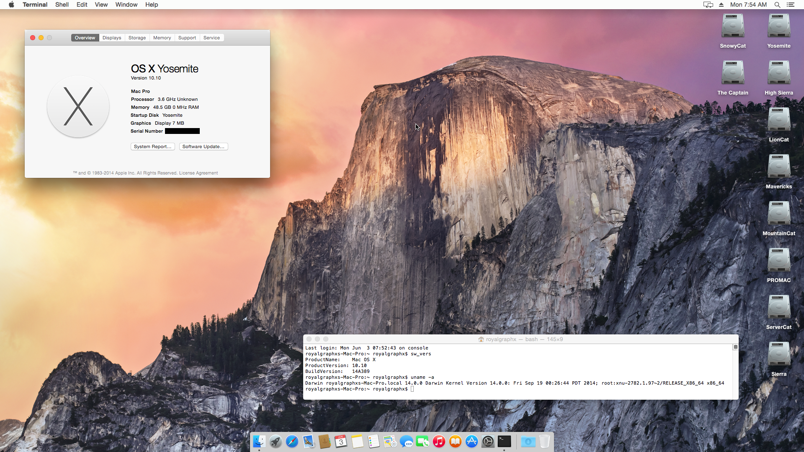</a>

<h2 align="center"><b>Mac OS X Mavericks</b></h2>
<h5 align="center"><i>Mac Pro (2010) - MacPro5,1</i></h5>

  <h3 align="center">
    10.9.5 - VESA / VGA Graphics - x86_64
  </h3>
  

<h2 align="center"><b>Mac OS X Mountain Lion</b></h2>
<h5 align="center"><i>Mac Pro (2010) - MacPro5,1</i></h5>

  <h3 align="center">
    10.8.5 - VESA / VGA Graphics - x86_64
  </h3>
  <a href="">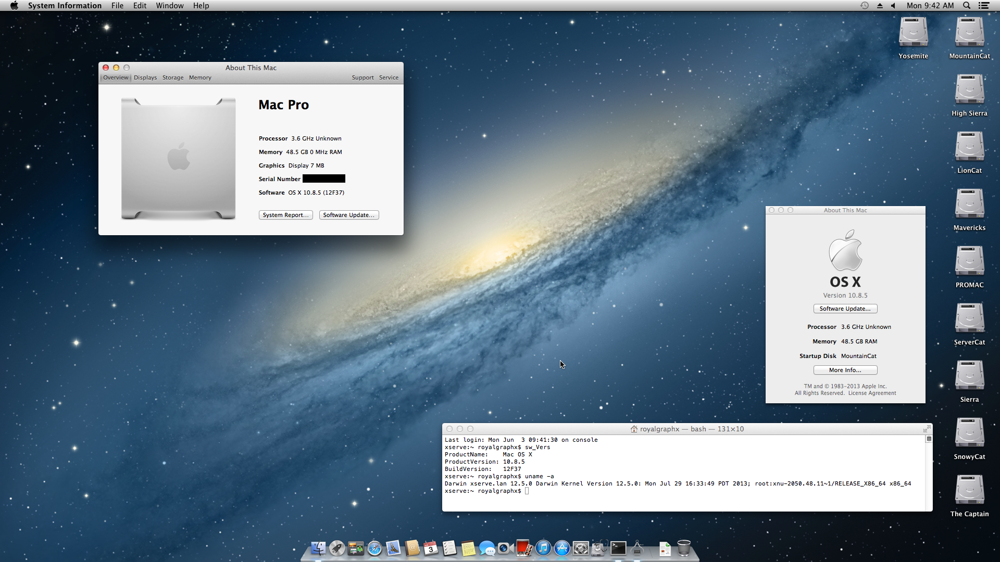</a>

<h2 align="center"><b>Mac OS X Lion</b></h2>
<h5 align="center"><i>Mac Pro (2010) - MacPro5,1</i></h5>

  <h3 align="center">
    10.7.5 - GTX 470 1280MB - x86_64
  </h3>
  

<h2 align="center"><b>Mac OS X Snow Leopard</b></h2>
<h5 align="center"><i>Mac Pro (2010) - MacPro5,1</i></h5>
<h5 align="center"><i>Xserve Xeon (2009) - Xserve3,1</i></h5>
<h5 align="center"><i>Mac mini (2009) - Macmini3,1</i></h5>
<h5 align="center"><i>PowerMac G4 AGP (1999) - PowerMac3,1</i></h5>

  <h3 align="center">
    10.6.8 - ATI Radeon HD 5450 2GB - x86_64
  </h3>
  <a href="">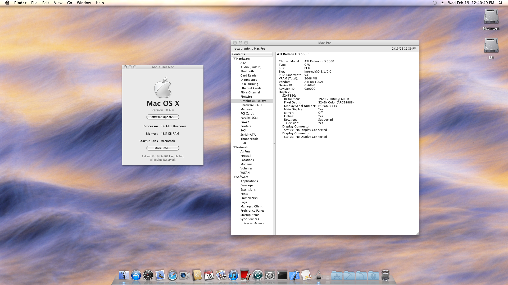</a>

  <h3 align="center">
    10.6.8 Server - ATI Radeon HD 5450 2GB - x86_64
  </h3>
  

  <h3 align="center">
    10.6.2 - AppleInternal Factory (10C540) - ATI Radeon HD 5450 2GB - i386
  </h3>
  <a href="">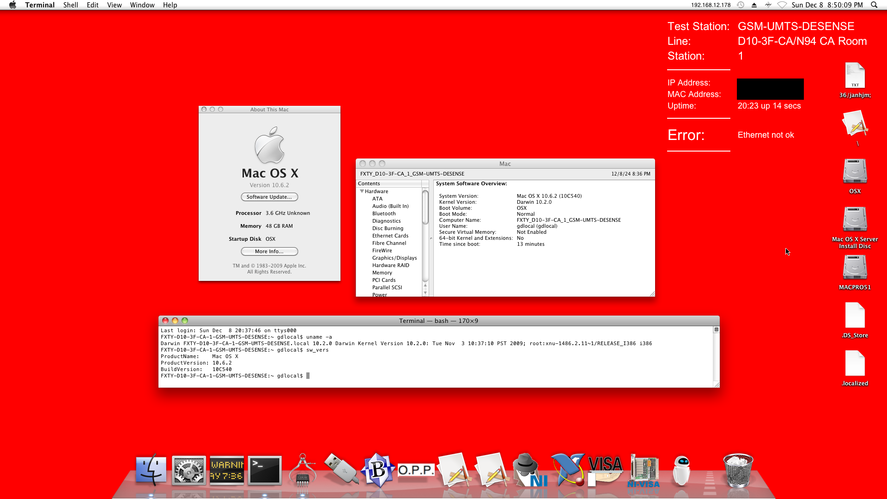</a>

  <h3 align="center">
    10.6 - Developer Preview 1 (10A190) - PowerPC
  </h3>
  

<h2 align="center"><b>Mac OS X Leopard</b></h2>
<h5 align="center"><i>Mac Pro (2009) - MacPro4,1</i></h5>
<h5 align="center"><i>Mac Pro (2008) - MacPro3,1</i></h5>
<h5 align="center"><i>PowerMac G4 AGP (1999) - PowerMac3,1</i></h5>

  <h3 align="center">
    10.5.8 - VESA / VGA Graphics - i386
  </h3>
  

  <h3 align="center">
    10.5.4 - VESA / VGA Graphics - PowerPC
  </h3>
  

  <h3 align="center">
    10.5 Server - VESA / VGA Graphics - i386
  </h3>
  

<h2 align="center"><b>Mac OS X Tiger</b></h2>
<h5 align="center"><i>Mac Pro (2007) - MacPro2,1</i></h5>
<h5 align="center"><i>Mac Pro (2006) - MacPro1,1</i></h5>
<h5 align="center"><i>Apple Developer Transition Kit (2005) - ADP2,1</i></h5>
<h5 align="center"><i>PowerMac G4 AGP (1999) - PowerMac3,1</i></h5>

  <h3 align="center">
    10.4.11 - VESA / VGA Graphics - i386
  </h3>
  <a href="">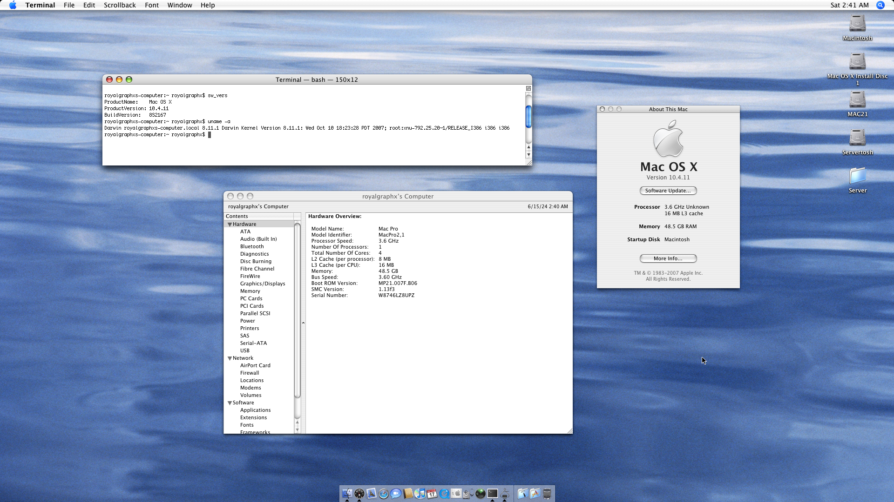</a>

  <h3 align="center">
    10.4.11 Server - VESA / VGA Graphics - i386
  </h3>
  <a href="">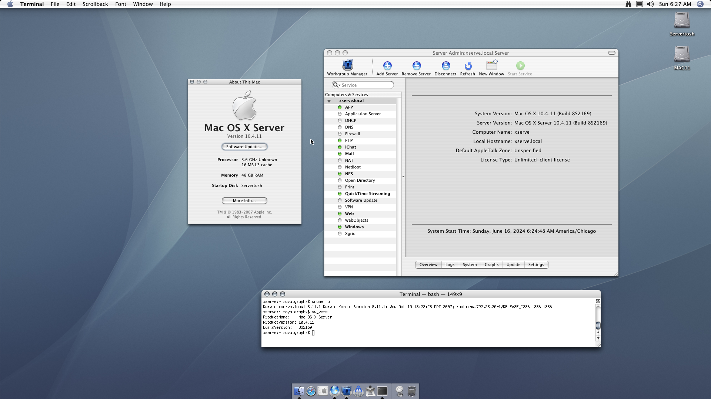</a>

  <h3 align="center">
    10.4.11 - VESA / VGA Graphics - PowerPC
  </h3>
  

  <h3 align="center">
    10.4.7 - VESA / VGA Graphics - i386
  </h3>
  <a href="">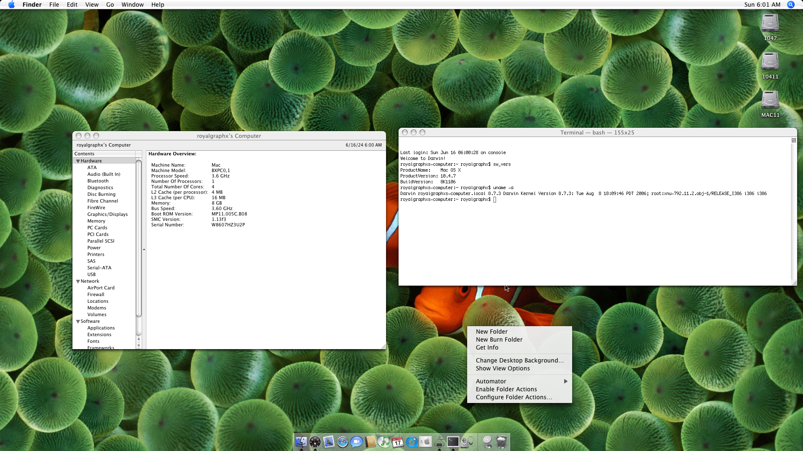</a>

  <h3 align="center">
    10.4.1 - Apple DTK Build 8B1025 - VESA / VGA Graphics - i386
  </h3>
  <a href="">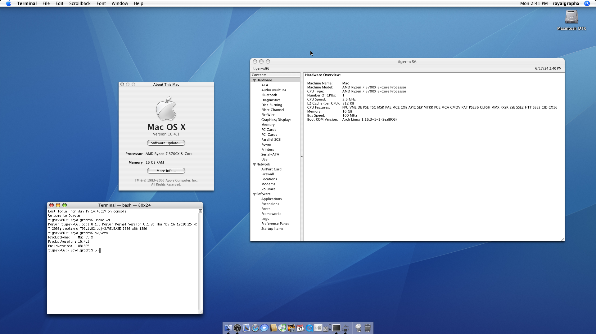</a>

<h2 align="center"><b>Mac OS X Panther</b></h2>
<h5 align="center"><i>PowerMac G4 AGP (1999) - PowerMac3,1</i></h5>

  <h3 align="center">
    10.3 - VESA / VGA Graphics - PowerPC
  </h3>
  <a href="">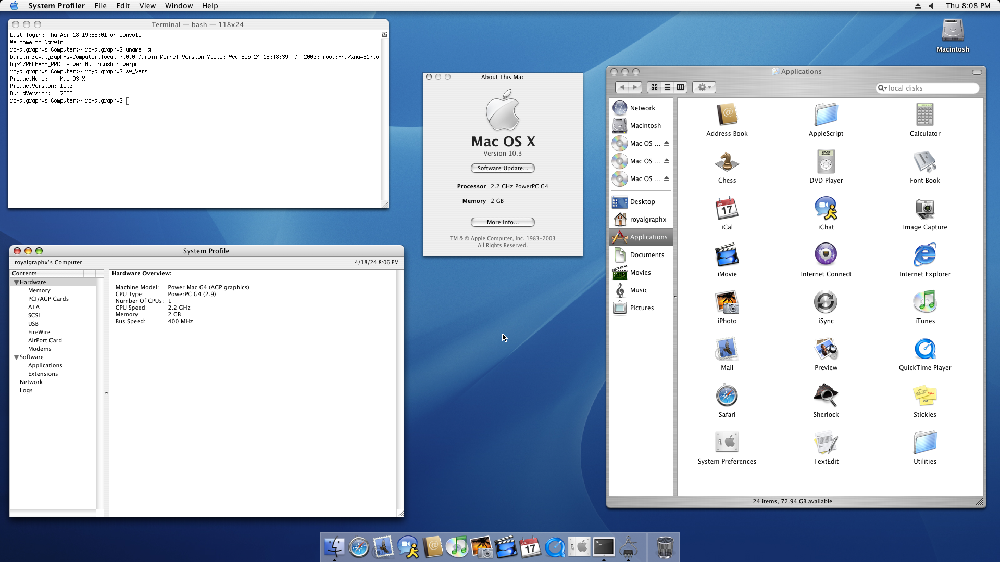</a>

<h2 align="center"><b>Mac OS X Jaguar</b></h2>
<h5 align="center"><i>PowerMac G4 AGP (1999) - PowerMac3,1</i></h5>

  <h3 align="center">
    10.2 - VESA / VGA Graphics - PowerPC
  </h3>
  <a href="">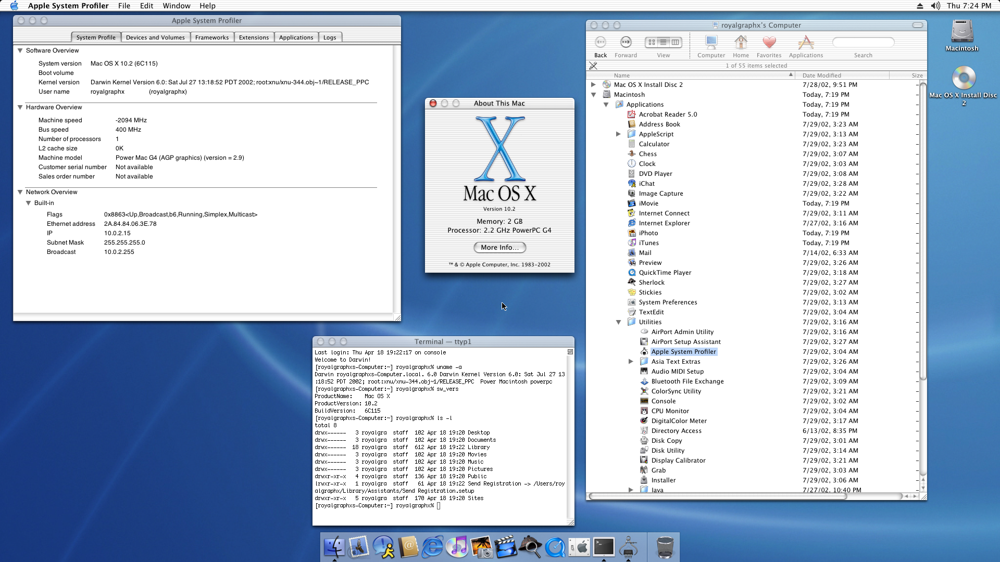</a>

<h2 align="center"><b>Mac OS X Puma</b></h2>
<h5 align="center"><i>PowerMac G4 AGP (1999) - PowerMac3,1</i></h5>

  <h3 align="center">
    10.1 - VESA / VGA Graphics - PowerPC
  </h3>
  <a href="">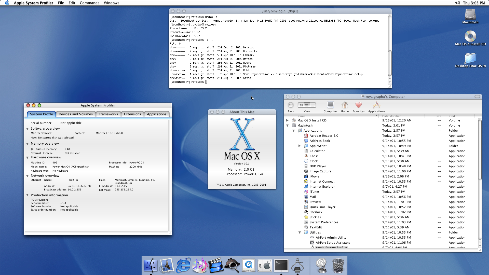</a>

<h2 align="center"><b>Mac OS X Cheetah</b></h2>
<h5 align="center"><i>PowerMac G4 AGP (1999) - PowerMac3,1</i></h5>

  <h3 align="center">
    10.0.3 - VESA / VGA Graphics - PowerPC
  </h3>
  

<h2 align="center">
   
  

    <a class="top-button" href="#">&uarr; Go to the Top &uarr;</a>
  

   
</h2>
