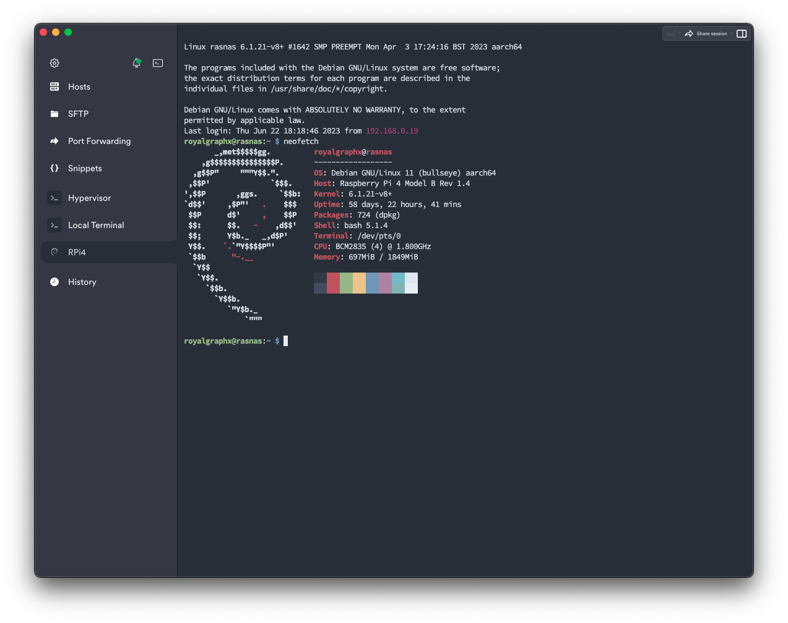

<p align="center">
  
</p>

# Bridge Networking
#### Creation of the Bridge interface for your DKVM.
#### This section has been derived from the <a href="https://github.com/royalgraphx/DarwinKVM/tree/main/BridgeNetworking">Bridge Networking</a> Submodule.

## Overview

First things first, I highly recommend you take the time out of your day to not skip this process, just as you shouldn't skip over any other steps. To understand the point of a network bridge, you'll need to know that when you use QEMU or Virt-Manager to start a Virtual Machine with networking, you will typically be using the default network provided by libvirt. This creates its own DHCP server, meaning that our Machines are created with IP addresses such that, we see "192.168.68.2" or something along those lines, which does not match up with our local IPs on our broader network. The point of setting this Bridge interface up is to strip our ethernet controller of an assigned IP address and stop any other Network Managers that may be present on the users' system so that we can leverage systemd-networkd to automate the bridge creation. What it simply does, is create a new interface named "br0". It then modifies the users' current ethernet interface to "master br0", meaning that br0 is now providing the information to the users' physical ethernet interface. We then give br0 an IP address via DHCP using ipv4. When we use Virt-Manager in this configuration, we can use a bridge interface, we set it to ``br0`` and the result is our Virtual Machines now appear on the broader network as physical, real devices. Allowing SSH via and to any other devices on the LAN.

## Prerequisites to the script

In my opinion, this is the number one step to set up practically right after the installation of a new host operating system. Allowing your virtual machines to be visible to the broader network may seem like something you can ignore, and while you very well can... I enjoy my Virtual Machines appearing as real, physical ethernet devices. The most popular and commonly used package for managing your network connection will most likely be "NetworkManager", and this can be checked by issuing a systemctl command to check the status.

```
sudo systemctl status NetworkManager
```

If you see that it is running, you can choose to stop it but for this guide, we'll be making use of the DKVM Bridge Networking submodule. It contains a script that will quickly go through a few checks and create a bridge interface for your use. You must have systemd in some form, install it prior or check your system for systemd-networkd with the following command.

```
sudo systemctl status systemd-networkd
```

For more information and the completion of this section, refer to [Bridge Networking](https://github.com/royalgraphx/DarwinKVM/tree/main/BridgeNetworking).

## Post installation results

<h3 align="center">This is the guest macOS talking to devices on the broader network.</h3>

<p align="center">
  
</p>

<p align="center">
  
</p>

<p align="center">
  
</p>

<p align="center">
  
</p>

## You can now continue to the next <a href="04-PackageInstall.html">page</a>.