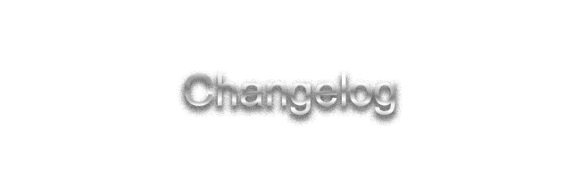

  

 

{: .internalnote }
> Always maintain a temporary Commit entry at the top of this file.
> Maintain using Prerelease@BranchName and continue with using 3.0.0 while the Docs are still not released as 3.0.0 officially.
> This note will be removed in the future.

 

All notable changes to this project will be documented in this file. The format is based on [Keep a Changelog](https://keepachangelog.com/en/1.0.0/), and this project adheres to [Semantic Versioning](https://semver.org/spec/v2.0.0.html). Below is the Template Entry.

 

---

## Complete Base DKVM Resources
### Prerelease@royalStaging
#### By royalgraphx

## [3.0.0~prerelease] - 2025-04-09

### Added
- A crapton of stuff.

### Changed
- Everything.

### Fixed
- Stuff.

### Deprecated
- A ton of pages.

### Removed
- A ton of images on accident.

### Security
- All of it.

---

## Initialize base docs again
### Prerelease@royalStaging
#### By royalgraphx

## [3.0.0~prerelease] - 2025-02-22

### Added
- Changelog
- Carnations branding
- Navigation Bar

### Changed
- Gallery
- Structure
- Footer

### Fixed
- Updated repository to support latest Ruby + Bundle

### Deprecated
- Pretty much the entire docs, but things will slowly be restored in proper order

### Removed
-

### Security
-

<h2 align="center">
   
  

    <a class="top-button" href="#">&uarr; Go to the Top &uarr;</a>
  

   
</h2>
