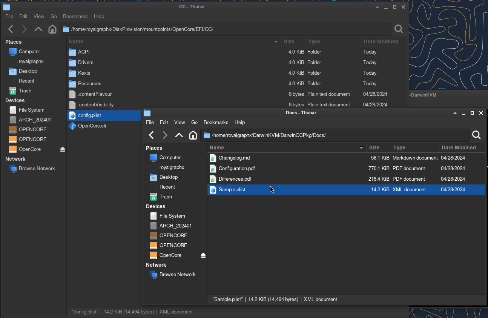

# Disk Image Creation
#### Creation of an OC Type .img for your DKVM.
#### This section has been derived from the <a href="https://github.com/royalgraphx/DiskProvision">DiskProvision</a> Github.

 
To continue in this guide you will need a disk image that will act as the OpenCore disk for booting macOS. In this page you'll get a basic overview on how to utilize the DiskProvision tool that's in DarwinKVM to complete this requirement.

First, navigate to the DiskProvision directory so you can use the launcher. If you need any help understanding this section, please refer to the DiskProvision [README.md](https://github.com/royalgraphx/DiskProvision/blob/main/README.md) for better context.

## Basic Walkthrough

When you first cd into the ``DiskProvision/`` folder, you'll see a bash script you can launch via a terminal, to do so, run ``./DiskProvision``, you will then be presented with a menu with a few options.

To get started, Linux hosts have a special 3rd option which will begin the creation of a new OpenCore Type disk image that is prepared to be used as a boot drive.

{: .note }
Feel free to call it as you'd like, as it doesn't have to be "OpenCore", but will have an 8 character limit due to FAT32. 2GB is the minimum recommended size if using recoveryOS.

You will be brought back to the main menu afterwards. Select option 2 to browse the images in the database, and select the disk image you created. You will be asked if you'd like to mount it to a directory, and yes we do want to. Press enter as Yes is the default.

When you look at your file explorer graphically, you will see there is a ``mountpoints/`` folder that holds all actively mounted images

In this folder, will spawn folders linked to the mounted NBD device. This is how you can interact with the contents of the mounted disk image.

{: .warning }
Do NOT use the left-hand side mounted disks tab to view the contents! Make sure you are using the folder itself, that is linked to the disk image itself.

You can now go ahead and transfer the EFI folder from [DarwinOCPkg](https://github.com/royalgraphx/DarwinOCPkg) to the root of the image. The rest of the steps will outline adding the necessary files to build your EFI for your installation target.

{: .headsup }
Do not forget to copy the ``Sample.plist`` over to ``EFI/OC/`` and rename it to ``config.plist``!

<h2 align="center">You can now proceed to the <a href="../../infocenter/01-FileOverview/index">OpenCore Files Overview</a>!</h2>
