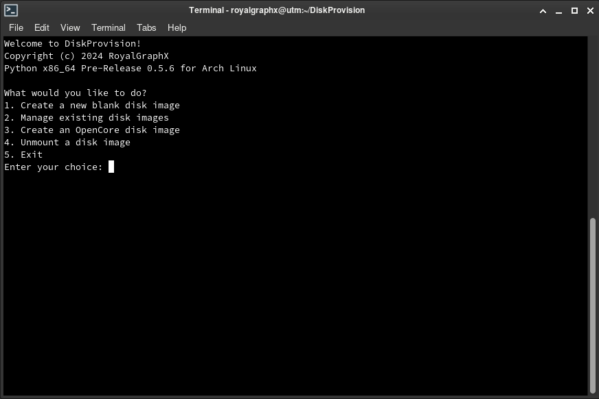
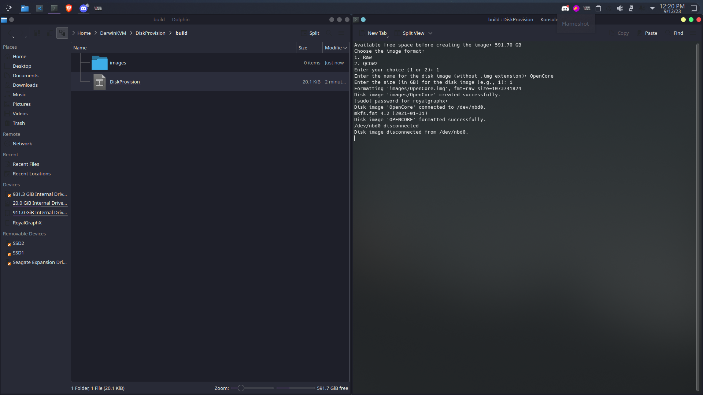
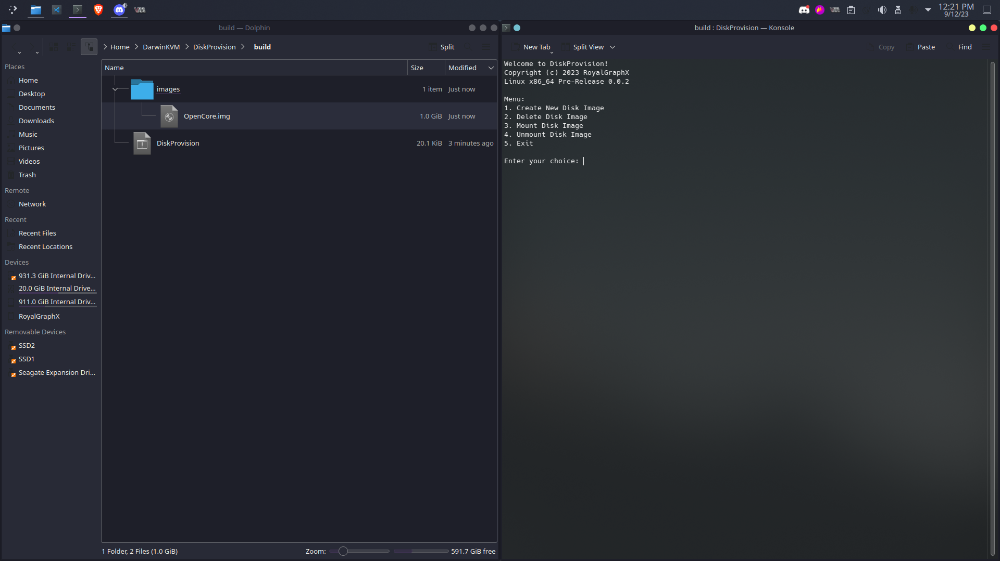
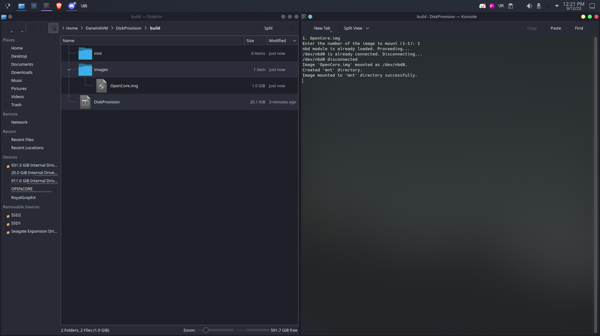
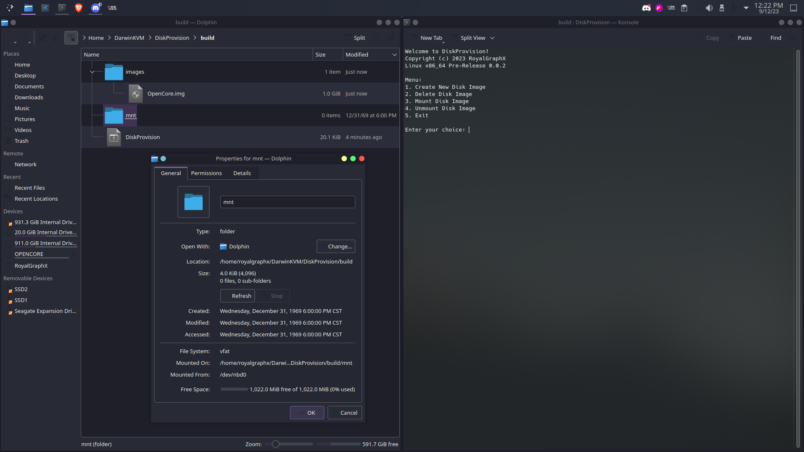

# OpenCore Image Creation
#### Creation of the OpenCore .img for your DKVM.
#### This section has been derived from the <a href="https://github.com/royalgraphx/DiskProvision">DiskProvision</a> Github.

{: .new }
DiskProvision automates the process of creating and formatting a disk image for use with QEMU. It can also mount and unmount an image to easily modify the contents.

To continue in this guide you will need a disk image that will act as the OpenCore disk for booting macOS. In this page you'll get a basic overview on how to utilize the DiskProvision tool that's in DarwinKVM. First, navigate to the DiskProvision/build directory so you can use the executable. If you need any help understanding this section, please refer to the DiskProvision [README.md](https://github.com/royalgraphx/DiskProvision/blob/main/README.md) for better context.

## Basic Walkthrough

When you first head into the build/ folder, you'll see an executable you can launch via a terminal, you will be presented with a menu with a few options.

  

To get started, you can select option 1 which will begin the creation of a new disk image. Feel free to call it as you'd like, as it doesn't have to be "OpenCore".

  

You will now see a new Disk Image created for you in the images folder.

  

Go ahead and mount the disk image you created. You can do this by selection option 3 and choosing the image to mount, this will create an mnt/ folder which acts as the image mount point.

  

  

You can now go ahead and transfer the EFI folder from [DarwinOCPkg](https://github.com/royalgraphx/DarwinOCPkg) to the root of the image. The rest of the steps will outline adding the necessary files to build your EFI for your Virtual Machine.

  

## You can now continue to the next <a href="01-ACPITables.html">page</a>.
