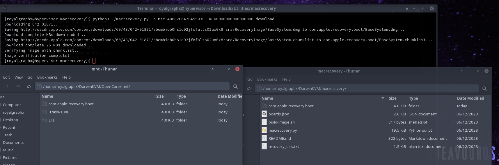

# macrecovery

Open a terminal and navigate to the directory containing the script files.

For this example, we'll be getting the latest macOS Ventura:

``python3 macrecovery.py -b Mac-4B682C642B45593E -m 00000000000000000 download``

Notice that it will then create a folder ``com.apple.recovery.boot`` where the ``BaseSystem.dmg`` is located. Since the image is compressed, we have to convert it to standard (hfsplus) image. It can be achieved by using a tool like `dmg2img`:

``dmg2img -i BaseSystem.dmg BaseSystem.img``

## If you'd like to persist recovery in OpenCore.img

Copy ``com.apple.recovery.boot`` folder over to the root of the OpenCore .img mount point. Do note that this way it loads greatly slower compared to attaching converted image directly to the Virtual Machine.

<p align="center">
  
</p>

## List of downloadable BaseSystems

```
# High Sierra (10.13)
python3 macrecovery.py -b Mac-7BA5B2D9E42DDD94 -m 00000000000J80300 download
python3 macrecovery.py -b Mac-BE088AF8C5EB4FA2 -m 00000000000J80300 download

# Mojave (10.14)
python3 macrecovery.py -b Mac-7BA5B2DFE22DDD8C -m 00000000000KXPG00 download

# Catalina (10.15)
python3 macrecovery.py -b Mac-00BE6ED71E35EB86 -m 00000000000000000 download

# Big Sur (11)
python3 macrecovery.py -b Mac-42FD25EABCABB274 -m 00000000000000000 download

# Monterey (12)
python3 macrecovery.py -b Mac-FFE5EF870D7BA81A -m 00000000000000000 download

# Latest version
# ie. Ventura (13)
python3 macrecovery.py -b Mac-4B682C642B45593E -m 00000000000000000 download
```

<h1>You can now proceed to the <a href="../06-InstallingmacOS/">Installing macOS</a> section!</h1>
