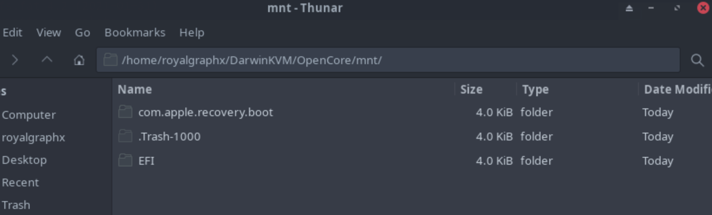

# Adding to OpenCore
#### You'll need to use DiskProvision to mount the image.

Notice that macrecovery then creates a ``com.apple.recovery.boot`` folder. Inside you'll find a BaseSystem.dmg and a chunklist file which holds the recoveryOS for retrieving and installing macOS from scratch.

Because we'd like to maintain SecureBootModel and various other aspects for security reasons, we'll want to follow the same method as using a baremetal USB. Drag the ``com.apple.recovery.boot`` folder to the root of the OpenCore image.

With this, you can later boot Base System.

  

Now that you've completed configuring your OpenCore disk image, **DO NOT FORGET TO UNMOUNT**, before continuing.

<h1>You can now proceed to the <a href="../06-InstallingmacOS/">Installing macOS</a> section!</h1>