

  

<h3 align="center">macOS Sequoia 15.0 Beta 1</h3>
<a href="https://raw.githubusercontent.com/royalgraphx/DarwinKVM/main/docs/showcase/HacProKVM15Beta.png">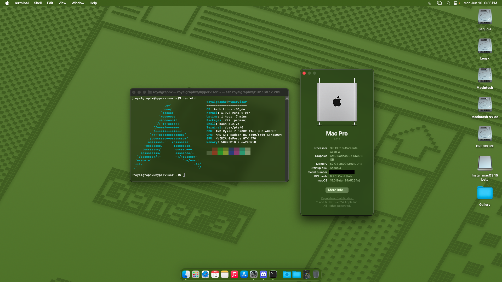</a>
<a href="https://raw.githubusercontent.com/royalgraphx/DarwinKVM/main/docs/showcase/HacProKVM15BetaAlt.png">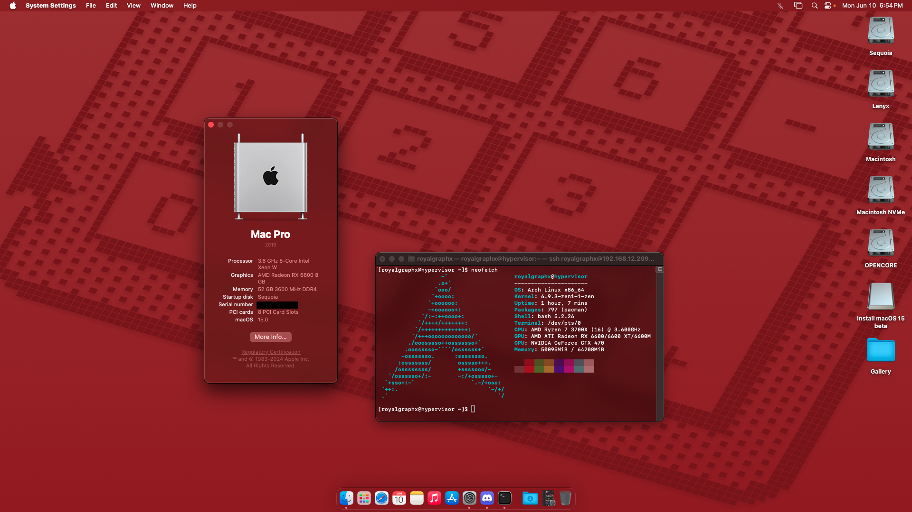</a>

<h3 align="center">macOS Sonoma 14.5</h3>
<a href="https://raw.githubusercontent.com/royalgraphx/DarwinKVM/main/docs/showcase/HacProKVM145.png">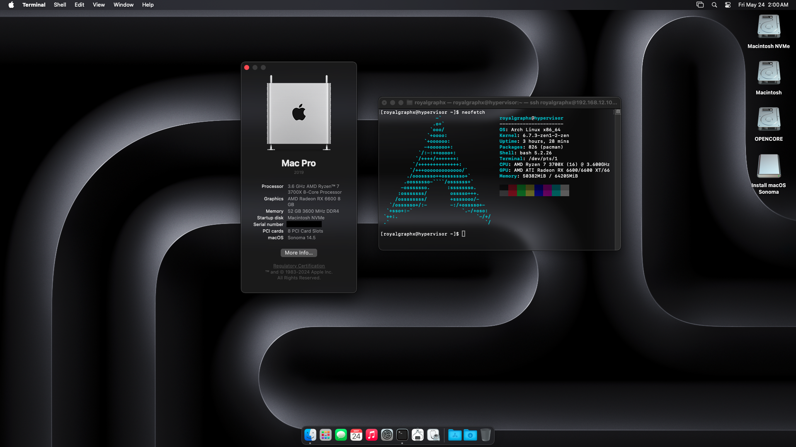</a>

<h3 align="center">macOS Sonoma 14.4 Beta</h3>

<h3 align="center">macOS Sonoma 14.3</h3>
<a href="https://raw.githubusercontent.com/royalgraphx/DarwinKVM/main/docs/showcase/HacProKVM143.png">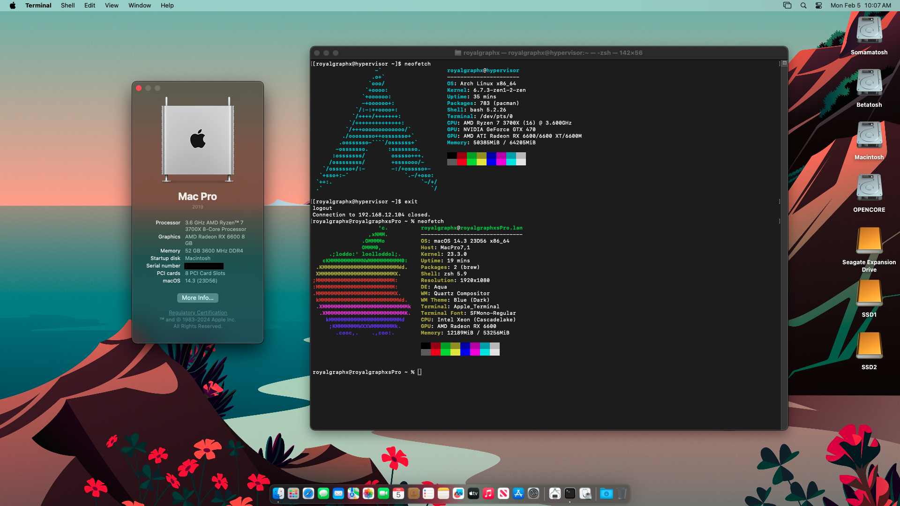</a>

<h3 align="center">macOS Sonoma 14.2.1 (Credits: @heliokroger)</h3>
<a href="https://raw.githubusercontent.com/royalgraphx/DarwinKVM/main/docs/showcase/Helio1421.png">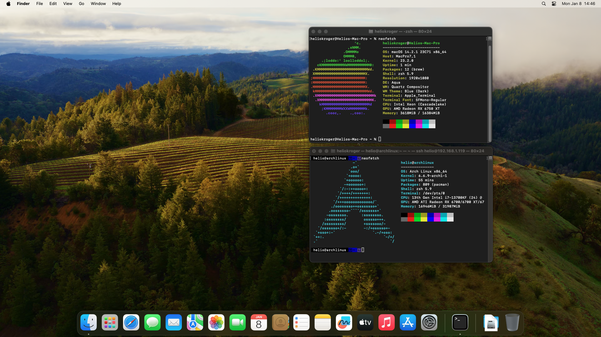</a>

<h3 align="center">macOS Sonoma 14.1</h3>

<h3 align="center">macOS Sonoma 14.1 (Credits: @Haxi0)</h3>

<h3 align="center">macOS Sonoma 14.0</h3>
<a href="https://raw.githubusercontent.com/royalgraphx/DarwinKVM/main/docs/showcase/HacProKVM140.png">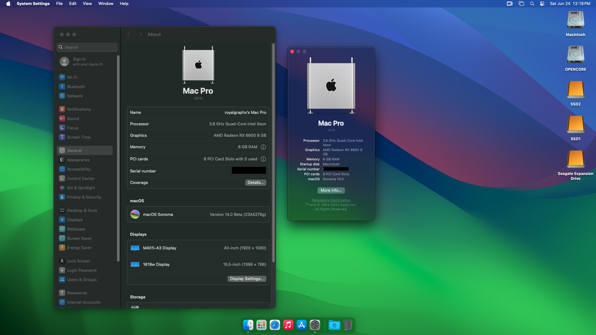</a>

<h3 align="center">macOS Ventura 13.5.1</h3>

<h3 align="center">macOS Ventura 13.5 + NVIDIA GPU (Credits: @Zormeister)</h3>
<a href="https://raw.githubusercontent.com/royalgraphx/DarwinKVM/main/docs/showcase/ZormDKVMnvidia.png">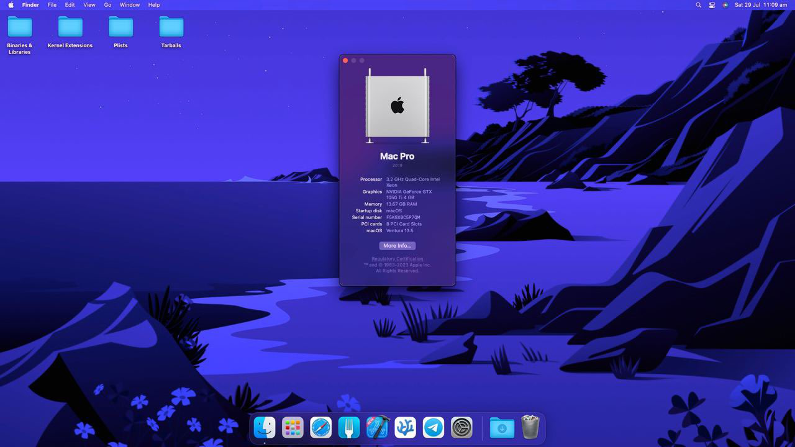</a>

<h3 align="center">macOS Ventura 13.5 (Credits: @Rowlul)</h3>

<h3 align="center">macOS Ventura 13.4</h3>

<h3 align="center">macOS Monterey 12.7.5</h3>

<h3 align="center">macOS Big Sur 11.7.10</h3>

<h3 align="center">Mac OS X Catalina 10.15.7</h3>

<h3 align="center">Mac OS X Mojave 10.14.4</h3>
<a href="https://raw.githubusercontent.com/royalgraphx/DarwinKVM/main/docs/showcase/ProMacMojave.png">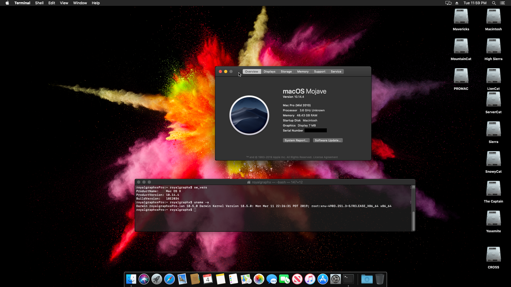</a>

<h3 align="center">Mac OS X High Sierra 10.13.6</h3>

<h3 align="center">Mac OS X Sierra 10.12</h3>

<h3 align="center">Mac OS X El Capitan 10.11.6</h3>
<a href="https://raw.githubusercontent.com/royalgraphx/DarwinKVM/main/docs/showcase/ProMacTheCaptain.png">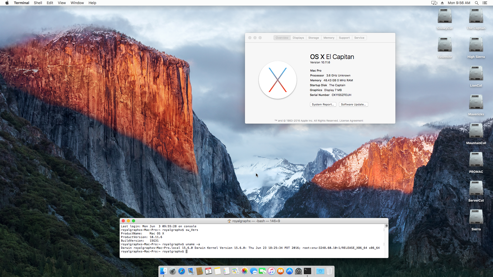</a>

<h3 align="center">Mac OS X Yosemite 10.10</h3>
<a href="https://raw.githubusercontent.com/royalgraphx/DarwinKVM/main/docs/showcase/ProMacYosemite.png">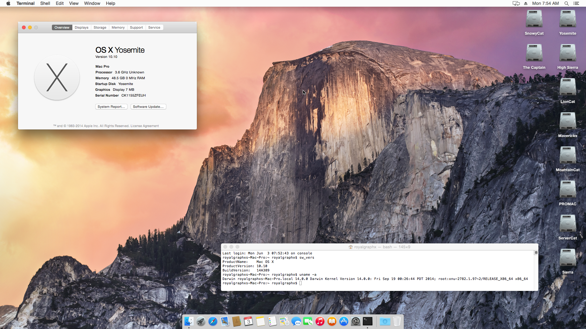</a>

<h3 align="center">Mac OS X Mavericks 10.9.5</h3>
<a href="https://raw.githubusercontent.com/royalgraphx/DarwinKVM/main/docs/showcase/ProMacMavericks.png">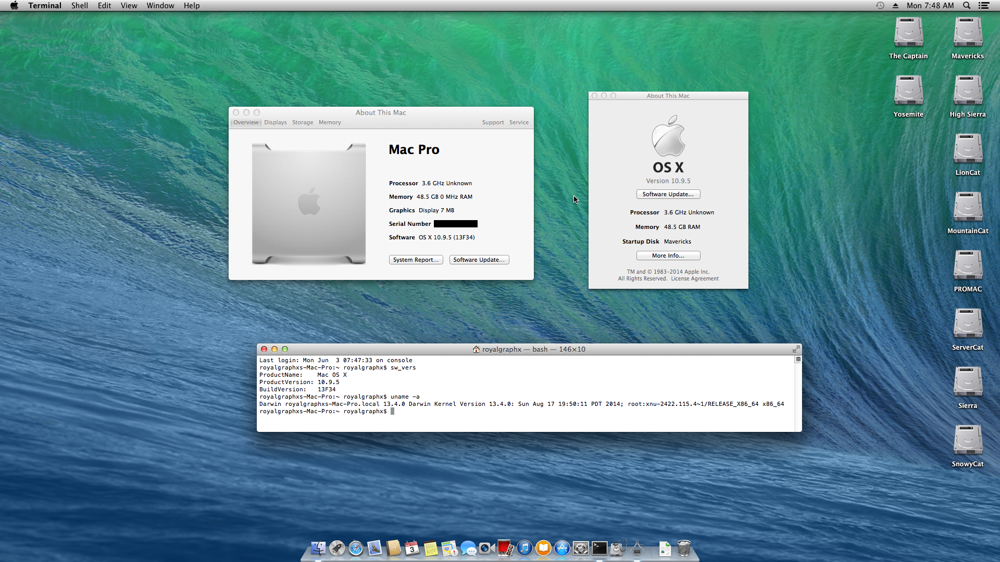</a>

<h3 align="center">Mac OS X Mountain Lion 10.8.5</h3>

<h3 align="center">Mac OS X Lion 10.7.5</h3>
<a href="https://raw.githubusercontent.com/royalgraphx/DarwinKVM/main/docs/showcase/ProMacLion.png">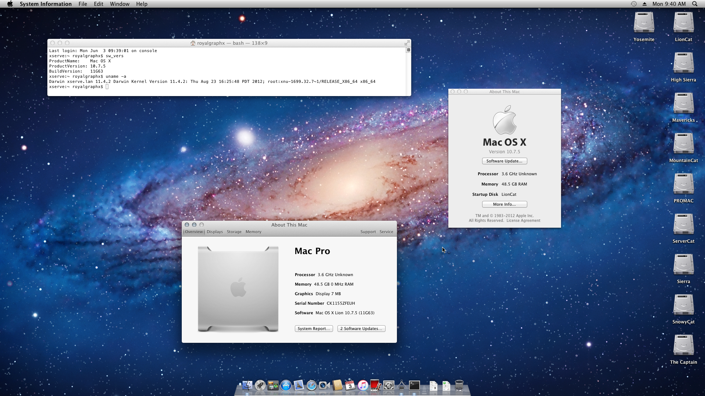</a>

<h3 align="center">Mac OS X Snow Leopard 10.6.8 on x86_64</h3>
<a href="https://raw.githubusercontent.com/royalgraphx/DarwinKVM/main/docs/showcase/ProMacSnowLeopard.png">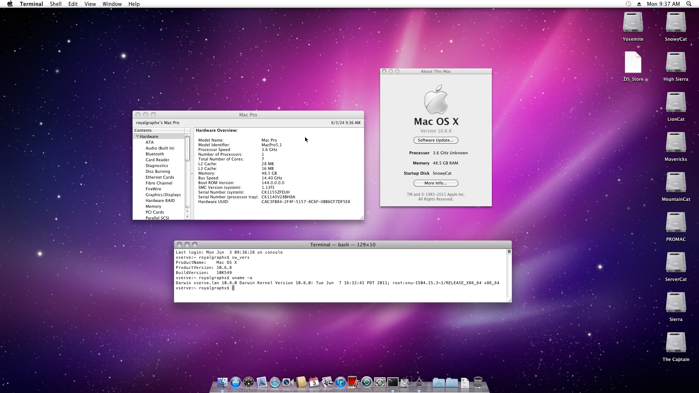</a>

<h3 align="center">Mac OS X Snow Leopard 10.6 on PowerPC</h3>
<a href="https://raw.githubusercontent.com/royalgraphx/DarwinKVM/main/docs/showcase/PowerMacSnowLeopard.png">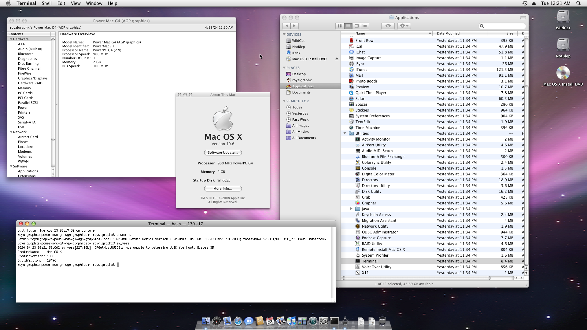</a>

<h3 align="center">Mac OS X Leopard 10.5.4 on PowerPC</h3>

<h3 align="center">Mac OS X Tiger 10.4.11 on PowerPC</h3>

<h3 align="center">Mac OS X Panther 10.3</h3>

<h3 align="center">Mac OS X Jaguar 10.2</h3>

<h3 align="center">Mac OS X Puma 10.1</h3>

<h3 align="center">Mac OS X Cheetah 10.0.3</h3>

