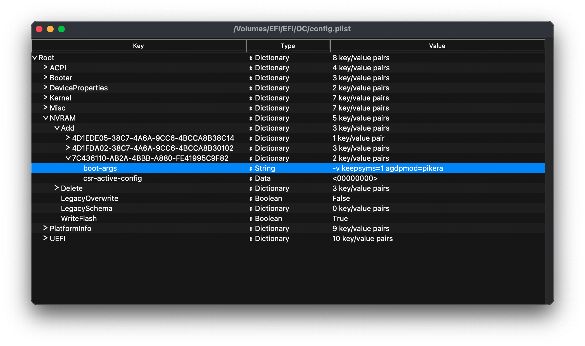

# Setting up macOS Boot Args for GPU
#### Depends on your hardware!

As you may recall from earlier, when passing through certain AMD GPU's you will need to add boot arguments to enable [WhateverGreen](https://github.com/acidanthera/WhateverGreen) flags.

The most common one here for latest AMD GPU's is ``agdpmod=pikera``.

| Argument | Result |
| ----- | ----- |
| shikigva=40 + shiki-id=Mac-7BA5B2D9E42DDD94 | Swaps boardID with iMacPro1,1 which allows for Polaris, Vega and Navi GPUs to handle all types of rendering, useful for SMBIOS which expect an iGPU |
| radpg=15 | Fixes initialization for HD 7730/7750/7770/R7 250/R7 250X |
| -raddvi | Fixes DVI connector-type for 290X, 370, etc |
| -radvesa | Forces GPU to VESA mode. Useful for troubleshooting. Apple's built in version of this flag is -amd_no_dgpu_accel |
| agdpmod=vit9696 | Disables board-id check, may be needed for when screen turns black after finishing booting |
| agdpmod=pikera | Renames board-id to board-ix effectively disabling boardID checks. This is also required for all Navi GPUs due to the difference in framework with the x6000 drivers |

  

Once you've added this to your config.plist, your next boot is prepared for a GPU.

## You can now continue to the next <a href="01-Installation.html">page</a>.