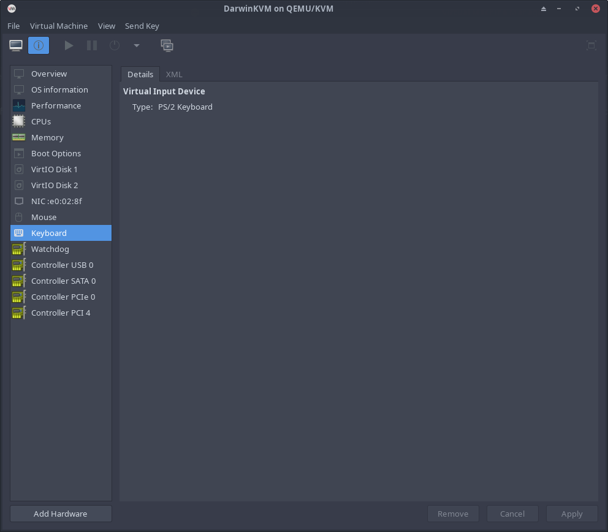
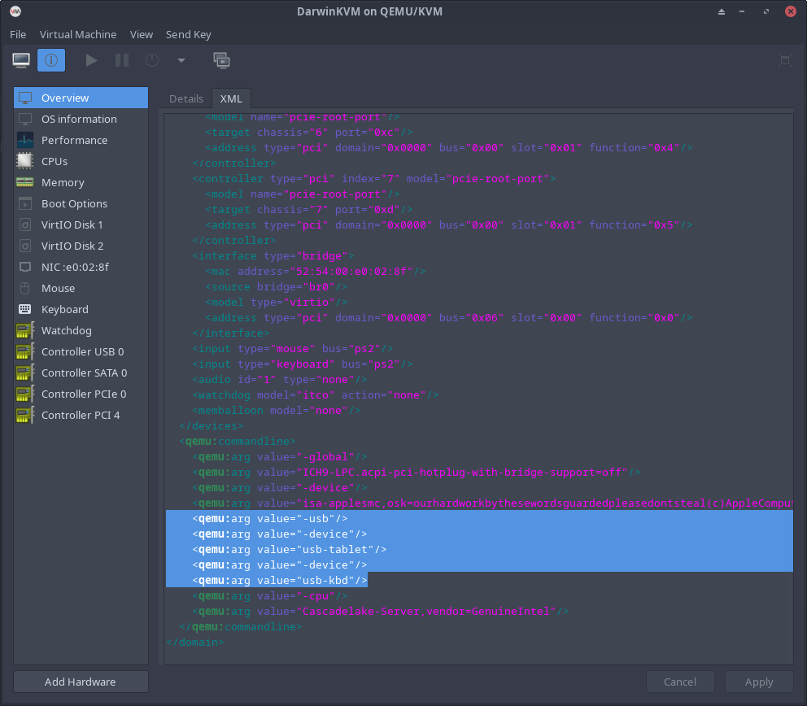
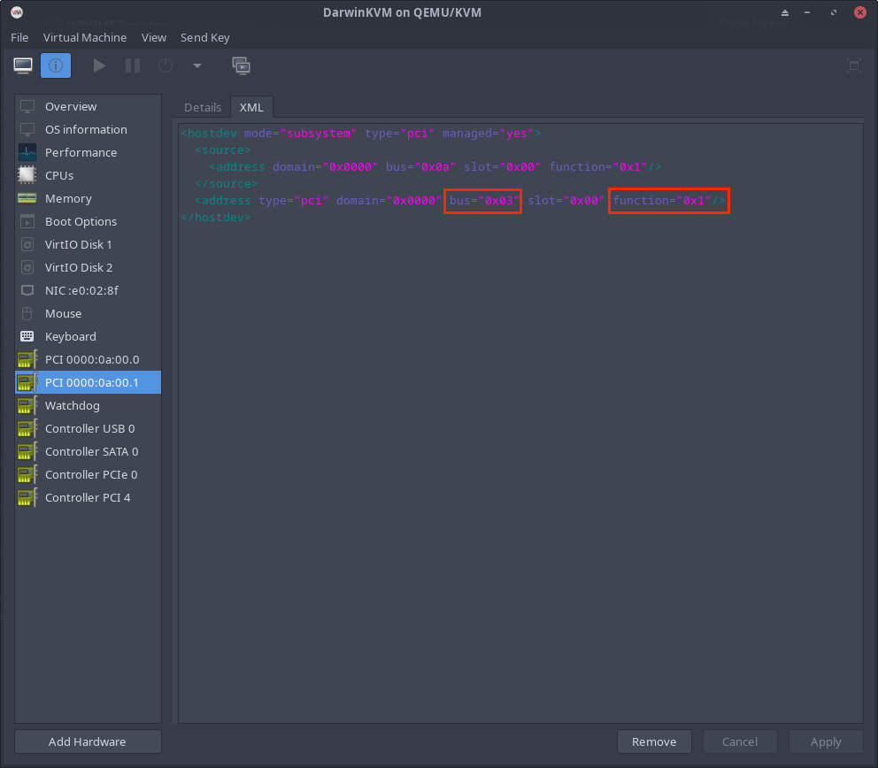
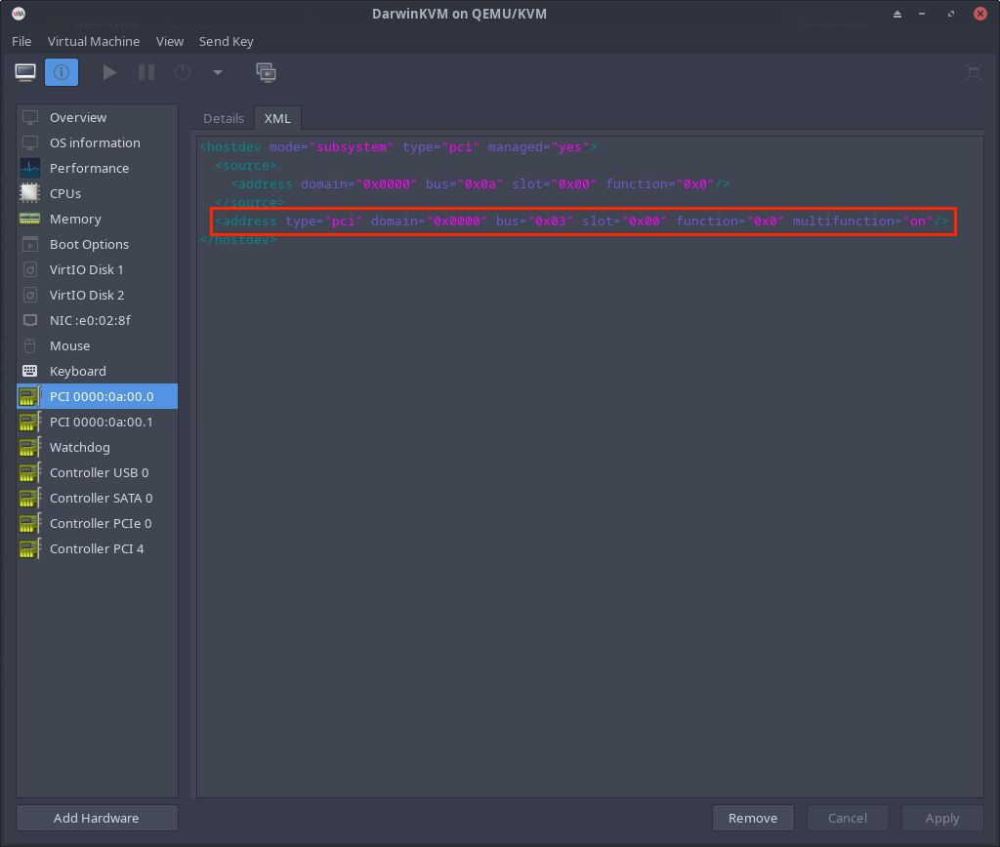

# Virt-Manager Modifications
#### How to properly use GPU Passthrough.

## Removing the virt-manager Display

First things first, we must remove the ``Spice Display`` and ``Video Virtio`` from the left hand side in our Virt-Manager window for DarwinKVM. As you can see here, they are now removed.

<p align="center">
  
</p>

## Removing recoveryOS Keyboard & Mouse

Now let's go ahead and remove the recoveryOS Keyboard and Mouse as we'll now be passing through our actual USB controllers later. You'll have to select the ``Overview`` tab on your left-hand side, and swap to the XML tab at the top. Scroll to the very bottom and delete and save this change.

<p align="center">
  
</p>

## Enabling Topoext / AMD Simultaneous Multithreading (SMT) for Multithreading

If you have an AMD CPU, you should enable Topoext / AMD Simultaneous Multithreading (SMT) for the guest.

<p align="center">
  
</p>

## IOMMU Groups

Now here's the tricky bit. You'll need to check your IOMMU groups. This can be done within the DarwinKVM repository by simply issuing the command ``./iommu-check.sh``

Sample Output, this is a host using [Zen Kernel](https://github.com/zen-kernel/zen-kernel) and [ACS Patches](https://wiki.archlinux.org/title/PCI_passthrough_via_OVMF#Bypassing_the_IOMMU_groups_(ACS_override_patch)):

Note that you will not get this output, you will see multiple devices within groups, <b>you can only pass through devices in a group, if you can pass the entire group</b>. This means that if your GPU and Ethernet are in the same group, you must pass through the entire group. This is where many people will run into issues. I do not want to go into great detail about it because I feel like it's common sense when reading the documentation I've linked above. If your IOMMU groups are not great, then consider the Zen Kernel, and ACS Patch.

<b>And remember for later, DO NOT ADD BRIDGES to your VM, that means devices like PCI bridge [0604] in your groups. </b>

```
IOMMU Group 24:
	08:00.0 PCI bridge [0604]: Advanced Micro Devices, Inc. [AMD/ATI] Navi 10 XL Upstream Port of PCI Express Switch [1002:1478] (rev c7)
IOMMU Group 25:
	09:00.0 PCI bridge [0604]: Advanced Micro Devices, Inc. [AMD/ATI] Navi 10 XL Downstream Port of PCI Express Switch [1002:1479]
IOMMU Group 26:
	0a:00.0 VGA compatible controller [0300]: Advanced Micro Devices, Inc. [AMD/ATI] Navi 23 [Radeon RX 6600/6600 XT/6600M] [1002:73ff] (rev c7)
IOMMU Group 27:
	0a:00.1 Audio device [0403]: Advanced Micro Devices, Inc. [AMD/ATI] Navi 21/23 HDMI/DP Audio Controller [1002:ab28]
IOMMU Group 28:
	0b:00.0 Non-Essential Instrumentation [1300]: Advanced Micro Devices, Inc. [AMD] Starship/Matisse PCIe Dummy Function [1022:148a]
IOMMU Group 29:
	0c:00.0 Non-Essential Instrumentation [1300]: Advanced Micro Devices, Inc. [AMD] Starship/Matisse Reserved SPP [1022:1485]
```

If everything seems fine, if you think that you can pass your USB controllers, and Graphics card + it's audio without issues, you can move on.

## Adding GPU + Audio

Let's go ahead and add the GPU and its Audio to our Virtual Machine.

<p align="center">
  
</p>

<p align="center">
  
</p>

## Correcting GPU Multifunction + Audio Bus

Here's what a lot of people don't check. This will be required here as on macOS if you want your HDMI/DP Audio to work, this must be configured correctly. Windows doesn't care so it's not an issue.

Essentially, your GPU and Audio must be on the same ``Bus`` in the Virtual Machine, but your Audio must be a ``Function`` of the Virtual Machines GPU. Thus creating a multifunction GPU in the VM which has an accompanying Audio device. This displays the GPU as a single unit. Allowing for HDMI/DP Audio in macOS.


Go Ahead and select your GPU from the left-hand side. Note the Bus assigned.

<p align="center">
  
</p>

Go Ahead and select your Audio from the left-hand side. Note the Bus assigned does not line up with that which was assigned to the GPU. We will now correct it to the same value. You must also switch the ``0x0`` to ``0x1`` to assign the Audio as a ``Function`` of the GPU device.

<p align="center">
  
</p>

The corrected Audio device:

<p align="center">
  
</p>

Now you can see the GPU is a multifunction device.

<p align="center">
  
</p>

## Adding USB Controllers

Go ahead and add your USB Controllers as you'll need to use your Keyboard and Mouse now.

<p align="center">
  
</p>

<p align="center">
  
</p>

## Adding NVMe (Optional)

If you have two NVMe drives in your system, and you'd like to dedicate one completely to the installation of macOS for maximum performance, you can add your NVMe drive. It still needs to be supported by macOS, or at least not reported to be problematic with macOS. I won't be adding it, but here it is for the example. For more information about whether or not or how you can pass your NVMe drive, please refer to the following [write-up]().

<p align="center">
  
</p>

## Example VM ready to start

If you've gone ahead and verified everything, your IOMMU groups, and your multifunction GPU, you are now ready! Here's an example of what a completed GPU Passthrough Virt-Manager will look like. Note that in this example image, the BaseSystem.dmg is still included within the OPENCORE image.

<p align="center">
  
</p>

<h1>You can now proceed to the <a href="../10-Finish.html">Finish!</a> page.</h1>